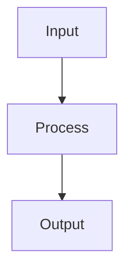

# CLAUDE.md - コードリーディングプロジェクト指示書

## プロジェクト概要

このリポジトリはOSSのコードリーディング結果を構造化して蓄積するためのものです。
対象OSSは `target/` ディレクトリにgit submoduleとして配置されています。

- **対象OSS**: （プロジェクト作成時に記入）
- **調査目的**: （プロジェクト作成時に記入）
- **重点領域**: （プロジェクト作成時に記入）

## ディレクトリ構成

```
.claude/CLAUDE.md          ← このファイル（常に参照）
target/                    ← 対象OSSソースコード（git submodule）
docs/src/                  ← 公開ドキュメント（mdbook用）
docs/src/investigations/   ← トピック別調査報告
.state/                    ← 調査状態管理（Claude Code用）
.state/questions.md        ← 未解決の疑問（調査を駆動）
.state/reading-guide.md    ← 対象OSS固有の読解ルール・ユーザー優先度
templates/                 ← ドキュメントテンプレート
scripts/                   ← ユーティリティスクリプト
```

## Phase境界ルール（厳守）

**1セッション = 1 Phase。複数Phaseをまたぐセッションは禁止。**

- Phase Nの完了条件を全て満たすまでPhase N+1に進まない
- planモードでは現在のPhaseの計画のみを立てる。次Phase以降は「概要」のみ記載可
- Phase完了時は必ずセッション終了プロトコルを実行し、next-actions.mdに「Phase N+1 開始」と明記する
- 対象OSSの規模が小さくても、Phase境界は守る（品質とコンテキスト効率のため）

## 調査プロトコル

### セッション開始時（必ず実行）

1. `.state/exploration-log.md` を読んで現在のPhaseと全体の進捗を把握
2. `.state/reading-guide.md` を読んで対象OSS固有のルールとユーザー優先度を把握
3. `.state/next-actions.md` を読んで今回の作業を決定（現在のPhaseに関係するアクションのみ）
4. 必要に応じて `.state/context-index.md` で既存知見を確認
5. 必要に応じて `.state/questions.md` を読み、調査すべき疑問を把握
6. 前回の続きの場合は `.state/sessions/` の該当ファイルを読む（任意。詳細が必要な場合のみ）

### 調査中

#### ソースコードの読み方
- **まず `rg`（ripgrep）や `grep` で当たりをつける**。大きなファイルを丸ごと読まない
- クラス定義、関数シグネチャ、import文から構造を把握し、必要な箇所だけ深く読む
- `rg -n "class ClassName" target/` や `rg -n "def method_name" target/` を活用

#### 既存ドキュメントの活用（コンテキスト節約）
- **確信度マーカーに基づいて再読を判断する**:
  - `[VERIFIED]` → ドキュメントを信頼してよい。ソース再読不要
  - `[INFERRED]` → 推測を含む。深堀り時はソース確認を推奨
  - `[SHALLOW]` → 概要のみ。詳細調査時は必ずソース確認
- submodule更新後は関連ドキュメントの再検証を検討

#### ドキュメントへの書き込み
- 発見は適切な `docs/src/` 配下のファイルに記録
- 新しいコンポーネントを発見したら `docs/src/components/` にディレクトリを作成
- トピック別の調査報告は `docs/src/investigations/` に配置
- テンプレート（`templates/`）を参照して一貫した形式で書く
- **ファイル参照は必ず `target/` からの相対パスと行番号を記載**: `target/path/to/file.py:123`

#### ツール選択ガイド

| やりたいこと | 使うべきツール | 理由 |
|---|---|---|
| 特定の定義を探す | Grep | 精密な位置特定 |
| ファイル種類の検索 | Glob | 高速なファイル発見 |
| ファイルの一部を読む | Read (offset/limit指定) | コンテキスト最小 |
| 広い範囲の構造理解 | Task (Explore agent) | 複数パス追跡可能 |
| 既存知見の確認 | Read (.state/ or docs/src/) | ソース再読より低コスト |
| 単純な事実確認 | ドキュメント参照 | ファイル操作不要 |

**注意**: 単純なファイル読みにExplore agentを使わない（コスト高）。

### セッション終了時（必ず実行）

1. `.state/exploration-log.md` を更新（カバレッジマップ・セッション履歴に追記）
2. `.state/context-index.md` を更新（新規/変更ドキュメントを反映）
3. `.state/next-actions.md` を更新（次回やるべきことを記載）
4. `.state/questions.md` を更新（新しい疑問の追加、解決済みの消込）
5. `.state/reading-guide.md` を更新（新ルール発見、確信度昇格があれば）
6. `.state/sessions/` にセッション記録を作成（命名: `YYYYMMDD-phaseN-topic.md`）
7. `docs/src/` の変更があれば `python scripts/gen_summary.py` でSUMMARY.md更新

## ドキュメント規約

### 深度マーカー

各セクションの見出しに付与:
- `[SHALLOW]` - 概要レベル。名前と役割を知っている程度
- `[MEDIUM]` - 中程度。主要なAPI、データフロー、設定を理解
- `[DEEP]` - 深い理解。内部実装、エッジケース、最適化を把握

### 確信度マーカー

各セクションの見出しに付与:
- `[VERIFIED]` - ソースコードで確認済み。信頼してよい
- `[INFERRED]` - コード構造やコメントからの推測を含む。要確認
- `[TODO]` - 未調査。プレースホルダとして存在

### ファイル参照形式

```markdown
**参照**: `target/path/to/file.py:315` (function_name)
```

### 図の記法

Mermaid記法を使用（mdbook-mermaidで描画）:

````markdown

````

ASCII図も可（Mermaidで表現しにくい場合）。

## アンチパターン（やってはいけないこと）

1. 大きなファイル（500行以上）を全行読み込む → offset/limitを使う
2. grepせずに当て推量でファイルを開く → まずGrepで検索
3. [VERIFIED]のドキュメントがある内容をソースから再読する → ドキュメントを信頼
4. Phase境界を越えて調査を進める → 1セッション1Phase
5. 1セッションで3つ以上の新しいコンポーネントを調査する → 集中する
6. コンテキストが枯渇してからまとめを書く → 発見したらすぐ記録
7. exploration-log.md確認前に探索開始しない → 重複調査を防ぐ
8. summary.mdなしで詳細ドキュメントを作成しない → まず概要から
9. reading-guide.mdでスキップ対象とした領域を深堀りする → ルールに従う
10. ユーザー優先度を確認せずにPhase 1のスライスを選択する → 必ずユーザーに確認

## 調査フェーズガイド

### Phase 0: オリエンテーション（1-2セッション）

**目標**: 全体像の把握、主要エントリポイント特定、読解戦略の確立

#### Phase 0a: 構造把握（セッション1）

成果物:
- `docs/src/architecture/overview.md` を作成
- `docs/src/glossary.md` に主要用語を登録
- `.state/reading-guide.md` の「コードベース構造ルール」セクションを作成

手順:
1. README、公式ドキュメント、ディレクトリ構成を確認
2. 主要エントリポイントを特定
3. コードベースを構造分析し、以下を判断:
   - 新旧アーキテクチャが並存するか → どちらにフォーカスすべきか
   - 同種の実装が大量にあるか → リファレンス実装を1つ選び、他は差分記録
   - 複数プラットフォーム対応か → 主要プラットフォームを特定
   - 読む必要がない領域はどこか
4. 分析結果を `.state/reading-guide.md` に記録（`templates/reading-guide.md` 参照）

完了条件:
- [ ] overview.mdが作成されている
- [ ] 主要エントリポイントが3つ以上特定されている
- [ ] glossary.mdに10用語以上登録されている
- [ ] reading-guide.mdに構造ルールが3つ以上記載されている

#### Phase 0b: 優先度確認（セッション2）

成果物:
- `.state/reading-guide.md` の「ユーザー優先度」セクションを完成

手順:
1. Phase 0aの成果をもとに、発見したコンポーネント/領域の一覧をユーザーに提示
2. 以下をユーザーに質問:
   - 「どの領域に最も関心がありますか？（複数可、優先順位をつけてください）」
   - 「この調査で最終的に何を得たいですか？（例: 自社への応用、バグ修正、貢献準備）」
   - 「関心が低い/スキップしてよい領域はありますか？」
3. 回答を `.state/reading-guide.md` の「ユーザー優先度」セクションに記録
4. ユーザー優先度と構造ルールを統合し、Phase 1で追跡する垂直スライスを提案

完了条件:
- [ ] ユーザー優先度が reading-guide.md に記録されている
- [ ] Phase 1 で追跡する垂直スライスの候補が next-actions.md に記載されている

**注**: 小規模OSSではPhase 0a+0bを1セッションで完了してよい。

禁止: 個別関数の実装詳細に入らない。コンポーネント間の詳細な相互作用を追わない。

### Phase 1: 垂直スライス（2-3セッション）

**目標**: 1つのリクエストパスを入力から出力まで完全に追跡
（`.state/reading-guide.md` のユーザー優先度に基づいてスライスを選択）

成果物:
- `docs/src/architecture/data-flow.md` を作成
- パス上の各コンポーネントの `summary.md` を作成
- コンポーネント優先度リストを作成

完了条件:
- [ ] data-flow.mdにエンドツーエンドのフローが記載されている
- [ ] フロー上の全コンポーネントが `docs/src/components/` に登録されている
- [ ] 各コンポーネントの優先度が決定されている

禁止: フロー上にないコンポーネントを深掘りしない。最適化やエッジケースは追わない。reading-guide.mdでスキップ対象とした領域には入らない。

### Phase 2: コンポーネント別深堀り（継続的）

**目標**: 優先度順にコンポーネントを詳細調査
（`.state/reading-guide.md` のユーザー優先度と構造ルールに従って順序決定。
  代表実装パターン適用領域では、リファレンス実装を深堀りし他は差分記録）

成果物:
- 各コンポーネントの `summary.md` + 詳細ドキュメント
- 相互参照の更新

完了条件（コンポーネントごと）:
- [ ] summary.mdが[MEDIUM]以上の深度で作成されている
- [ ] 主要なクラス/関数がソースコード参照つきで記載されている
- [ ] 依存関係（上流・下流）が明記されている

禁止: 1セッションで3つ以上のコンポーネントに手を広げない。

### Phase 3: 横断的機能の理解（継続的）

**目標**: 複数コンポーネントにまたがる機能を調査

成果物:
- `docs/src/investigations/` にトピック別調査報告
- 既存ドキュメントの相互参照を強化

完了条件（テーマごと）:
- [ ] 調査報告がinvestigations/に作成されている
- [ ] 関連する全コンポーネントのsummary.mdが更新されている

禁止: 関連コンポーネントのsummary.mdが未作成のまま横断調査を開始しない。

## コンテキスト管理

### 読み込み優先度

```
レベル0（常に読む）: .state/exploration-log.md, next-actions.md, reading-guide.md （〜80行）
レベル1（セッション開始時）: context-index.md, questions.md （〜50行）
レベル2（必要時）: 対象コンポーネントの summary.md （〜100行）
レベル3（深堀り時）: 個別ドキュメント、investigations/
レベル4（前セッション詳細時）: .state/sessions/ の該当ファイル
レベル5（ピンポイント）: target/ 内のソースコード
```

### context-index.md の維持

新しいドキュメントを作成/大幅更新したら、context-index.md に1行サマリを追加/更新する。
これにより、次回セッションで「どのドキュメントに何が書いてあるか」を即座に把握できる。

### コンテキスト管理戦略

**Strategy 1: Summary-First**
新しい領域を調べる前に、context-index.mdで既存ドキュメントを確認。あればsummary.mdを読んでから、不足分だけソースに当たる。

**Strategy 2: 質問駆動探索**
漠然と読まない。questions.mdから具体的な問いを1つ選び、その回答を得ることを目的にソースを読む。

**Strategy 3: 増分コンテキスト**
まずgrepで当たりをつけ、次にRead(offset/limit)で該当部分だけ読む。ファイル全体を読まない。

**Strategy 4: 読解ガイド準拠**
reading-guide.mdのルールに従う。スキップ対象は避け、代表実装パターン適用領域ではリファレンス実装のみ深堀りし他は差分で記録する。ユーザー優先度の高い領域から着手する。

## タスク実行

```bash
uv run task docs-build    # mdbookビルド
uv run task docs-serve    # ローカルプレビュー
uv run task summary       # SUMMARY.md自動生成
uv run task stats         # 調査進捗表示
```
