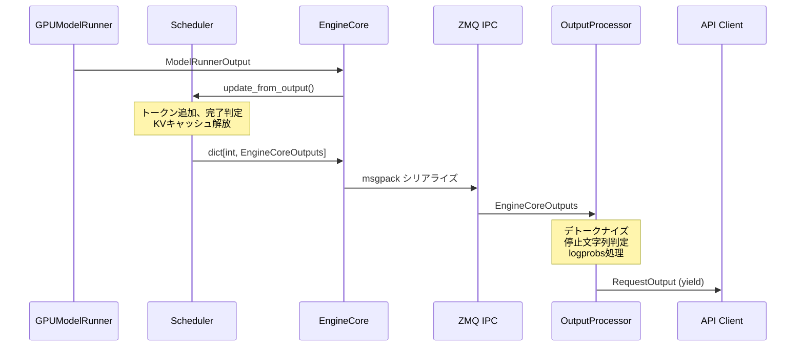

# テキスト推論データフロー

> **深度**: [MEDIUM]
> **確信度**: [VERIFIED]
> **最終更新**: 2026-02-11 (セッション3で下流パス追加)

## 概要

テキスト推論リクエストは、APIエントリポイントからエンジン層を経てGPUで実行され、生成されたトークンがデトークナイズされてユーザーに返却される。フロー全体は5つの境界データ構造（EngineCoreRequest → SchedulerOutput → ModelRunnerOutput → EngineCoreOutput → RequestOutput）で区切られ、ZMQ IPCによるプロセス分離とasyncioによる非同期パイプラインで高スループットを実現する。

## フロー全体図


## 境界データ構造

フローは以下の5つのデータ構造で区切られる。各構造はプロセス間またはコンポーネント間の境界を定義する。

### EngineCoreRequest

フロントエンド → バックエンドの境界。ユーザー入力を正規化した内部表現。

**参照**: `target/vllm/vllm/v1/engine/__init__.py:55` (EngineCoreRequest)

| フィールド | 型 | 説明 |
|-----------|-----|------|
| `request_id` | `str` | 内部リクエストID（外部IDに8文字ランダムサフィックス付与） |
| `prompt_token_ids` | `list[int] \| None` | トークナイズ済みプロンプト |
| `mm_features` | `list[MultiModalFeatureSpec] \| None` | マルチモーダル入力（テキスト推論ではNone） |
| `sampling_params` | `SamplingParams \| None` | サンプリングパラメータ（clone済み） |
| `eos_token_id` | `int \| None` | 終了トークンID |
| `arrival_time` | `float` | リクエスト到着時刻 |
| `lora_request` | `LoRARequest \| None` | LoRAアダプタ情報 |
| `priority` | `int` | 優先度（デフォルト0） |
| `data_parallel_rank` | `int \| None` | データ並列ランク指定 |

`msgspec.Struct` を継承し、`array_like=True` + `omit_defaults=True` で効率的にmsgpackシリアライズされる。

### SchedulerOutput

Scheduler → Executor の境界。各ステップのスケジュール結果を含む。

**参照**: `target/vllm/vllm/v1/core/sched/output.py:184` (SchedulerOutput)

| フィールド | 型 | 説明 |
|-----------|-----|------|
| `scheduled_new_reqs` | `list[NewRequestData]` | 初回スケジュールされたリクエスト（フルデータ） |
| `scheduled_cached_reqs` | `CachedRequestData` | 既スケジュール済みリクエスト（差分のみ） |
| `num_scheduled_tokens` | `dict[str, int]` | リクエストごとのスケジュールトークン数 |
| `total_num_scheduled_tokens` | `int` | 合計スケジュールトークン数 |
| `scheduled_spec_decode_tokens` | `dict[str, list[int]]` | Speculative Decoding用トークン |
| `scheduled_encoder_inputs` | `dict[str, list[int]]` | エンコーダ入力インデックス（マルチモーダル） |
| `num_common_prefix_blocks` | `list[int]` | 共通プレフィックスブロック数（Cascade Attention用） |
| `finished_req_ids` | `set[str]` | このステップで完了したリクエストID |
| `free_encoder_mm_hashes` | `list[str]` | 解放するエンコーダキャッシュのmm_hash |
| `preempted_req_ids` | `set[str] \| None` | プリエンプションされたリクエスト |
| `has_structured_output_requests` | `bool` | 構造化出力リクエストの有無 |
| `pending_structured_output_tokens` | `bool` | Grammar bitmask準備状態 |
| `num_invalid_spec_tokens` | `dict[str, int] \| None` | 無効スペキュレーショントークン数 |
| `kv_connector_metadata` | `KVConnectorMetadata \| None` | KV Transfer メタデータ |
| `ec_connector_metadata` | `ECConnectorMetadata \| None` | EC Transfer メタデータ |

**NewRequestData** は初回スケジュール時のフルデータ（プロンプトトークン、サンプリングパラメータ、ブロックID等）を含む。**CachedRequestData** は既スケジュール済みリクエストの差分（新規ブロックID、新トークンID、計算済みトークン数の更新）のみを含み、プロセス間通信コストを最小化する。

### ModelRunnerOutput

GPUModelRunner → EngineCore の境界。モデル推論結果を含む。

**参照**: `target/vllm/vllm/v1/outputs.py:160` (ModelRunnerOutput)

| フィールド | 型 | 説明 |
|-----------|-----|------|
| `req_ids` | `list[str]` | バッチ内のリクエストID一覧 |
| `req_id_to_index` | `dict[str, int]` | リクエストID → バッチインデックス |
| `sampled_token_ids` | `list[list[int]]` | サンプリング済みトークンID [num_reqs, num_generated] |
| `logprobs` | `LogprobsLists \| None` | 生成トークンの対数確率 |
| `prompt_logprobs_dict` | `dict[str, LogprobsTensors \| None]` | プロンプトトークンの対数確率 |
| `pooler_output` | `list[Tensor \| None] \| None` | プーリング出力（埋め込みモデル用） |
| `kv_connector_output` | `KVConnectorOutput \| None` | KV Transfer出力 |
| `ec_connector_output` | `ECConnectorOutput \| None` | EC Transfer出力 |
| `num_nans_in_logits` | `dict[str, int] \| None` | logits内のNaN数 |
| `cudagraph_stats` | `CUDAGraphStat \| None` | CUDAGraph実行統計 |

Worker→Executorへの転送ではPythonリスト形式を使用し、torch.Tensorの高コストなシリアライゼーションを回避する。

### EngineCoreOutput

バックエンド → フロントエンドの境界。リクエスト単位の推論結果。

**参照**: `target/vllm/vllm/v1/engine/__init__.py:130` (EngineCoreOutput)

| フィールド | 型 | 説明 |
|-----------|-----|------|
| `request_id` | `str` | 対応するリクエストID |
| `new_token_ids` | `list[int]` | 新たに生成されたトークンID |
| `finish_reason` | `FinishReason \| None` | 完了理由（stop/length/abort/error） |
| `new_logprobs` | `LogprobsLists \| None` | 生成トークンのlogprobs |
| `num_cached_tokens` | `int` | プレフィックスキャッシュヒット数 |

`EngineCoreOutputs`（複数形）がこれを`list[EngineCoreOutput]`としてバッチ化し、`scheduler_stats`やタイムスタンプと共にZMQ経由で送信される。

**参照**: `target/vllm/vllm/v1/engine/__init__.py:176` (EngineCoreOutputs)

### RequestOutput

OutputProcessor → API の境界。ユーザーに返却される最終出力。

**参照**: `target/vllm/vllm/outputs.py:86` (RequestOutput)

| フィールド | 型 | 説明 |
|-----------|-----|------|
| `request_id` | `str` | 外部リクエストID（クライアントが指定したID） |
| `prompt` | `str \| None` | 元のプロンプト文字列 |
| `prompt_token_ids` | `list[int] \| None` | トークナイズ済みプロンプト |
| `prompt_logprobs` | `PromptLogprobs \| None` | プロンプトトークンの対数確率 |
| `outputs` | `list[CompletionOutput]` | サンプルごとの出力（n>1で複数） |
| `finished` | `bool` | リクエスト完了フラグ |
| `metrics` | `RequestStateStats \| None` | レイテンシ等の統計情報 |
| `num_cached_tokens` | `int \| None` | プレフィックスキャッシュヒット数 |
| `kv_transfer_params` | `dict[str, Any] \| None` | KV Transfer情報（完了時） |

**CompletionOutput** (`target/vllm/vllm/outputs.py:23`) は各サンプルの出力を表す:

| フィールド | 型 | 説明 |
|-----------|-----|------|
| `index` | `int` | サンプルインデックス |
| `text` | `str` | デトークナイズ済みテキスト |
| `token_ids` | `GenericSequence[int]` | 生成トークンID列 |
| `cumulative_logprob` | `float \| None` | 累積対数確率 |
| `logprobs` | `SampleLogprobs \| None` | 各トークンのlogprobs |
| `finish_reason` | `str \| None` | 完了理由（"stop" / "length"） |
| `stop_reason` | `int \| str \| None` | 停止トークン/文字列 |

**出力モード**（`RequestOutputKind`、`target/vllm/vllm/sampling_params.py:108`）:
- `CUMULATIVE`: 毎回全出力を返す（デフォルト）
- `DELTA`: 差分のみ返す（ストリーミング向け）
- `FINAL_ONLY`: 完了時のみ返す

## 上流パス: リクエスト受信 → EngineCore

### エントリポイント (LLM / AsyncLLM)

vLLMには同期パス（`LLM`）と非同期パス（`AsyncLLM`）の2つのエントリポイントがある。内部的にはどちらも`InputProcessor`と`EngineCoreClient`を使用する。

#### 非同期パス（主パス）: AsyncLLM

APIサーバー（OpenAI互換API等）が使用する主要パス。

**参照**: `target/vllm/vllm/v1/engine/async_llm.py:71` (AsyncLLM)

```
AsyncLLM.generate(prompt, sampling_params, request_id)    # L537
  │
  ├─ add_request(request_id, prompt, params)               # L286
  │   ├─ input_processor.process_inputs(prompt, params)    # L364
  │   │   → EngineCoreRequest を生成
  │   ├─ input_processor.assign_request_id(request)        # L378
  │   │   → 内部IDを付与（外部ID + 8文字ランダムサフィックス）
  │   ├─ output_processor.add_request(request, ...)        # L423
  │   │   → フロントエンド側でリクエストを登録
  │   └─ engine_core.add_request_async(request)            # L426
  │       → ZMQ経由でバックエンドへ送信
  │
  └─ while not finished:                                    # L586
      out = q.get_nowait() or await q.get()                # L589
      yield out                                             # L596
```

`generate()`はAsyncGeneratorで、バックグラウンドの`output_handler`タスクがEngineCoreからの出力を`RequestOutputCollector`キューにpushし、`generate()`がそれをyieldする。

**output_handler（バックグラウンドタスク）**:

**参照**: `target/vllm/vllm/v1/engine/async_llm.py:647` (_run_output_handler)

```
output_handler():                                           # L662
  while True:
    outputs = await engine_core.get_output_async()          # L666
    for chunk in outputs.outputs:                           # L677
      output_processor.process_outputs(chunk, ...)          # L681
      → RequestOutputをキューにpush
    if reqs_to_abort:
      await engine_core.abort_requests_async(...)           # L693
```

#### 同期パス: LLM

オフライン推論（バッチ処理）で使用される。

**参照**: `target/vllm/vllm/entrypoints/llm.py:396` (generate)

```
LLM.generate(prompts, sampling_params)                      # L396
  → _run_completion(prompts, params)                        # L449
    → _add_request(prompt, params) × N                      # L1850
    │  ├─ input_processor.process_inputs(prompt, params)    # L1879
    │  └─ llm_engine.add_request(request_id, request, ...)  # L1889
    → _run_engine()                                         # L1900
       while has_unfinished_requests():                     # L1918
         step_outputs = llm_engine.step()                   # L1919
```

同期パスとの主な違い:
- `LLM`は`_run_engine()`でポーリングループを回す（AsyncGeneratorではない）
- `llm_engine`（=`AsyncLLM`のラッパー）の`step()`を直接呼ぶ
- プログレスバー（tqdm）でバッチ処理の進捗を表示

### 入力処理 (InputProcessor)

`InputProcessor`はユーザー入力（テキストプロンプト、パラメータ）を`EngineCoreRequest`に変換する。

**参照**: `target/vllm/vllm/v1/engine/input_processor.py:56` (InputProcessor)

```
InputProcessor.process_inputs(request_id, prompt, params)   # L521
  ├─ _validate_lora(lora_request)                           # L535
  ├─ _validate_params(params)                               # L536
  ├─ data_parallel_rank の範囲チェック                       # L542
  ├─ arrival_time 設定（未指定なら time.time()）             # L548
  │
  ├─ input_preprocessor.preprocess(prompt, ...)             # L581
  │   → テキストをトークナイズ（tokenizer.encode()）
  │   → ProcessorInputs を返す
  │
  ├─ split_enc_dec_inputs(processed_inputs)                 # L597
  │   → エンコーダ/デコーダ入力を分離
  │
  ├─ SamplingParams の正規化                                # L608-623
  │   ├─ params.clone()                                     # L612
  │   ├─ max_tokens 未設定時: max_model_len - seq_len       # L614-618
  │   ├─ update_from_generation_config()                    # L619
  │   └─ update_from_tokenizer()                            # L623
  │
  └─ EngineCoreRequest を構築して返す                        # L656-671
```

テキスト推論の場合、マルチモーダル関連処理（L630-654）はスキップされる（`mm_features`はNone）。

### プロセス間通信 (EngineCoreClient / ZMQ IPC)

`EngineCoreClient`はフロントエンドプロセスとバックエンドプロセス（EngineCore）間のZMQ IPC通信を担当する。

**参照**: `target/vllm/vllm/v1/engine/core_client.py:63` (EngineCoreClient)

#### クライアント階層

| クラス | 用途 | トランスポート |
|--------|------|--------------|
| `EngineCoreClient` (ABC) | 抽象インターフェース | — |
| `InprocClient` | インプロセス（デバッグ用） | 直接呼び出し |
| `SyncMPClient` | 同期マルチプロセス（LLM用） | ZMQ同期 |
| `AsyncMPClient` | 非同期マルチプロセス（AsyncLLM用） | ZMQ非同期 |
| `DPAsyncMPClient` | データ並列（外部LB） | 複数ZMQ |
| `DPLBAsyncMPClient` | データ並列（内部LB） | 複数ZMQ |

**参照**: `target/vllm/vllm/v1/engine/core_client.py:442` (MPClient)

#### ZMQソケット構成

```
フロントエンド                 バックエンド
┌──────────────┐              ┌──────────────┐
│ AsyncMPClient│              │ EngineCore   │
│              │              │              │
│ input_socket ├─── ROUTER ──→│ (受信)       │
│ (zmq.ROUTER) │    msgpack   │              │
│              │              │              │
│ output_socket│←── PULL ─────┤ (送信)       │
│ (zmq.PULL)   │    msgpack   │              │
└──────────────┘              └──────────────┘
```

- **シリアライゼーション**: `MsgpackEncoder` / `MsgpackDecoder`（`msgspec`ライブラリ）
  - `EngineCoreRequest`のシリアライズ → 入力ソケット経由で送信
  - `EngineCoreOutputs`のデシリアライズ ← 出力ソケット経由で受信
- **非同期出力受信**: `process_outputs_socket()`タスクがZMQソケットをポーリングし、受信したOutputsを`asyncio.Queue`にpush

**参照**: `target/vllm/vllm/v1/engine/core_client.py:822` (AsyncMPClient)

#### EngineCore側のリクエスト受信

`EngineCore.add_request()`はリクエストをバリデーションしてSchedulerに登録する。

**参照**: `target/vllm/vllm/v1/engine/core.py:288` (add_request)

```
EngineCore.add_request(request)                             # L288
  ├─ request_id の型チェック                                 # L295
  ├─ pooling_params のバリデーション                          # L300
  ├─ kv_transfer_params の互換性チェック                      # L311
  └─ scheduler.add_request(request)                          # L319
```

#### EngineCore.step() （コアループ概要）

**参照**: `target/vllm/vllm/v1/engine/core.py:389` (step)

```
EngineCore.step()                                            # L389
  ├─ scheduler.schedule()        → SchedulerOutput           # L404
  ├─ executor.execute_model()    → Future[ModelRunnerOutput]  # L405
  ├─ grammar_output 取得                                      # L406
  ├─ future.result()             → ModelRunnerOutput          # L411
  ├─ sample_tokens()（非同期スケジューリング時）              # L413
  └─ scheduler.update_from_output() → EngineCoreOutputs      # L418
```

## コアループ: EngineCore.step()

EngineCoreの`step()`メソッドは、各ステップで **schedule → execute → update** のサイクルを実行し、待機中のリクエストから生成トークンを生産する。

### step() 実行フロー

**参照**: `target/vllm/vllm/v1/engine/core.py:389` (step)

```
EngineCore.step()                                            # L389
  │
  ├─ if _scheduler_paused: return {}, False                  # L397
  ├─ if not scheduler.has_requests(): return {}, False       # L402
  │
  ├─ 1. scheduler_output = scheduler.schedule()              # L404
  │      → SchedulerOutput
  │      （RUNNINGリクエストの予算割当 → WAITINGリクエストの受け入れ
  │        → KVキャッシュブロック確保 → SchedulerOutput構築）
  │
  ├─ 2. future = executor.execute_model(                     # L405
  │         scheduler_output, non_block=True)
  │      → Future[ModelRunnerOutput | None]
  │      （非ブロッキング。ワーカープロセスで並行実行）
  │
  ├─ 3. grammar_output = scheduler.get_grammar_bitmask(      # L406
  │         scheduler_output)
  │      （構造化出力有効時のみ使用）
  │
  ├─ 4. model_output = future.result()                       # L411
  │      → ModelRunnerOutput（ブロッキング待機）
  │
  ├─ 5. if model_output is None:                             # L413
  │        model_output = executor.sample_tokens(grammar_output)
  │      （非同期スケジューリング時: execute_modelとsamplingが分離）
  │
  ├─ 6. _process_aborts_queue()                              # L417
  │
  └─ 7. engine_core_outputs = scheduler.update_from_output(  # L418
  │         scheduler_output, model_output)
  │      → dict[int, EngineCoreOutputs]
  │      （生成トークンの追加、完了判定、出力構築）
  │
  └─ return (engine_core_outputs,                            # L422
             total_num_scheduled_tokens > 0)
```

### Scheduler と KVCacheManager の相互作用


### Scheduler.schedule() の3フェーズ

**参照**: `target/vllm/vllm/v1/core/sched/scheduler.py:321` (schedule)

`schedule()` は Unified Compute Model を採用し、Prefill/Decodeを区別せず `num_computed_tokens` の進捗で統一的にトークンを割り当てる。

| フェーズ | 行 | 対象 | 処理 |
|---------|-----|------|------|
| Phase 1 | L350-517 | RUNNINGリクエスト | トークン予算割当。ブロック不足時はプリエンプション |
| Phase 2 | L532-800 | WAITINGリクエスト | 新規受け入れ。プレフィックスキャッシュ検索 + ブロック割当 |
| Phase 3 | L827-896 | 出力構築 | NewRequestData + CachedRequestData → SchedulerOutput |

**トークン予算**: `token_budget = max_num_scheduled_tokens`（ステップあたり上限）で、各リクエストのスケジュール時に消費される。

詳細は [Scheduler サマリー](../components/scheduler/summary.md) を参照。

### KVCacheManager のブロック割り当て

**参照**: `target/vllm/vllm/v1/core/kv_cache_manager.py:206` (allocate_slots)

`allocate_slots()` は以下のブロック配置に基づいてGPUメモリブロックを確保する:

```
|  comp  | new_comp | ext_comp |   new   | lookahead |
|<------ 既計算トークン ------>|<-- 新規計算対象 -->|
                               |<- 割り当て対象 ->|
```

- 成功時: `KVCacheBlocks`（割り当てたブロック情報）を返す
- 失敗時: `None` を返す → Schedulerがプリエンプション（RUNNING）またはスキップ（WAITING）

プレフィックスキャッシュ検索は `get_computed_blocks()` で行い、過去に計算済みのブロックを再利用する。

詳細は [KVCacheManager サマリー](../components/kv-cache-manager/summary.md) を参照。

### update_from_output() → EngineCoreOutputs

**参照**: `target/vllm/vllm/v1/core/sched/scheduler.py:1241` (update_from_output)

`ModelRunnerOutput`を受けてSchedulerの状態を更新し、クライアントに返す`EngineCoreOutputs`を構築する。

```
update_from_output(scheduler_output, model_runner_output)
  for each scheduled request:
    ├─ Speculative Decodingリジェクション処理
    │   → 不採用分の num_computed_tokens 巻き戻し
    ├─ 生成トークンをリクエストに追加
    ├─ 完了判定（EOS、max_tokens、stop_token）
    │   → 完了時: kv_cache_manager.free(request) でブロック解放
    └─ EngineCoreOutput 構築（request_id, new_token_ids, finish_reason, ...）
  → dict[int, EngineCoreOutputs]（クライアントインデックス別）
```

## 下流パス: 実行 → ユーザー応答

### 実行層: Executor → Worker → GPUModelRunner

EngineCore.step()は`executor.execute_model()`を**非ブロッキング**で呼び出し、GPUでの推論実行を開始する。

**参照**: `target/vllm/vllm/v1/executor/abstract.py:202` (execute_model)

#### collective_rpc パターン

Executorは`collective_rpc()`パターンで全Workerに同一メソッドを実行させ、出力ランクのWorkerの結果のみを返す。

```
EngineCore.step()
  │
  ├─ executor.execute_model(scheduler_output, non_block=True)
  │   └─ collective_rpc("execute_model", args=(scheduler_output,))
  │       └─ Worker.execute_model(scheduler_output)                # L604
  │           └─ model_runner.execute_model(scheduler_output)      # L652
  │               → ExecuteModelState を内部保存、None を返す
  │
  ├─ grammar_output = scheduler.get_grammar_bitmask(...)           # 並行処理
  │
  ├─ future.result()  → None                                       # 待機
  │
  └─ executor.sample_tokens(grammar_output)                         # L222
      └─ collective_rpc("sample_tokens", args=(grammar_output,))
          └─ Worker.sample_tokens(grammar_output)                  # L598
              └─ model_runner.sample_tokens(grammar_output)        # L3621
                  → ModelRunnerOutput を返す
```

**参照**: `target/vllm/vllm/v1/worker/gpu_worker.py:604` (Worker.execute_model)

#### GPUModelRunner の2フェーズ実行

GPUModelRunnerは `execute_model()` と `sample_tokens()` を分離する**2フェーズ実行パターン**を採用する。これにより、モデルフォワード中にgrammar bitmask計算を並行実行できる。

**Phase 1: execute_model()** (`target/vllm/vllm/v1/worker/gpu_model_runner.py:3312`)

```
execute_model(scheduler_output)
  ├─ _update_states(scheduler_output)          # バッチ状態更新
  ├─ _prepare_inputs(scheduler_output)         # 入力ID・位置計算
  ├─ _build_attention_metadata(...)            # Attention メタデータ構築
  ├─ _model_forward(...)                       # model.forward() 実行
  │   → hidden_states
  ├─ compute_logits(hidden_states)             # logits 計算
  │   → logits
  └─ ExecuteModelState に保存 → None を返す
```

**Phase 2: sample_tokens()** (`target/vllm/vllm/v1/worker/gpu_model_runner.py:3621`)

```
sample_tokens(grammar_output)
  ├─ ExecuteModelState を復元
  ├─ grammar bitmask 適用（構造化出力時）
  ├─ _sample(logits) → SamplerOutput
  ├─ バッチ状態更新（生成トークン反映）
  └─ ModelRunnerOutput を構築して返す
```

**ExecuteModelState** (`target/vllm/vllm/v1/worker/gpu_model_runner.py:313`) はGPUテンソル（logits, hidden_states等）を保持するNamedTupleで、2フェーズ間の一時状態転送に使用される。

### 出力処理: EngineCoreOutput → RequestOutput

ModelRunnerOutputはバックエンドプロセス（EngineCore）で`EngineCoreOutput`に変換され、ZMQ経由でフロントエンドプロセスの`OutputProcessor`に送られてデトークナイズされる。



#### OutputProcessor.process_outputs()

**参照**: `target/vllm/vllm/v1/engine/output_processor.py:582` (process_outputs)

OutputProcessorは**フロントエンドプロセス**で動作し、`EngineCoreOutput`をユーザー向け`RequestOutput`に変換する。

```
OutputProcessor.process_outputs(engine_core_outputs)       # L582
  for each engine_core_output:
    ├─ req_state = request_states[req_id]                  # RequestState取得
    │
    ├─ detokenizer.update(new_token_ids, stop_terminated)  # L637
    │   ├─ トークン→テキスト変換（インクリメンタル）
    │   └─ 停止文字列チェック → stop_string or None
    │
    ├─ logprobs_processor.update_from_output(output)       # L646
    │
    ├─ req_state.make_request_output(...)                   # L649
    │   ├─ _new_completion_output(token_ids, finish_reason, ...)
    │   │   ├─ detokenizer.get_next_output_text(finished, delta)
    │   │   └─ CompletionOutput(text, token_ids, logprobs, ...)
    │   └─ RequestOutput(request_id, outputs, finished, ...)
    │
    └─ req_state.queue.put(request_output)                 # L661
        → AsyncLLM.generate() が yield
```

#### Detokenizer（インクリメンタルデトークナイズ）

**参照**: `target/vllm/vllm/v1/engine/detokenizer.py:30` (IncrementalDetokenizer)

トークンからテキストへの変換はインクリメンタルに行われ、ストリーミング出力を実現する。

| クラス | 条件 | 方式 |
|--------|------|------|
| `FastIncrementalDetokenizer` | `PreTrainedTokenizerFast` 使用時 | HF tokenizersの`DecodeStream`で高速変換 |
| `SlowIncrementalDetokenizer` | その他のトークナイザ | `detokenize_incrementally()`でPython変換 |
| `IncrementalDetokenizer` | トークナイザなし | No-op（テキスト出力なし） |

`update()`メソッドで各トークンをインクリメンタルにデコードし、同時に`check_stop_strings()`で停止文字列を検出する（`target/vllm/vllm/v1/engine/detokenizer.py:316`）。

## Prefill vs Decode

vLLM v1は**Unified Compute Model**を採用し、PrefillとDecodeを明示的に区別しない。両者は`num_computed_tokens`の進捗によって暗黙的に区分される。

### 統一管理の仕組み

各リクエストは`num_computed_tokens`フィールドで計算済みトークン数を追跡する:

```
プロンプト: [A, B, C, D, E]    (len=5)
num_computed_tokens: 0 → 5 → 6 → 7 → ...

Prefillフェーズ: num_computed_tokens < len(prompt_token_ids)
  → 複数トークンを一度に計算（チャンクプリフィル可能）

Decodeフェーズ: num_computed_tokens >= len(prompt_token_ids)
  → 1トークンずつ生成
```

### Schedulerでの扱い

Scheduler.schedule()はPrefill/Decodeを区別せず、トークン予算の範囲内で各リクエストに計算トークン数を割り当てる:

- **新規リクエスト（WAITING→RUNNING）**: `num_tokens = len(prompt_token_ids) - num_computed_tokens`（プレフィックスキャッシュヒット分を差し引き）
- **継続リクエスト（RUNNING）**: `num_tokens = 1`（Decode 1トークン）
- 予算不足時は部分的なPrefill（チャンクプリフィル）も可能

### GPUModelRunner内での違い

GPUModelRunner.execute_model()は入力準備の段階で暗黙的にPrefill/Decodeを処理する:

- **_prepare_inputs()**: `num_scheduled_tokens`に基づいて入力トークンと位置を計算。Prefillなら複数トークン、Decodeなら1トークン
- **_build_attention_metadata()**: Prefillはフルattention、Decodeはキャッシュ済みKVに対するattentionのメタデータを構築
- **モデルフォワード**: 入力テンソルのサイズが異なるだけで、同一のforward()を実行

この統一モデルにより、同一バッチ内にPrefillリクエストとDecodeリクエストを混在させるContinuous Batchingが自然に実現される。

## コンポーネント優先度（確定）

Phase 2での深堀り順序。ユーザー関心領域とフロー上の重要度に基づく。

| 優先度 | コンポーネント | 理由 | 現在の深度 |
|--------|--------------|------|-----------|
| **S** | KVCacheManager | ユーザー関心1位（メモリ管理/KVキャッシュ）。PagedAttention、ブロック管理、Eviction | [MEDIUM] |
| **A** | Scheduler | KVCacheManagerと密連携、推論パイプライン全体を制御。Continuous Batching | [MEDIUM] |
| **A** | GPUModelRunner | 推論実行の中核。6277行の巨大クラス。将来のプラグイン開発に重要 | [SHALLOW] |
| **B** | EngineCore | step()サイクル、batch_queueパイプライン。全体の統合ポイント | [MEDIUM] |
| **B** | OutputProcessor | デトークナイズ、停止判定。ストリーミング出力の仕組み | [SHALLOW] |
| **C** | AsyncLLM, InputProcessor | エントリポイント。薄いレイヤー | [SHALLOW] |
| **C** | Executor, Worker | 委譲パターン。分散推論時のみ詳細が必要 | [SHALLOW] |
| **C** | EngineCoreClient | ZMQ IPC通信層。プロトコルは把握済み | [SHALLOW] |

## 参照ファイル一覧

| ファイル | 主要クラス/関数 | 役割 |
|---------|----------------|------|
| `target/vllm/vllm/entrypoints/llm.py` | `LLM.generate()` (L396), `_add_request()` (L1850) | 同期エントリポイント |
| `target/vllm/vllm/v1/engine/async_llm.py` | `AsyncLLM.generate()` (L537), `add_request()` (L286) | 非同期エントリポイント |
| `target/vllm/vllm/v1/engine/input_processor.py` | `InputProcessor.process_inputs()` (L521) | 入力処理 |
| `target/vllm/vllm/v1/engine/__init__.py` | `EngineCoreRequest` (L55), `EngineCoreOutput` (L130), `EngineCoreOutputs` (L176) | 境界データ構造 |
| `target/vllm/vllm/v1/engine/core_client.py` | `EngineCoreClient` (L63), `MPClient` (L442), `AsyncMPClient` (L822) | ZMQ IPC通信 |
| `target/vllm/vllm/v1/engine/core.py` | `EngineCore.add_request()` (L288), `step()` (L389) | 推論ループ本体 |
| `target/vllm/vllm/v1/core/sched/scheduler.py` | `Scheduler.schedule()` (L321), `update_from_output()` (L1241) | スケジューリング |
| `target/vllm/vllm/v1/core/sched/output.py` | `SchedulerOutput` (L184), `NewRequestData` (L34), `CachedRequestData` (L114) | スケジュール出力データ構造 |
| `target/vllm/vllm/v1/core/kv_cache_manager.py` | `KVCacheManager.allocate_slots()` (L206), `get_computed_blocks()` (L164) | KVキャッシュ管理 |
| `target/vllm/vllm/v1/core/block_pool.py` | `BlockPool` (L128) | 物理ブロック管理 |
| `target/vllm/vllm/v1/request.py` | `Request` | リクエスト内部状態 |
| `target/vllm/vllm/v1/outputs.py` | `ModelRunnerOutput` (L160) | モデル推論出力 |
| `target/vllm/vllm/v1/executor/abstract.py` | `Executor` (ABC), `execute_model()` (L202), `collective_rpc()` (L180) | 実行層抽象 |
| `target/vllm/vllm/v1/executor/uniproc_executor.py` | `UniProcExecutor` (L26) | 単一プロセス実行 |
| `target/vllm/vllm/v1/executor/multiproc_executor.py` | `MultiprocExecutor` (L93) | マルチプロセス実行 |
| `target/vllm/vllm/v1/worker/gpu_worker.py` | `Worker.execute_model()` (L604), `sample_tokens()` (L598) | GPU Worker |
| `target/vllm/vllm/v1/worker/gpu_model_runner.py` | `GPUModelRunner.execute_model()` (L3312), `sample_tokens()` (L3621), `ExecuteModelState` (L313) | モデル実行 |
| `target/vllm/vllm/v1/engine/output_processor.py` | `OutputProcessor.process_outputs()` (L582), `RequestState.make_request_output()` (L269) | 出力処理 |
| `target/vllm/vllm/v1/engine/detokenizer.py` | `IncrementalDetokenizer` (L30), `FastIncrementalDetokenizer` (L169), `check_stop_strings()` (L316) | デトークナイズ |
| `target/vllm/vllm/v1/engine/logprobs.py` | `LogprobsProcessor` (L28) | logprobs処理 |
| `target/vllm/vllm/outputs.py` | `RequestOutput` (L86), `CompletionOutput` (L23) | 最終出力データ構造 |
