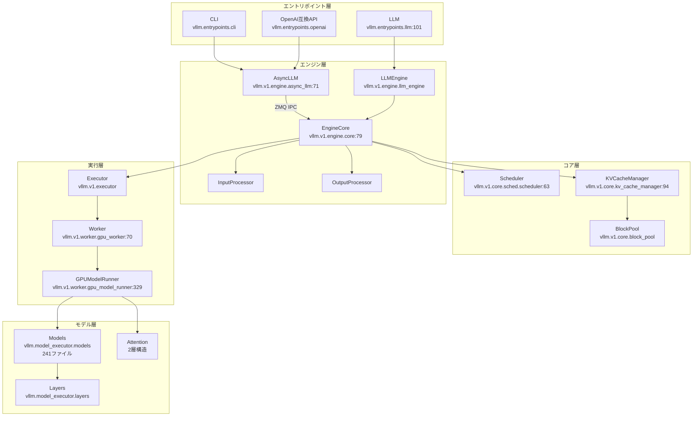

# アーキテクチャ概要

> **深度**: [SHALLOW]
> **確信度**: [VERIFIED]
> **最終更新**: 2026-02-09

## 概要

vLLMはUC Berkeley Sky Computing Lab発のLLM推論・サービングライブラリである。PagedAttentionによるKVキャッシュの効率的メモリ管理、Continuous Batchingによる動的バッチスケジューリングを中核技術とし、高スループット・低レイテンシのLLM推論を実現する。OpenAI互換APIサーバー、マルチモーダル対応、分散推論（Tensor/Pipeline/Data/Expert並列）を備える。

## 全体構造

## アーキテクチャの世代

`vllm/engine/` は `vllm/v1/` への薄いラッパーである。

**参照**: `target/vllm/vllm/engine/llm_engine.py:4` — `LLMEngine = V1LLMEngine` の1行エイリアス

v1が現行アーキテクチャの本体であり、コードリーディングでは `vllm/v1/` を中心に読む。ただし `vllm/model_executor/`、`vllm/distributed/`、`vllm/multimodal/` 等はv1からも直接利用されるため調査対象に含む。

## 主要コンポーネント

| コンポーネント | クラス | パス | 役割 |
|---------------|--------|------|------|
| AsyncLLM | `AsyncLLM(EngineClient)` | `target/vllm/vllm/v1/engine/async_llm.py:71` | 非同期APIトップレベル |
| EngineCore | `EngineCore` | `target/vllm/vllm/v1/engine/core.py:79` | 推論ループ内側。ZMQで外側と通信 |
| Scheduler | `Scheduler(SchedulerInterface)` | `target/vllm/vllm/v1/core/sched/scheduler.py:63` | Continuous Batchingスケジューラ |
| KVCacheManager | `KVCacheManager` | `target/vllm/vllm/v1/core/kv_cache_manager.py:94` | KVキャッシュブロック管理 |
| Executor | `Executor`(ABC) | `target/vllm/vllm/v1/executor/abstract.py` | Worker群を束ねる実行層 |
| Worker | `Worker(WorkerBase)` | `target/vllm/vllm/v1/worker/gpu_worker.py:70` | 1 GPUデバイスを担当 |
| GPUModelRunner | `GPUModelRunner` | `target/vllm/vllm/v1/worker/gpu_model_runner.py:329` | GPU上のフォワードパス実行 |
| VllmConfig | `VllmConfig` | `target/vllm/vllm/config/vllm.py` | 全設定の集約クラス |

## 設計原則

### PagedAttention
KVキャッシュをOSの仮想メモリページングに着想を得てブロック単位で管理する。連続したGPUメモリ確保が不要になり、メモリ断片化を大幅に抑制する。

### Continuous Batching
リクエストの到着・完了に応じてバッチを動的に更新する。固定バッチサイズと異なり、GPU稼働率を最大化できる。

### ZMQ IPC によるプロセス分離
EngineCoreは別プロセス（`EngineCoreProc`）として動作し、ZeroMQソケットで上位エンジン層と通信する。これによりスケジューリングと推論処理を並行実行できる。

### プラグインシステム
`vllm/plugins/` によるプラグイン機構を備え、起動時に `load_general_plugins()` で拡張を読み込む。

## C++/CUDA 拡張

`target/vllm/csrc/` にパフォーマンスクリティカルなネイティブコードが配置されている。PagedAttentionカーネル、LayerNorm、量子化カーネル、カスタムAllReduce等が含まれる。Pythonからは `vllm._custom_ops` 等のバインディング経由で呼び出される。

## 参照ファイル

| ファイル | 主要クラス/関数 |
|---------|----------------|
| `target/vllm/vllm/engine/llm_engine.py` | `LLMEngine`（v1への薄いラッパー） |
| `target/vllm/vllm/v1/engine/async_llm.py` | `AsyncLLM` |
| `target/vllm/vllm/v1/engine/core.py` | `EngineCore`, `EngineCoreProc` |
| `target/vllm/vllm/v1/core/sched/scheduler.py` | `Scheduler` |
| `target/vllm/vllm/v1/core/kv_cache_manager.py` | `KVCacheManager` |
| `target/vllm/vllm/v1/executor/abstract.py` | `Executor`(ABC) |
| `target/vllm/vllm/v1/worker/gpu_worker.py` | `Worker` |
| `target/vllm/vllm/v1/worker/gpu_model_runner.py` | `GPUModelRunner` |
| `target/vllm/vllm/config/vllm.py` | `VllmConfig` |
| `target/vllm/vllm/entrypoints/llm.py` | `LLM` |
