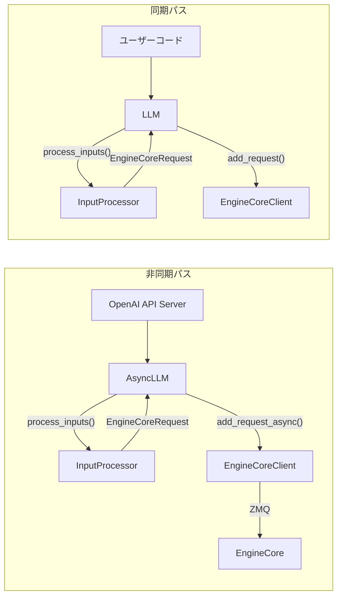

# エントリポイント (AsyncLLM / LLM) サマリー

> **深度**: [SHALLOW]
> **確信度**: [VERIFIED]
> **最終更新**: 2026-02-09

## 概要

`AsyncLLM`と`LLM`はvLLMの2つの主要エントリポイントである。`AsyncLLM`はAPIサーバー（OpenAI互換API等）が使用する非同期パスで、`LLM`はオフラインバッチ推論用の同期パスである。どちらも`InputProcessor`で入力を処理し、`EngineCoreClient`経由でバックエンド（EngineCore）にリクエストを送信する。

## アーキテクチャ



## 主要コンポーネント

| コンポーネント | 用途 | ファイル |
|--------------|------|---------|
| `AsyncLLM` | 非同期推論エントリポイント。AsyncGeneratorでストリーミング出力 | `target/vllm/vllm/v1/engine/async_llm.py:71` |
| `LLM` | 同期バッチ推論エントリポイント。`list[RequestOutput]`を返す | `target/vllm/vllm/entrypoints/llm.py:101` |
| `RequestOutputCollector` | 非同期パスでの出力キュー管理 | `target/vllm/vllm/v1/engine/async_llm.py` |
| `ParentRequest` | n>1サンプリング時の親リクエスト管理 | `target/vllm/vllm/v1/engine/async_llm.py` |

## 主要メソッド

### AsyncLLM

| メソッド | 行 | 説明 |
|---------|-----|------|
| `generate()` | L537 | メインAPI。AsyncGeneratorでRequestOutputをyield |
| `add_request()` | L286 | リクエスト追加。InputProcessor→OutputProcessor→EngineCore |
| `_add_request()` | L414 | 内部: OutputProcessorとEngineCoreに登録 |
| `_run_output_handler()` | L647 | バックグラウンドタスク起動。EngineCore出力を受信→キュー |

### LLM

| メソッド | 行 | 説明 |
|---------|-----|------|
| `generate()` | L396 | バッチ推論API。`list[RequestOutput]`を返す |
| `_add_request()` | L1850 | InputProcessor→llm_engine.add_request() |
| `_run_engine()` | L1900 | ポーリングループ。完了まで`step()`を繰り返す |

## 設定

| パラメータ | デフォルト | 説明 |
|-----------|----------|------|
| `log_requests` | `True` | リクエストログ出力 |
| `log_stats` | 引数指定 | 統計ログ出力 |
| `start_engine_loop` | `True` | エンジンループ自動起動 |

## 呼び出しフロー

```
[APIサーバー or ユーザーコード]
  → AsyncLLM.generate() / LLM.generate()
    → InputProcessor.process_inputs()
      → EngineCoreRequest
    → EngineCoreClient.add_request_async()
      → ZMQ → EngineCore（別プロセス）

[バックグラウンド output_handler タスク]
  → EngineCoreClient.get_output_async()
    → EngineCoreOutputs
  → OutputProcessor.process_outputs()
    → RequestOutput → キューにpush

[generate() AsyncGenerator]
  → キューから取り出してyield
```

## 関連ドキュメント

- [入力処理](../input-processor/summary.md)
- [EngineCoreClient](../engine-core-client/summary.md)
- [データフロー](../../architecture/data-flow.md)
