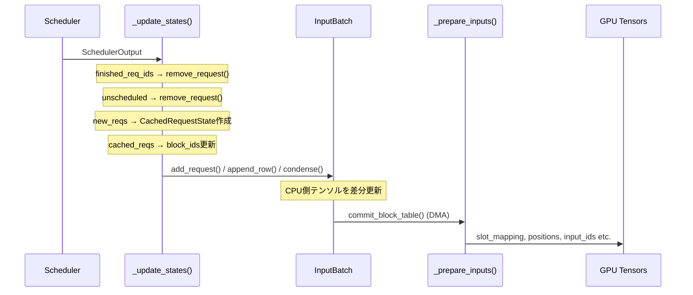

# InputBatch: 永続バッチと状態管理

> **深度**: [MEDIUM]
> **確信度**: [VERIFIED]
> **最終更新**: 2026-02-14

## 概要

GPUModelRunnerは2つのデータ構造でリクエスト状態を管理する:

- **`CachedRequestState`** — リクエストごとの論理状態（step間で永続、プリエンプション後も保持）
- **`InputBatch`** — 全リクエストの物理バッチテンソル群（事前割り当て、step間でCPU側を差分更新）

永続バッチ最適化により、連続するstep間でリクエストの大部分が同じであることを前提に、差分のみを更新する。

## CachedRequestState [VERIFIED]

**参照**: `target/vllm/vllm/v1/worker/gpu_input_batch.py:30`

`@dataclass` で定義されるリクエスト単位の状態。`GPUModelRunner.requests: dict[str, CachedRequestState]` に格納される。

| フィールド | 型 | 説明 |
|-----------|-----|------|
| `req_id` | `str` | リクエストID |
| `prompt_token_ids` | `list[int] \| None` | プロンプトトークンID列 |
| `prompt_embeds` | `Tensor \| None` | プロンプト埋め込み（embedsモード時） |
| `mm_features` | `list[MultiModalFeatureSpec]` | マルチモーダル特徴量 |
| `sampling_params` | `SamplingParams \| None` | サンプリングパラメータ |
| `generator` | `torch.Generator \| None` | シード付き乱数生成器 |
| `block_ids` | `tuple[list[int], ...]` | KVキャッシュグループごとのブロックID列 |
| `num_computed_tokens` | `int` | 計算済みトークン数（プレフィックスキャッシュ含む） |
| `output_token_ids` | `list[int]` | 生成済みトークンID列 |
| `lora_request` | `LoRARequest \| None` | LoRAアダプタ |

**ライフサイクル**: `_update_states()` で作成され、`finished_req_ids` で削除される。プリエンプション時もInputBatchからは除去されるが `self.requests` には保持され、復帰時に再利用される。

**`num_tokens` プロパティ**: `num_prompt_tokens + len(output_token_ids)` — 現在のリクエスト全体のトークン数。

## InputBatch [VERIFIED]

**参照**: `target/vllm/vllm/v1/worker/gpu_input_batch.py:81`

全リクエストの状態を事前割り当てテンソル群で管理するバッチマネージャー。

### 主要テンソル群

| テンソル | shape | 種別 | 説明 |
|---------|-------|------|------|
| `token_ids_cpu_tensor` | `(max_num_reqs, max_model_len)` | CPU (非pin) | 全リクエストのトークンID。**大きくなりうる**（TODOコメントあり） |
| `num_computed_tokens_cpu_tensor` | `(max_num_reqs,)` | CPU (pin) | 計算済みトークン数 |
| `num_tokens_no_spec` | `(max_num_reqs,)` | numpy | Spec Decode以外のトークン数 |
| `num_prompt_tokens` | `(max_num_reqs,)` | numpy | プロンプトトークン数 |
| `temperature_cpu` / `top_p_cpu` / `top_k_cpu` | `(max_num_reqs,)` | CPU (pin) | サンプリングパラメータ |
| `block_table` | `MultiGroupBlockTable` | CpuGpuBuffer | KVキャッシュブロックテーブル |

### リクエスト管理

| データ構造 | 説明 |
|-----------|------|
| `_req_ids: list[str \| None]` | インデックス→リクエストID。`None` は空スロット |
| `req_id_to_index: dict[str, int]` | リクエストID→インデックス。逆引き |
| `num_reqs` プロパティ | `len(req_id_to_index)` — 現在のリクエスト数 |

### add_request() / remove_request() [VERIFIED]

**参照**: `target/vllm/vllm/v1/worker/gpu_input_batch.py:304`, `469`

**`add_request()`**:
1. 空きインデックスを探す（末尾追加 or 空スロット再利用）
2. `token_ids_cpu` にプロンプト+出力トークンIDをコピー
3. `block_table.add_row()` でブロックIDを設定
4. サンプリングパラメータを各テンソルにコピー

**`remove_request()`**:
1. `req_id_to_index` から削除、`_req_ids[index] = None` で空スロット化
2. `batch_update_builder.removed_append()` で空きインデックスを記録
3. サンプリング関連のset/dictからも除去
4. テンソル自体はクリアしない（次のadd_requestで上書きされる）

### condense() — バッチ圧縮 [VERIFIED]

**参照**: `target/vllm/vllm/v1/worker/gpu_input_batch.py:626`

`remove_request()` で生じた空スロットを埋める処理。末尾のリクエストを空スロットに移動し、連続した配列を保つ:

```
[A, _, B, _, C]  →  [A, C, B]  （Cを空スロット1に移動）
```

移動対象: `token_ids_cpu`, `num_tokens_no_spec`, `num_prompt_tokens`, `num_computed_tokens_cpu`, `block_table.move_row()`, サンプリングパラメータ等。

## MultiGroupBlockTable [VERIFIED]

**参照**: `target/vllm/vllm/v1/worker/block_table.py:253`

KVキャッシュグループごとに `BlockTable` を保持するラッパー。Hybridモデル（異なるアテンションタイプが混在）では複数のBlockTableが存在する。

```python
# アクセスパターン
input_batch.block_table[kv_cache_gid]  # → BlockTable
input_batch.block_table.append_row(block_ids, req_index)  # 全グループに委譲
input_batch.block_table.commit_block_table(num_reqs)       # 全グループDMA
```

`block_ids` は `tuple[list[int], ...]` 型で、外側タプルのインデックスがKVキャッシュグループIDに対応。

## 永続バッチ最適化の全体像 [VERIFIED]



**最適化の本質**: 前stepと大部分が同じリクエスト群に対して、変更があったフィールド（新ブロックID、num_computed_tokens等）のみをCPU側で更新し、GPUへはDMA一括転送する。毎step全データを再構築する必要がない。

## 主要ファイル

| ファイル | 主要クラス/関数 |
|---------|----------------|
| `target/vllm/vllm/v1/worker/gpu_input_batch.py` | `CachedRequestState` (L30), `InputBatch` (L81), `add_request()` (L304), `remove_request()` (L469), `condense()` (L626) |
| `target/vllm/vllm/v1/worker/block_table.py` | `MultiGroupBlockTable` (L253) |
