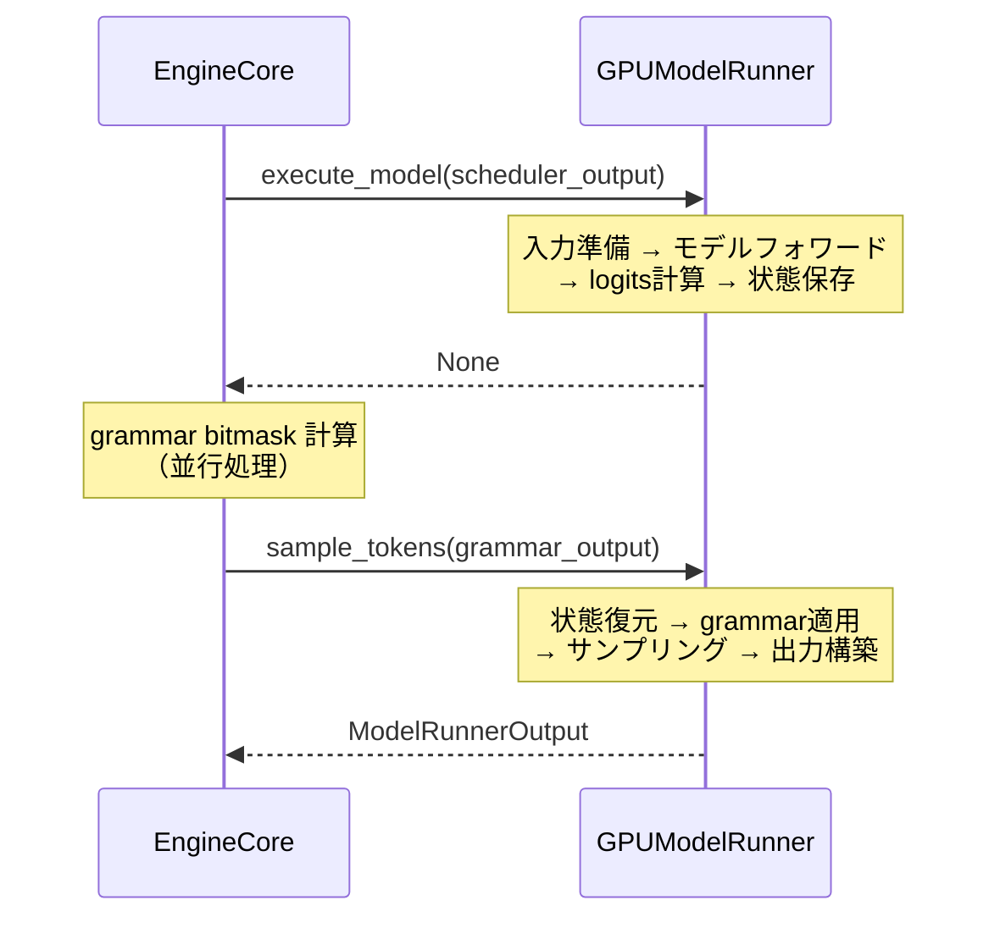

# GPUModelRunner

> **深度**: [SHALLOW]
> **確信度**: [VERIFIED]
> **最終更新**: 2026-02-11

## 概要

GPUModelRunnerは、推論パイプラインの実行中核を担う巨大クラス（約6,300行）である。SchedulerOutputを受け取り、入力テンソルの準備、モデルのforward実行、サンプリングを経て、ModelRunnerOutputを返す。**2フェーズ実行パターン**（`execute_model()` → `sample_tokens()`）を採用し、モデルフォワードとgrammar bitmask計算の並行実行を可能にしている。

## クラス定義

**参照**: `target/vllm/vllm/v1/worker/gpu_model_runner.py:329` (GPUModelRunner)

```python
class GPUModelRunner(
    LoRAModelRunnerMixin,           # LoRAアダプタ管理
    KVConnectorModelRunnerMixin,    # KV Transfer対応
    ECConnectorModelRunnerMixin,    # エンコーダキャッシュ対応
):
```

## 2フェーズ実行パターン

GPUModelRunnerの中核設計。`execute_model()`でモデルフォワードとlogits計算を行い、結果を`ExecuteModelState`に保存して`None`を返す。その後`sample_tokens()`が状態を復元してサンプリングを実行する。



### Phase 1: execute_model()

**参照**: `target/vllm/vllm/v1/worker/gpu_model_runner.py:3312` (execute_model)

```
execute_model(scheduler_output, intermediate_tensors=None)
  │
  ├─ 早期リターン判定                                      # L3335-3367
  │   スケジュールトークン0件 → EMPTY_MODEL_RUNNER_OUTPUT
  │
  ├─ 1. バッチ状態更新                                     # L3376
  │   _update_states(scheduler_output)
  │   → 新規リクエスト登録、キャッシュ済みリクエスト更新
  │
  ├─ 2. 入力準備                                           # L3389
  │   _prepare_inputs(scheduler_output)
  │   → input_ids, positions, logits_indices 計算
  │
  ├─ 3. Attentionメタデータ構築                             # L3400
  │   _build_attention_metadata(scheduler_output, ...)
  │
  ├─ 4. 前処理                                             # L3440-3504
  │   slot_mapping取得、入力トークン/位置/埋め込み準備
  │
  ├─ 5. モデルフォワード                                    # L3521-3603
  │   _model_forward(...)
  │   → hidden_states = model.forward(input_ids, positions, ...)
  │   → logits = compute_logits(hidden_states)
  │
  └─ 6. 状態保存                                            # L3605-3615
      ExecuteModelState(scheduler_output, logits, ...)
      → self.execute_model_state に保存
      → None を返す
```

**戻り値のパターン**:
- `None` — 通常ケース（sample_tokens()を後で呼ぶ）
- `ModelRunnerOutput` — プーリングモデル等（サンプリング不要）
- `IntermediateTensors` — Pipeline Parallelismの中間ランク
- `EMPTY_MODEL_RUNNER_OUTPUT` — スケジュールトークン0件

### Phase 2: sample_tokens()

**参照**: `target/vllm/vllm/v1/worker/gpu_model_runner.py:3621` (sample_tokens)

```
sample_tokens(grammar_output)
  │
  ├─ 1. 状態復元                                            # L3643-3657
  │   ExecuteModelState から logits, scheduler_output 等を復元
  │   self.execute_model_state = None（クリア）
  │
  ├─ 2. Grammar制約適用                                     # L3659-3663
  │   grammar bitmask を logits に適用（構造化出力時）
  │
  ├─ 3. サンプリング                                        # L3665-3666
  │   _sample(logits, spec_decode_metadata) → SamplerOutput
  │
  ├─ 4. 後処理                                             # L3668-3699
  │   バッチ状態に生成トークンを反映
  │   PP時のトークンブロードキャスト
  │   Speculative Decodingのドラフトトークン提案
  │
  └─ 5. ModelRunnerOutput構築                               # L3775-3787
      ModelRunnerOutput(
        req_ids, req_id_to_index,
        sampled_token_ids,    # list[list[int]]
        logprobs,             # numpy配列
        prompt_logprobs_dict, # torch.Tensor
        kv_connector_output, ...
      )
```

## ExecuteModelState

**参照**: `target/vllm/vllm/v1/worker/gpu_model_runner.py:313` (ExecuteModelState)

2フェーズ間の一時状態を保持するNamedTuple。GPUテンソルを含むため、シリアライズはされない。

| フィールド | 型 | 説明 |
|-----------|-----|------|
| `scheduler_output` | `SchedulerOutput` | スケジュール結果 |
| `logits` | `torch.Tensor` | モデル出力logits |
| `spec_decode_metadata` | `SpecDecodeMetadata \| None` | Speculative Decoding情報 |
| `hidden_states` | `torch.Tensor` | 隠れ状態 |
| `sample_hidden_states` | `torch.Tensor` | サンプリング用隠れ状態 |
| `aux_hidden_states` | `list[torch.Tensor] \| None` | 補助隠れ状態 |
| `ec_connector_output` | `ECConnectorOutput \| None` | エンコーダ出力 |
| `cudagraph_stats` | `CUDAGraphStat \| None` | CUDAGraph統計 |
| `slot_mappings` | `dict \| list \| None` | KVキャッシュスロットマッピング |

## 6,300行の内訳 [INFERRED]

GPUModelRunnerが巨大な理由は、以下の多岐にわたる責務を単一クラスに集約しているため:

- **バッチ状態管理**: リクエストの追加・削除、永続バッチテンソルの管理
- **入力準備**: トークンID、位置、埋め込みの計算
- **Attentionメタデータ**: FlashAttention/FlashInfer用メタデータ構築
- **モデルフォワード**: CUDAGraph対応、torch.compile統合
- **サンプリング**: トップk/p/温度、logprobs計算
- **KV Transfer**: KVコネクタとの連携
- **Speculative Decoding**: ドラフトトークン提案・検証
- **Pipeline Parallelism**: 中間テンソル管理
- **LoRA**: アダプタの動的切り替え
- **マルチモーダル**: エンコーダ入力の処理

## 上流・下流の関係

- **上流**: Worker（`execute_model()` / `sample_tokens()`経由で呼び出し）
- **下流**: モデル層（`model.forward()`）、Sampler

## Phase 2 深堀り候補

| テーマ | 関連メソッド | ユーザー関心 |
|--------|------------|------------|
| 入力準備の詳細 | `_prepare_inputs()`, `_update_states()` | 中 |
| Attentionメタデータ | `_build_attention_metadata()` | KVキャッシュ関連で高 |
| CUDAGraph統合 | `_model_forward()`, CUDAGraphランナー | 中 |
| サンプリング実装 | `_sample()`, Sampler | 低 |
| KV Transfer連携 | `KVConnectorModelRunnerMixin` | 高（ユーザー関心2位） |
| マルチモーダル入力 | エンコーダ処理、mm_cache | 高（ユーザー関心3位） → **Phase 2bで調査済み** |

## マルチモーダル処理

マルチモーダル推論時、GPUModelRunnerは `execute_model()` 内で以下の追加処理を行う:

1. **`_execute_mm_encoder()`** (L2293): `model.embed_multimodal()` でビジョンエンコーダ実行。結果を `encoder_cache[mm_hash]` に格納
2. **`_gather_mm_embeddings()`** (L2449): `encoder_cache` からスケジュール範囲に対応する埋め込みをスライス。チャンクPrefill対応
3. **`embed_input_ids()`**: `masked_scatter_` でテキスト + ビジョン埋め込みをマージ → `inputs_embeds` として model.forward() に渡す

`encoder_cache: dict[str, torch.Tensor]` はGPU上のシンプルなdictキャッシュで、Schedulerの `free_encoder_mm_hashes` 指示で解放される。

詳細は [バックエンド MM処理パス](../multimodal/mm-engine-gpu.md) を参照。

## 主要ファイル

| ファイル | 主要クラス/関数 |
|---------|----------------|
| `target/vllm/vllm/v1/worker/gpu_model_runner.py` | `GPUModelRunner` (L329), `execute_model()` (L3312), `sample_tokens()` (L3621), `ExecuteModelState` (L313) |
| `target/vllm/vllm/v1/outputs.py` | `ModelRunnerOutput` (L160), `AsyncModelRunnerOutput` (L200) |
