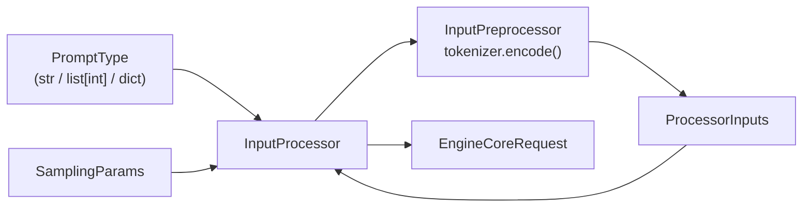

# InputProcessor サマリー

> **深度**: [SHALLOW]
> **確信度**: [VERIFIED]
> **最終更新**: 2026-02-09

## 概要

`InputProcessor`はユーザー入力（テキストプロンプト、SamplingParams等）を内部表現`EngineCoreRequest`に変換するコンポーネントである。トークナイズ、パラメータのバリデーションと正規化、マルチモーダル入力の前処理を担当する。AsyncLLMの初期化時に生成され、フロントエンドプロセスで動作する。

## アーキテクチャ



## 主要コンポーネント

| コンポーネント | 用途 | ファイル |
|--------------|------|---------|
| `InputProcessor` | 入力処理のメインクラス | `target/vllm/vllm/v1/engine/input_processor.py:56` |
| `InputPreprocessor` | トークナイズとマルチモーダル前処理 | `target/vllm/vllm/v1/engine/input_processor.py` (内部利用) |
| `ProcessorInputs` | 前処理結果の中間データ構造 | `target/vllm/vllm/v1/engine/input_processor.py` |

## 主要メソッド

| メソッド | 行 | 入力 | 出力 |
|---------|-----|------|------|
| `process_inputs()` | L521 | `request_id`, `prompt`, `params` | `EngineCoreRequest` |
| `assign_request_id()` | (別メソッド) | `EngineCoreRequest` | None (内部IDを付与) |
| `_validate_lora()` | L535付近 | `LoRARequest` | バリデーション |
| `_validate_params()` | L536付近 | `SamplingParams` | バリデーション |

## process_inputs() の処理フロー

```
process_inputs(request_id, prompt, params)
  1. バリデーション
     ├─ LoRAリクエスト検証
     ├─ パラメータ検証
     └─ data_parallel_rank 範囲チェック
  2. arrival_time 設定
  3. input_preprocessor.preprocess(prompt)
     → テキストをトークナイズ → ProcessorInputs
  4. split_enc_dec_inputs()
     → エンコーダ/デコーダ入力を分離
  5. SamplingParams 正規化
     ├─ clone() で複製
     ├─ max_tokens 未設定時: max_model_len - seq_len
     ├─ update_from_generation_config()
     └─ update_from_tokenizer()
  6. EngineCoreRequest を構築して返す
```

## 設定

| パラメータ | デフォルト | 説明 |
|-----------|----------|------|
| `model_config.max_model_len` | モデル依存 | max_tokens未指定時の上限計算に使用 |
| `cache_config.enable_prefix_caching` | — | マルチモーダルUUID生成方式に影響 |

## 呼び出しフロー

```
AsyncLLM.add_request() / LLM._add_request()
  → InputProcessor.process_inputs()
    → InputPreprocessor.preprocess()
      → tokenizer.encode()
    → EngineCoreRequest を返す
  → InputProcessor.assign_request_id()
    → 外部IDを external_req_id に退避
    → 内部ID（外部ID + 8文字ランダム）を request_id に設定
```

## 関連ドキュメント

- [エントリポイント](../entrypoint/summary.md)
- [データフロー](../../architecture/data-flow.md)
