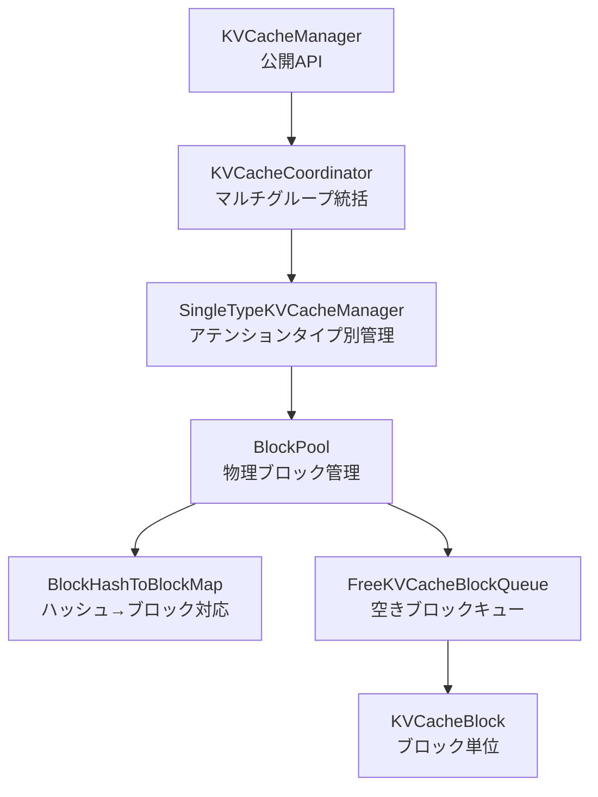

# KVCacheManager サマリー

> **深度**: [MEDIUM]
> **確信度**: [VERIFIED]
> **最終更新**: 2026-02-11

## 概要

`KVCacheManager`はPagedAttentionに基づくKVキャッシュブロックの割り当て・解放・プレフィックスキャッシュ検索を管理するクラスである。階層設計を採用し、`KVCacheManager` → `KVCacheCoordinator` → `SingleTypeKVCacheManager` → `BlockPool` の4層でマルチグループKVキャッシュを統括する。Schedulerから呼び出され、各リクエストに必要なGPUメモリブロックを確保する。

## アーキテクチャ

### クラス階層



### ブロック配置図（allocate_slots）

`allocate_slots()` がリクエストに割り当てるブロックの論理構造:

```
|  comp  | new_comp | ext_comp |   new   | lookahead |
|<------ 既計算トークン ------>|<-- 新規計算対象 -->|
                               |<- 割り当て対象 ->|
```

- `comp`: `request.num_computed_tokens` — 前ステップまでに計算済み
- `new_comp`: `num_new_computed_tokens` — プレフィックスキャッシュから新規にヒットしたトークン
- `ext_comp`: `num_external_computed_tokens` — KVコネクタ（LMCache等）から取得したトークン
- `new`: `num_new_tokens` — 今回計算するトークン
- `lookahead`: `num_lookahead_tokens` — Speculative Decoding用の先読みトークン

## 主要コンポーネント

| コンポーネント | 用途 | ファイル |
|--------------|------|---------|
| `KVCacheManager` | Scheduler向け公開API | `target/vllm/vllm/v1/core/kv_cache_manager.py:94` |
| `KVCacheCoordinator` | 複数KVキャッシュグループの統括 | `target/vllm/vllm/v1/core/kv_cache_manager.py` 内部 |
| `SingleTypeKVCacheManager` | アテンションタイプ別（Full/SlidingWindow等）のブロック管理 | `target/vllm/vllm/v1/core/kv_cache_manager.py` 内部 |
| `BlockPool` | 物理ブロックの割り当て・解放・キャッシュ管理 | `target/vllm/vllm/v1/core/block_pool.py:128` |
| `KVCacheBlock` | ブロックメタデータ（block_id, ref_cnt, block_hash） | `target/vllm/vllm/v1/core/kv_cache_utils.py:107` |
| `BlockHashToBlockMap` | プレフィックスキャッシュ用ハッシュ→ブロック対応表 | `target/vllm/vllm/v1/core/block_pool.py` |
| `FreeKVCacheBlockQueue` | LRU順序の空きブロック管理キュー | `target/vllm/vllm/v1/core/block_pool.py` |

## 主要メソッド

| メソッド | 行 | 説明 |
|---------|-----|------|
| `allocate_slots()` | L206 | リクエストにKVキャッシュブロックを割り当て。成功時`KVCacheBlocks`、失敗時`None` |
| `get_computed_blocks()` | L164 | プレフィックスキャッシュから最長ヒットを検索。`(KVCacheBlocks, int)` |
| `free()` | L378 | リクエストのブロックをプールに返却 |
| `usage` (property) | L143 | KVキャッシュ使用率 (0.0-1.0) |
| `reset_prefix_cache()` | L409 | プレフィックスキャッシュ全体をリセット |
| `get_num_common_prefix_blocks()` | L425 | 全リクエスト共通の先頭ブロック数（Cascade Attention用） |
| `cache_blocks()` | L475 | ブロックをプレフィックスキャッシュに登録 |

## allocate_slots() の詳細

**参照**: `target/vllm/vllm/v1/core/kv_cache_manager.py:206`

```python
def allocate_slots(
    self,
    request: Request,
    num_new_tokens: int,
    num_new_computed_tokens: int = 0,
    new_computed_blocks: KVCacheBlocks | None = None,
    num_lookahead_tokens: int = 0,
    num_external_computed_tokens: int = 0,
    delay_cache_blocks: bool = False,
    num_encoder_tokens: int = 0,
) -> KVCacheBlocks | None
```

処理フロー:
1. 必要ブロック数を計算（`coordinator.get_num_blocks_to_allocate()`）
2. 空きブロック数と比較 → 不足なら `None` を返す（プリエンプション誘発）
3. プレフィックスキャッシュヒットのブロックをリクエストに追加
4. 新規ブロックを割り当て（`coordinator.allocate_new_blocks()`）
5. キャッシング有効時、計算済みブロックをプレフィックスキャッシュに登録

**割り当て失敗時** (L336-338):
```python
if num_blocks_to_allocate > self.block_pool.get_num_free_blocks():
    return None  # → Scheduler がプリエンプションを実行
```

## プレフィックスキャッシュ

**参照**: `target/vllm/vllm/v1/core/kv_cache_manager.py:164` (get_computed_blocks)

プロンプトトークン列をブロックサイズ単位でハッシュ化し、`BlockHashToBlockMap` で過去に計算済みのブロックを検索する。ハッシュチェーンを前方から走査し、最長一致を見つける。

```
get_computed_blocks(request)
  → coordinator.find_longest_cache_hit(request.block_hashes, max_length)
    → block_pool.get_cached_block(block_hash) を順次検索
    → キャッシュミスで検索終了
  → (キャッシュ済みブロック, ヒットトークン数) を返却
```

**制約**: 全トークンがキャッシュヒットしても、logits取得のため最後の1トークンは再計算が必要（`max_cache_hit_length = request.num_tokens - 1`）。

## 参照カウントとEviction

**KVCacheBlock** (L107) の `ref_cnt` フィールドでブロックの使用状況を管理:

| ref_cnt | 状態 |
|---------|------|
| 0 | 空きブロックキュー（`FreeKVCacheBlockQueue`）内。Eviction候補 |
| ≥ 1 | リクエストに使用中。Eviction対象外 |

- **touch()**: キャッシュヒット時に`ref_cnt`を増加し、空きキューから除外
- **free_blocks()**: `ref_cnt`を減少。0になったら空きキューに戻す（逆順追加でLRU効率化）
- **_maybe_evict_cached_block()**: 新規ブロック要求時に空きキューの先頭（最古）からEvict。ハッシュメタデータをリセット

## スライディングウィンドウ対応

アテンションウィンドウ外のブロックを`null_block`（ダミーブロック）で置換し、物理メモリを解放する:

```
remove_skipped_blocks(request_id, total_computed_tokens)
  → num_skipped_tokens = get_num_skipped_tokens(total_computed_tokens)
  → 前方のブロックをnull_blockで置換
  → 解放したブロックをBlockPoolに返却
```

## 設定

| パラメータ | デフォルト | 説明 |
|-----------|----------|------|
| `block_size` | モデル依存 | 1ブロックあたりのトークン数 |
| `enable_caching` | 設定依存 | プレフィックスキャッシュの有効化 |
| `num_gpu_blocks` | プロファイリングで決定 | GPUメモリから算出される総ブロック数 |

## 呼び出しフロー

```
Scheduler.schedule()
  ├─ kv_cache_manager.get_computed_blocks(request)     # プレフィックスキャッシュ検索
  ├─ kv_cache_manager.allocate_slots(request, ...)     # ブロック割り当て
  │   └─ None の場合 → プリエンプション実行
  └─ （完了時）kv_cache_manager.free(request)           # ブロック解放
```

## 関連ドキュメント

- [Scheduler](../scheduler/summary.md)
- [EngineCore](../engine-core/summary.md)
- [データフロー](../../architecture/data-flow.md)
- [用語集: PagedAttention, KVCacheBlock, BlockPool](../../glossary.md)
