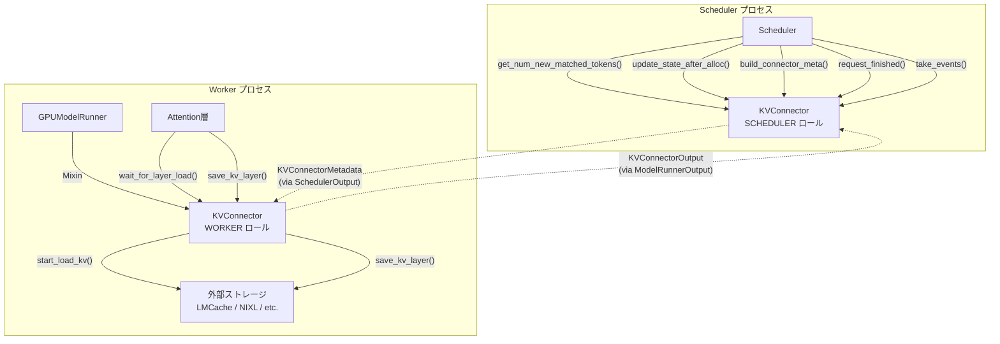
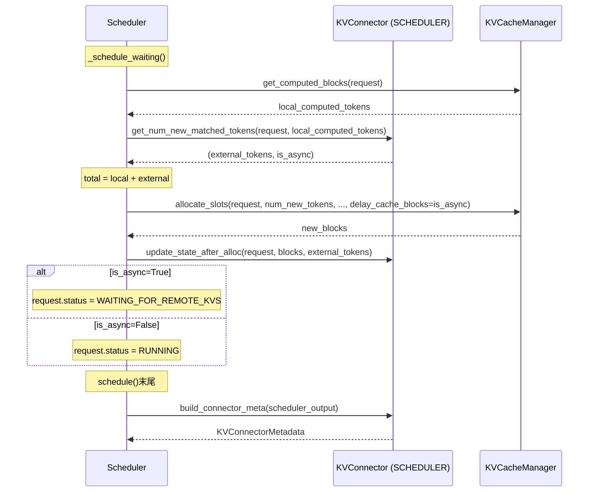

# KV Transfer [MEDIUM] [VERIFIED]

> **最終更新**: 2026-02-15
> **対象ソース**: `target/vllm/vllm/distributed/kv_transfer/`, `target/vllm/vllm/v1/worker/kv_connector_model_runner_mixin.py`

## 概要

KV Transferは、vLLMインスタンス間またはストレージ間でデコーダKVキャッシュを転送するためのプラグインフレームワーク。Disaggregated Prefill（P/D分離）、KVキャッシュのオフロード、外部キャッシュ（LMCache等）との連携を実現する。

**ECConnector（`ec_transfer/`）とは完全に独立した系統**。ECConnectorがエンコーダキャッシュ専用であるのに対し、KV Transferはデコーダ側のKVキャッシュのみを対象とする。ただし、設計パターン（2ロール分離、Factory、Mixin統合）は共通している。

## アーキテクチャ



**参照**: `target/vllm/vllm/distributed/kv_transfer/kv_connector/v1/base.py:147` (KVConnectorBase_V1)

### 2ロール分離

KVConnectorBase_V1は**同一クラス**だが、SchedulerプロセスとWorkerプロセスで**別インスタンス**が生成される。KVConnectorFactory.create_connector()がロールを引数に取り、各プロセスで適切なインスタンスを構築する。

```python
# KVConnectorRole enum
class KVConnectorRole(enum.Enum):
    SCHEDULER = 0  # Schedulerプロセス内
    WORKER = 1     # Workerプロセス内
```

**参照**: `target/vllm/vllm/distributed/kv_transfer/kv_connector/v1/base.py:121`

### グローバル状態管理

Worker側のKVConnectorインスタンスはグローバル変数で管理される。

| 関数 | 用途 |
|------|------|
| `get_kv_transfer_group()` | 現在のコネクタインスタンス取得（assertで非None保証） |
| `has_kv_transfer_group()` | コネクタ初期化済みか確認 |
| `ensure_kv_transfer_initialized()` | 未初期化なら初期化（`is_kv_transfer_instance=True`時のみ） |
| `ensure_kv_transfer_shutdown()` | コネクタ停止・グローバル変数クリア |

**参照**: `target/vllm/vllm/distributed/kv_transfer/kv_transfer_state.py:16-74`

## KVConnectorBase_V1 抽象基底クラス

### Abstract メソッド（7つ）

#### Worker側（4つ）

| メソッド | シグネチャ | 呼び出し元 | 用途 |
|---------|-----------|-----------|------|
| `start_load_kv()` | `(ForwardContext, **kwargs) → None` | Mixin（forward前） | KVキャッシュの非同期ロード開始 |
| `wait_for_layer_load()` | `(layer_name: str) → None` | Attention層内 | レイヤー別ロード完了待機 |
| `save_kv_layer()` | `(layer_name, kv_layer, attn_metadata, **kwargs) → None` | Attention層内 | レイヤー別KVの非同期セーブ開始 |
| `wait_for_save()` | `() → None` | Mixin（forward後） | 全セーブ完了待機 |

**レイヤーバイレイヤー・パイプライニング**: `start_load_kv()`で全レイヤーのロードを非同期開始し、各Attention層のforward内で`wait_for_layer_load()`を呼ぶことで、前のレイヤーの計算中に次レイヤーのKVをロードできる。セーブも`save_kv_layer()`で即座に非同期開始し、`wait_for_save()`で全体の完了を保証する。

**参照**: `target/vllm/vllm/distributed/kv_transfer/kv_connector/v1/base.py:275-338`

#### Scheduler側（3つ）

| メソッド | シグネチャ | 呼び出し元 | 用途 |
|---------|-----------|-----------|------|
| `get_num_new_matched_tokens()` | `(Request, int) → (int\|None, bool)` | Scheduler._schedule_waiting() | 外部KVキャッシュで利用可能なトークン数を返す |
| `update_state_after_alloc()` | `(Request, KVCacheBlocks, int) → None` | Scheduler._schedule_waiting() | ブロック割り当て後のコネクタ状態更新 |
| `build_connector_meta()` | `(SchedulerOutput) → KVConnectorMetadata` | Scheduler.schedule() | ステップ用メタデータ構築（状態リセットを伴う） |

**get_num_new_matched_tokens() の戻り値**:
- `(N, False)` — N個の外部トークンが同期的に利用可能
- `(N, True)` — N個の外部トークンが非同期ロード（WAITING_FOR_REMOTE_KVS状態へ遷移）
- `(None, _)` — まだ判定不能（次回再問い合わせ）
- `(0, False)` — 外部キャッシュなし

**参照**: `target/vllm/vllm/distributed/kv_transfer/kv_connector/v1/base.py:416-485`

### 非Abstract 重要メソッド

| メソッド | 用途 | デフォルト動作 |
|---------|------|--------------|
| `bind_connector_metadata()` | Scheduler→Workerメタデータ設定 | `_connector_metadata`に保存 |
| `clear_connector_metadata()` | メタデータクリア | Noneに設定 |
| `register_kv_caches()` | KVキャッシュテンソル事前登録（NIXL等で必要） | no-op |
| `register_cross_layers_kv_cache()` | 全レイヤー一括KVテンソル登録 | no-op |
| `set_host_xfer_buffer_ops()` | ホスト↔デバイス間コピー操作設定 | no-op |
| `handle_preemptions()` | プリエンプション通知（ブロック上書き前） | no-op |
| `get_finished()` | 非同期転送完了リクエストID取得 | `(None, None)` |
| `get_block_ids_with_load_errors()` | ロード失敗ブロックID取得 | `set()` |
| `request_finished()` | リクエスト完了通知・遅延解放制御 | `(False, None)` |
| `take_events()` | KVキャッシュイベント取得 | 空 |
| `update_connector_output()` | Worker出力でScheduler状態更新 | no-op |

### 補助クラス・インタフェース

| クラス | 用途 |
|-------|------|
| `KVConnectorMetadata` (ABC) | Scheduler→Worker間通信メタデータ |
| `KVConnectorHandshakeMetadata` (ABC) | P/Dワーカー間帯域外ハンドシェイク |
| `SupportsHMA` (ABC) | Hybrid Memory Allocator対応インタフェース |
| `CopyBlocksOp` (Callable) | `(s_tensors, d_tensors, s_indices, d_indices, direction) → None` |

**参照**: `target/vllm/vllm/distributed/kv_transfer/kv_connector/v1/base.py:82-144`

### Cross-Layer Blocks

`prefer_cross_layer_blocks`プロパティが`True`のコネクタは、全レイヤーのKVを1つの連続テンソルにまとめたレイアウトを使用する。これにより、ブロック単位で全レイヤーのKVデータを一括転送でき、転送効率が向上する。

**参照**: `target/vllm/vllm/v1/worker/kv_connector_model_runner_mixin.py:113-177`

## KVConnectorFactory

遅延ロードパターンのファクトリ。`module_path` + `class_name`を登録し、使用時にimportする。

### 登録済みコネクタ（10個）

| 名前 | 用途 | 特徴 |
|------|------|------|
| `ExampleConnector` | デバッグ用 | safetensorsでディスク保存 |
| `LMCacheConnectorV1` | LMCache統合 | チャンク単位KV保存・3層ストレージ |
| `LMCacheMPConnector` | LMCacheマルチプロセス版 | 別プロセスでLMCache実行 |
| `NixlConnector` | NIXL (RDMA) | 高速GPU間転送 |
| `P2pNcclConnector` | P2P NCCL | NCCL経由の直接GPU転送 |
| `OffloadingConnector` | KVオフロード | CPU/ディスクへのオフロード |
| `MultiConnector` | 複合コネクタ | 複数バックエンドを束ねる |
| `MoRIIOConnector` | MORIIO | MORIIOフレームワーク |
| `MooncakeConnector` | Mooncake | 分散学習フレームワーク |
| `DecodeBenchConnector` | ベンチマーク用 | デコード性能測定 |

**動的ロード**: `kv_connector_module_path`設定で未登録クラスも使用可能。旧2引数シグネチャとの互換性チェック（`supports_kw()`）あり。

**参照**: `target/vllm/vllm/distributed/kv_transfer/kv_connector/factory.py:27-203`

## Scheduler統合

### 外部キャッシュ問い合わせフロー

WAITINGリクエストのスケジューリング時、ローカルプレフィックスキャッシュに加えて外部KVキャッシュも問い合わせる。



**参照**: `target/vllm/vllm/v1/core/sched/scheduler.py:608-772`

### WAITING_FOR_REMOTE_KVS 状態管理

非同期KVロード中のリクエストは`WAITING_FOR_REMOTE_KVS`状態に遷移する。

1. **`_update_from_kv_xfer_finished()`**: Worker側コネクタの`finished_recving`/`finished_sending`を処理
   - `finished_recving` → `finished_recving_kv_req_ids`に追加（次stepで処理）
   - `finished_sending` → ブロック即時解放
2. **`_update_waiting_for_remote_kv()`**: WAITING_FOR_REMOTE_KVS状態のリクエストを確認
   - 受信完了 → `kv_cache_manager.cache_blocks()`でキャッシュ → WAITING状態に戻す
   - ロードエラー → 有効なcomputed_tokensだけキャッシュ、またはブロック解放

**参照**: `target/vllm/vllm/v1/core/sched/scheduler.py:1961-2034`

### リクエスト完了時の遅延解放

`_connector_finished()`は`request_finished()`を呼び、コネクタがブロックの非同期送信を引き受けるかを確認する。

```python
delay_free, kv_xfer_params = connector.request_finished(request, block_ids)
# delay_free=True → ブロックはget_finished()で送信完了報告後に解放
# kv_xfer_params → リクエスト出力に含めるKV転送パラメータ
```

**参照**: `target/vllm/vllm/v1/core/sched/scheduler.py:1930-1959`

## Worker/GPUModelRunner 統合

### KVConnectorModelRunnerMixin

GPUModelRunnerにミックスインされ、KVコネクタのライフサイクルを管理する。

#### `_get_kv_connector_output()` — コアライフサイクル

```python
@contextmanager
def _get_kv_connector_output(scheduler_output, wait_for_save=True):
    output = KVConnectorOutput()
    kv_connector = get_kv_transfer_group()

    # 1. Scheduler側メタデータをバインド
    kv_connector.bind_connector_metadata(scheduler_output.kv_connector_metadata)

    # 2. 非同期KVロード開始（forward前）
    kv_connector.start_load_kv(get_forward_context())

    try:
        yield output  # ← ここでモデルforward実行（save_kv_layer含む）
    finally:
        # 3. セーブ完了待機
        if wait_for_save:
            kv_connector.wait_for_save()

        # 4. 完了・エラー情報収集
        output.finished_sending, output.finished_recving = (
            kv_connector.get_finished(scheduler_output.finished_req_ids))
        output.invalid_block_ids = kv_connector.get_block_ids_with_load_errors()
        output.kv_connector_stats = kv_connector.get_kv_connector_stats()
        output.kv_cache_events = kv_connector.get_kv_connector_kv_cache_events()

        # 5. メタデータクリア
        kv_connector.clear_connector_metadata()
```

**参照**: `target/vllm/vllm/v1/worker/kv_connector_model_runner_mixin.py:80-111`

#### execute_model() 内の呼び出し位置

```python
# GPUModelRunner.execute_model()

# (1) プリエンプション処理
if scheduler_output.preempted_req_ids and has_kv_transfer_group():
    get_kv_transfer_group().handle_preemptions(scheduler_output.preempted_req_ids)

# (2) forward不要時のKV転送
if num_reqs == 0:
    return self.kv_connector_no_forward(scheduler_output, self.vllm_config)

# (3) モデルforward + KVコネクタ
with self.maybe_get_kv_connector_output(scheduler_output) as kv_connector_output:
    model_output = self._model_forward(...)

# (4) sample_tokens()に引き渡し
self.kv_connector_output = kv_connector_output  # ephemeral state
```

**参照**: `target/vllm/vllm/v1/worker/gpu_model_runner.py:3330-3617`

### KVコネクタ初期化

GPUModelRunner.`_initialize_kv_caches()`内で、KVキャッシュ確保後にコネクタを登録する。

```python
if has_kv_transfer_group():
    kv_transfer_group = get_kv_transfer_group()
    if self.cross_layers_kv_cache is not None:
        kv_transfer_group.register_cross_layers_kv_cache(
            self.cross_layers_kv_cache, self.cross_layers_attn_backend)
    else:
        kv_transfer_group.register_kv_caches(kv_caches)
    kv_transfer_group.set_host_xfer_buffer_ops(copy_kv_blocks)
```

**参照**: `target/vllm/vllm/v1/worker/gpu_model_runner.py:6079-6088`

## KVConnectorOutput

Worker→Schedulerへのフィードバック構造体。

| フィールド | 型 | 用途 |
|-----------|---|------|
| `finished_sending` | `set[str] \| None` | 送信完了リクエストID |
| `finished_recving` | `set[str] \| None` | 受信完了リクエストID |
| `kv_connector_stats` | `KVConnectorStats \| None` | 転送統計 |
| `kv_cache_events` | `KVConnectorKVEvents \| None` | ブロック保存/削除イベント |
| `invalid_block_ids` | `set[int]` | ロード失敗ブロックID |
| `expected_finished_count` | `int` | ハンドシェイクベースコネクタ用 |

**参照**: `target/vllm/vllm/v1/outputs.py:123-148`

## KV Cache Events

外部システム（ルーティング、モニタリング等）へのKVキャッシュ状態通知システム。

### イベント型

| イベント | フィールド | 発行タイミング |
|---------|-----------|--------------|
| `BlockStored` | `block_hashes, parent_block_hash, token_ids, block_size, lora_id, medium` | KVブロック保存時 |
| `BlockRemoved` | `block_hashes, medium` | KVブロック削除時 |
| `AllBlocksCleared` | なし | 全ブロッククリア時 |

**参照**: `target/vllm/vllm/distributed/kv_events.py:49-84`

### イベントフロー

1. Worker側コネクタが`BlockStored`/`BlockRemoved`イベントを生成
2. `_get_kv_connector_output()`がイベントを`KVConnectorOutput.kv_cache_events`に収集
3. Scheduler側で`update_connector_output()`→`KVEventAggregator`で全Worker共通イベントを集約
4. `take_events()`で集約済みイベントを取得
5. `EventPublisher`（ZMQ PUB/ROUTERまたはNull）で外部に配信

### EventPublisher

| 実装 | 用途 |
|------|------|
| `NullEventPublisher` | no-op（デフォルト） |
| `ZmqEventPublisher` | ZMQ PUB/ROUTERで配信。インメモリreplay buffer付き |

**参照**: `target/vllm/vllm/distributed/kv_events.py:205-473`

## KVTransferConfig

KV Transferの設定。`--kv-transfer-config`で指定する。

| フィールド | デフォルト | 用途 |
|-----------|----------|------|
| `kv_connector` | None | コネクタ名（"LMCacheConnectorV1"等） |
| `kv_role` | None | `"kv_producer"` / `"kv_consumer"` / `"kv_both"` |
| `engine_id` | UUID | エンジン識別子 |
| `kv_buffer_device` | "cuda" | バッファデバイス |
| `kv_buffer_size` | 1e9 | バッファサイズ（バイト） |
| `kv_rank` | None | P/D内のランク（0=prefill, 1=decode） |
| `kv_parallel_size` | 1 | 並列インスタンス数 |
| `kv_ip` / `kv_port` | "127.0.0.1" / 14579 | 接続先 |
| `kv_connector_extra_config` | {} | コネクタ固有追加設定 |
| `kv_connector_module_path` | None | 動的ロード用モジュールパス |
| `kv_load_failure_policy` | "recompute" | ロード失敗時ポリシー（"recompute" or "fail"） |

**参照**: `target/vllm/vllm/config/kv_transfer.py:17-117`

## ECConnectorとの比較

| 観点 | KV Transfer | ECConnector |
|------|-------------|-------------|
| 対象 | デコーダKVキャッシュ | エンコーダキャッシュ |
| 基底クラス | `KVConnectorBase_V1` | `ECConnectorBase` |
| abstractメソッド数 | 7 | 5 |
| ロール分離 | SCHEDULER / WORKER | SCHEDULER / WORKER |
| Factory | `KVConnectorFactory` | `ECConnectorFactory` |
| Mixin | `KVConnectorModelRunnerMixin` | `ECConnectorModelRunnerMixin` |
| レイヤー別操作 | あり（save/load per layer） | なし（エンコーダ出力一括） |
| 非同期ロード | あり（WAITING_FOR_REMOTE_KVS） | なし |
| イベント通知 | あり（BlockStored/Removed） | なし |
| 登録済み実装数 | 10 | 2（Example, SHM） |
| 設定クラス | `KVTransferConfig` | `ECTransferConfig` |

## ディレクトリ構造

```
target/vllm/vllm/distributed/kv_transfer/
├── kv_connector/
│   ├── base.py                    # KVConnectorBase リダイレクト
│   ├── factory.py                 # KVConnectorFactory + 10コネクタ登録
│   ├── utils.py
│   └── v1/
│       ├── base.py                # KVConnectorBase_V1 (抽象基底)
│       ├── metrics.py             # KVConnectorStats, Prometheus
│       ├── example_connector.py   # safetensorsデバッグ用
│       ├── lmcache_connector.py   # LMCacheラッパー
│       ├── lmcache_mp_connector.py
│       ├── nixl_connector.py
│       ├── offloading_connector.py
│       ├── multi_connector.py     # 複合コネクタ
│       ├── decode_bench_connector.py
│       ├── lmcache_integration/   # native LMCache実装
│       │   ├── vllm_v1_adapter.py
│       │   ├── multi_process_adapter.py
│       │   └── utils.py
│       ├── p2p/                   # P2P NCCLコネクタ
│       ├── moriio/                # MORIIOコネクタ
│       └── mooncake/              # Mooncakeコネクタ
├── kv_transfer_state.py           # グローバル状態管理
└── __init__.py

target/vllm/vllm/distributed/kv_events.py  # イベントシステム
target/vllm/vllm/config/kv_transfer.py     # KVTransferConfig
target/vllm/vllm/v1/worker/kv_connector_model_runner_mixin.py  # Mixin
```

## 依存関係

### 上流（KV Transferを使う側）

| コンポーネント | 使い方 |
|--------------|--------|
| Scheduler | 外部キャッシュ問い合わせ、メタデータ構築、完了処理 |
| GPUModelRunner | Mixinでライフサイクル管理、KVキャッシュ登録 |
| Attention層 | `wait_for_layer_load()` / `save_kv_layer()` 呼び出し |

### 下流（KV Transferが使う側）

| コンポーネント | 使い方 |
|--------------|--------|
| KVCacheManager | ブロック割り当て・解放情報の取得 |
| ForwardContext | KVキャッシュテンソルへのアクセス |
| LMCache / NIXL / etc. | 実際のKVデータ保存・取得 |
