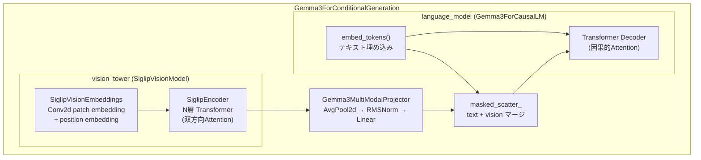

# Gemma3 ビジョンエンコーダと画像処理 [MEDIUM] [VERIFIED]

> **最終更新**: 2026-02-11

Gemma3 モデルにおけるビジョンエンコーダ（SiglipVisionModel）、プロジェクタ（Gemma3MultiModalProjector）、および text + vision 埋め込みマージの詳細。

## モデルアーキテクチャ全体像



**参照**: `target/vllm/vllm/model_executor/models/gemma3_mm.py:481-694`

## 1. SiglipVisionModel（ビジョンエンコーダ）

### 構造

**参照**: `target/vllm/vllm/model_executor/models/siglip.py:848-894`

```
SiglipVisionModel
  └─ SiglipVisionTransformer (L681)
      ├─ SiglipVisionEmbeddings (L282)
      │   ├─ patch_embedding: Conv2d(3, hidden_size, kernel=patch_size, stride=patch_size)
      │   └─ position_embedding: Embedding(num_patches, hidden_size)
      ├─ SiglipEncoder (L520)
      │   └─ layers: ModuleList[SiglipEncoderLayer] × N
      │       ├─ layer_norm1 → SiglipAttention (MMEncoderAttention)
      │       └─ layer_norm2 → SiglipMLP
      └─ post_layernorm: LayerNorm（最終層のみ）
```

### パッチ埋め込み (SiglipVisionEmbeddings)

**参照**: `target/vllm/vllm/model_executor/models/siglip.py:282-352`

```python
# 入力: pixel_values (batch, 3, H, W)
patch_embeds = self.patch_embedding(pixel_values)  # Conv2d: (batch, hidden_size, grid, grid)
embeddings = patch_embeds.flatten(2).transpose(1, 2)  # (batch, num_patches, hidden_size)
embeddings += self.position_embedding(position_ids)    # 位置埋め込みを加算
```

- `image_size = 256` の場合、`patch_size = 16` → `num_patches = (256/16)² = 256`
- 各パッチは `16×16×3 = 768` ピクセルから `hidden_size` 次元のベクトルに変換
- 位置埋め込みは学習済みの `nn.Embedding`（補間対応あり）

### エンコーダ層 (SiglipEncoder)

**参照**: `target/vllm/vllm/model_executor/models/siglip.py:520-567`

各エンコーダ層の構造:
```
SiglipEncoderLayer:
    residual = hidden_states
    hidden_states = layer_norm1(hidden_states)
    hidden_states = self_attn(hidden_states)     ← MMEncoderAttention（双方向）
    hidden_states = residual + hidden_states
    residual = hidden_states
    hidden_states = layer_norm2(hidden_states)
    hidden_states = mlp(hidden_states)
    hidden_states = residual + hidden_states
```

- **アテンション型**: `MMEncoderAttention`（双方向、因果マスクなし）
- 全パッチが全パッチを参照できる（テキストの因果アテンションとは異なる）

### forward() フロー

**参照**: `target/vllm/vllm/model_executor/models/siglip.py:755-788`

```python
def forward(self, pixel_values, *, select_layers=None, feature_select_strategy=None):
    hidden_states = self.embeddings(pixel_values)      # (batch, num_patches, hidden_size)
    encoder_outputs = self.encoder(inputs_embeds=hidden_states)  # N層 Transformer
    encoder_outputs = resolve_visual_encoder_outputs(   # 特徴選択
        encoder_outputs, select_layers, feature_select_strategy
    )
    return self.last_hs_proc(encoder_outputs)           # post_layernorm + head
```

出力: `(batch, num_patches, hidden_size)` — 典型的に `(batch, 256, 1152)`

## 2. Gemma3MultiModalProjector（投射層）

**参照**: `target/vllm/vllm/model_executor/models/gemma3_mm.py:432-473`

ビジョンエンコーダの出力をテキスト埋め込み空間に変換する。

### パラメータ

```python
mm_input_projection_weight: (vision_hidden_size, text_hidden_size)  # 例: (1152, 2048)
mm_soft_emb_norm: GemmaRMSNorm(vision_hidden_size)
avg_pool: AvgPool2d(kernel_size, stride=kernel_size)
```

### 設定値の計算

```python
patches_per_image = image_size // patch_size           # 256 // 16 = 16
tokens_per_side = int(mm_tokens_per_image ** 0.5)      # int(256 ** 0.5) = 16
kernel_size = patches_per_image // tokens_per_side     # 16 // 16 = 1
```

`kernel_size = 1` の場合、AvgPool2dは実質的にno-op（パッチ数が変わらない）。`mm_tokens_per_image` が小さい設定ではダウンサンプリングが発生する。

### forward() フロー

```python
def forward(self, vision_outputs):
    # vision_outputs: (batch, hidden_size, num_patches) — エンコーダ出力のtranspose形式
    batch_size, _, seq_length = vision_outputs.shape

    # 1. 2Dグリッドへリシェイプ
    reshaped = vision_outputs.transpose(1, 2).reshape(
        batch_size, seq_length, patches_per_image, patches_per_image
    )  # (batch, seq_length, 16, 16)

    # 2. 平均プーリング（ダウンサンプリング）
    pooled = self.avg_pool(reshaped)  # kernel=1の場合: (batch, seq_length, 16, 16)
    pooled = pooled.flatten(2).transpose(1, 2)  # (batch, mm_tokens_per_image, seq_length)

    # 3. RMS正規化
    normed = self.mm_soft_emb_norm(pooled)

    # 4. 線形投射: vision_hidden_size → text_hidden_size
    projected = torch.matmul(normed, self.mm_input_projection_weight)
    # (batch, mm_tokens_per_image, text_hidden_size)

    return projected.type_as(vision_outputs)
```

**重要な注意**: テキスト埋め込みの正規化とは異なり、ビジョン埋め込みには `mm_soft_emb_norm` のみが適用される。vocab embedding に適用されるスケーリング（`embed_tokens * normalizer`）はビジョン埋め込みには適用 **されない**。

## 3. embed_multimodal() と _process_image_input()

**参照**: `target/vllm/vllm/model_executor/models/gemma3_mm.py:567-594`

GPUModelRunner の `_execute_mm_encoder()` から呼ばれるメインのエンコーダ実行パス:

```python
def embed_multimodal(self, **kwargs):
    image_input = self._parse_and_validate_image_input(**kwargs)  # pixel_values 取得
    if image_input is None:
        return []
    return self._process_image_input(image_input)

def _process_image_input(self, image_input):
    pixel_values = image_input["pixel_values"]    # (total_patches, 3, image_size, image_size)
    num_patches = image_input["num_patches"]       # (num_images,) — 画像ごとのパッチ数

    # ビジョンエンコーダ実行
    image_features = self._image_pixels_to_features(self.vision_tower, pixel_values)

    # プロジェクタで投射
    image_embeds = self.multi_modal_projector(image_features)

    # 画像ごとに分割 + flatten
    return [e.flatten(0, 1) for e in image_embeds.split(num_patches.tolist())]
    # list[Tensor(mm_tokens_per_image, text_hidden_size)]
```

### テンソル形状の追跡

画像1枚、Pan-and-Scan なし（`num_patches=1`）の場合:

| ステージ | 形状 | 説明 |
|---------|------|------|
| 入力 pixel_values | `(1, 3, 256, 256)` | RGB画像 |
| patch_embedding | `(1, 1152, 16, 16)` | Conv2d出力 |
| flatten + transpose | `(1, 256, 1152)` | パッチシーケンス |
| + position_embedding | `(1, 256, 1152)` | 位置情報付加 |
| SiglipEncoder (N層) | `(1, 256, 1152)` | Transformer処理 |
| Projector reshape | `(1, 256, 16, 16)` | 2Dグリッド |
| AvgPool2d (k=1) | `(1, 256, 16, 16)` | no-op |
| flatten + transpose | `(1, 256, 256)` | ? |
| mm_soft_emb_norm | `(1, 256, 1152)` | RMS正規化 |
| matmul(projection) | `(1, 256, 2048)` | テキスト空間 |
| flatten(0,1) | `(256, 2048)` | 最終出力 |

## 4. テキスト + ビジョン埋め込みのマージ

### embed_input_ids()

**参照**: `target/vllm/vllm/model_executor/models/gemma3_mm.py:596-614`

```python
def embed_input_ids(self, input_ids, multimodal_embeddings=None, *, is_multimodal=None, ...):
    if multimodal_embeddings is None or is_multimodal is None:
        return super().embed_input_ids(input_ids)  # テキストのみ
    return super().embed_input_ids(
        input_ids, multimodal_embeddings=multimodal_embeddings,
        is_multimodal=is_multimodal, handle_oov_mm_token=True,
    )
```

### _merge_multimodal_embeddings()

**参照**: `target/vllm/vllm/model_executor/models/utils.py:445-487`

```python
def _merge_multimodal_embeddings(inputs_embeds, multimodal_embeddings, is_multimodal):
    mm_embeds_flat = _flatten_embeddings(multimodal_embeddings)
    # in-place 置換: is_multimodal=True の位置を mm_embeds_flat で上書き
    inputs_embeds.masked_scatter_(
        is_multimodal.unsqueeze(-1),
        mm_embeds_flat.to(dtype=inputs_embeds.dtype)
    )
    return inputs_embeds
```

**`masked_scatter_` の動作**:
1. `is_multimodal`: `(seq_len,)` のboolテンソル（True = 画像プレースホルダー位置）
2. `is_multimodal.unsqueeze(-1)`: `(seq_len, 1)` → ブロードキャストで `(seq_len, hidden_size)` に展開
3. `mm_embeds_flat`: True位置の数 × hidden_size の連続テンソル
4. True位置に順番に mm_embeds_flat の値を書き込む

**制約**: `is_multimodal.sum() == len(mm_embeds_flat)` でなければランタイムエラー

### handle_oov_mm_token

Gemma3 は `handle_oov_mm_token=True` を指定。これは image_token_id が vocab の範囲外の場合でも安全に処理するための仕組み。

## 5. Pan-and-Scan（パノラマクロップ）

**参照**: `target/vllm/vllm/model_executor/models/gemma3_mm.py:109-176`

アスペクト比が大きい画像に対して、複数のクロップを生成して詳細認識を向上させる仕組み。

### クロップ数の計算

```python
def get_num_crops(self, *, image_width, image_height, processor):
    # 横長画像の場合
    if image_width >= image_height:
        if width/height < min_ratio:  return 0  # 比率が小さすぎる
        num_crops_w = min(floor(width/min_crop_size), floor(w/h + 0.5))
        num_crops_w = max(2, num_crops_w)
        num_crops_w = min(max_num_crops, num_crops_w)
        num_crops_h = 1

    # 縦長画像の場合は逆
    ...

    # クロップサイズが小さすぎる場合は無効
    if min(crop_size_w, crop_size_h) < min_crop_size:
        return 0

    return num_crops_w * num_crops_h
```

### Pan-and-Scan時のプロンプト

```
"Here is the original image <full_image_seq> and here are some crops to help you see better <full_image_seq> <full_image_seq>"
```

各 `<full_image_seq>` は `image_seq_length`（=256）トークンを消費。

**V1での制限**: Pan-and-Scan は簡略化されたアテンションパターンを使用するため、最適ではない結果になる可能性がある。

## 6. forward() — 最終推論

**参照**: `target/vllm/vllm/model_executor/models/gemma3_mm.py:616-635`

```python
def forward(self, input_ids, positions, intermediate_tensors=None, inputs_embeds=None, **kwargs):
    if intermediate_tensors is not None:
        inputs_embeds = None  # Pipeline Parallelism の中間ランク

    hidden_states = self.language_model.model(
        input_ids,
        positions,
        intermediate_tensors,
        inputs_embeds=inputs_embeds,  # text + vision マージ済み
        **kwargs,
    )
    return hidden_states
```

マルチモーダル時は `inputs_embeds` が渡され、`input_ids` は使用されない（embed_input_ids で既に埋め込み済みのため）。

## データフロー全体

```
pixel_values: (total_patches, 3, 256, 256)
      │
      ▼
SiglipVisionEmbeddings
  Conv2d(3→1152, k=16, s=16) + position_embedding
      │
      ▼
(total_patches, 256, 1152)
      │
      ▼
SiglipEncoder (N層 Transformer, 双方向Attention)
      │
      ▼
(total_patches, 256, 1152)
      │
      ▼
Gemma3MultiModalProjector
  reshape → AvgPool2d → RMSNorm → matmul(1152→2048)
      │
      ▼
(total_patches, 256, 2048)
      │
      ▼
split by num_patches → list[(mm_tokens, 2048)]
      │
      ▼
encoder_cache[mm_hash] に格納
      │
      ▼
_gather_mm_embeddings() でスライス
      │
      ▼
embed_input_ids():
  text_embeds = embed_tokens(input_ids)     # (seq_len, 2048)
  merged = masked_scatter_(text_embeds, is_multimodal, mm_embeds)
      │
      ▼
language_model.model(inputs_embeds=merged)  # Gemma3 Decoder
```

## 主要ファイル

| ファイル | 主要クラス/関数 | 行 |
|---------|----------------|-----|
| `target/vllm/vllm/model_executor/models/gemma3_mm.py` | `Gemma3ForConditionalGeneration` | L481 |
| `target/vllm/vllm/model_executor/models/gemma3_mm.py` | `Gemma3MultiModalProjector` | L432 |
| `target/vllm/vllm/model_executor/models/gemma3_mm.py` | `Gemma3ProcessingInfo`, `Gemma3MultiModalProcessor` | L77, L276 |
| `target/vllm/vllm/model_executor/models/siglip.py` | `SiglipVisionModel` | L848 |
| `target/vllm/vllm/model_executor/models/siglip.py` | `SiglipVisionEmbeddings` | L282 |
| `target/vllm/vllm/model_executor/models/siglip.py` | `SiglipEncoder` | L520 |
| `target/vllm/vllm/model_executor/models/utils.py` | `_merge_multimodal_embeddings()` | L445 |

## 関連ドキュメント

- [フロントエンド MM処理パス](mm-processing.md)
- [バックエンド MM処理パス](mm-engine-gpu.md)
- [マルチモーダル処理パイプライン概要](summary.md)
