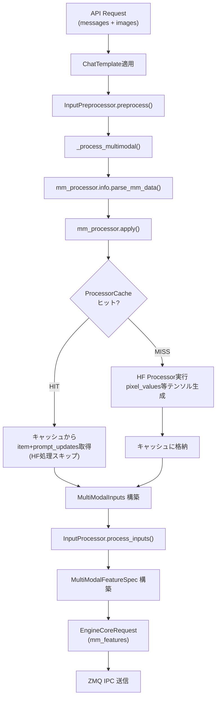

# フロントエンド マルチモーダル処理パス [MEDIUM] [VERIFIED]

> **最終更新**: 2026-02-11

APIリクエストに含まれる画像データが、フロントエンドプロセス（P0）でどのように処理され、EngineCoreRequest として ZMQ 経由でバックエンド（P1）へ送信されるかを追跡する。テキスト推論パスとの差分を中心に記述する。

## 全体フロー



## 1. チャットテンプレートとプレースホルダー

### テンプレート適用前後の文字列（Gemma3の例）

**適用前**（OpenAI形式のメッセージ）:
```json
{
  "messages": [
    {"role": "user", "content": [
      {"type": "image_url", "image_url": {"url": "data:image/png;base64,..."}},
      {"type": "text", "text": "この画像は何ですか？"}
    ]}
  ]
}
```

**チャットテンプレート適用後**（テキスト）:
```
<bos><start_of_turn>user
<start_of_image>この画像は何ですか？<end_of_turn>
<start_of_turn>model
```

ここで `<start_of_image>` がプレースホルダートークンとなる。

### プレースホルダーの展開

`Gemma3ProcessingInfo.get_image_repl()` がプレースホルダーを展開する。

**参照**: `target/vllm/vllm/model_executor/models/gemma3_mm.py:178`

```
<start_of_image> → processor.full_image_sequence
```

`processor.full_image_sequence` はHuggingFace Gemma3Processorが定義する完全なトークン列で、`<start_of_image>` + image_token × image_seq_length + `<end_of_image>` の形式。

**Pan-and-Scan有効時**（複数クロップ）:
```
"Here is the original image <full_image_seq> and here are some crops to help you see better <full_image_seq> <full_image_seq>"
```

**参照**: `target/vllm/vllm/model_executor/models/gemma3_mm.py:196-211`

### 画像1枚あたりのトークン数

```python
num_tokens = (num_crops + 1) * image_seq_length
```

**参照**: `target/vllm/vllm/model_executor/models/gemma3_mm.py:213-230`

- `image_seq_length`: Gemma3Processorの設定値（典型的に256）
- `num_crops`: Pan-and-Scan無効時は0、有効時はアスペクト比に基づいて計算（最大 `pan_and_scan_max_num_crops`）
- よって画像1枚で256〜1280+トークンを消費

### トークン列の構造

テキスト推論ではトークン列は純粋なテキストトークンのみ。マルチモーダルでは以下の構造になる:

```
[BOS] [start_of_turn] [user] [\n]
[start_of_image] [image_token × 256] [end_of_image]    ← 画像プレースホルダー
[テキストトークン列...]                                    ← "この画像は何ですか？"
[end_of_turn] [\n] [start_of_turn] [model] [\n]
```

`image_token` の位置がマスクで追跡され（`PlaceholderRange`）、後にビジョンエンコーダの出力で置換される。

### 改行トークンの結合処理

Gemma3固有の問題：`\n\n\n` と `\n\n\n\n` が単一トークンとして存在する。画像置換テキストに `\n\n` が挿入されると、隣接する `\n` と結合が必要。

**参照**: `target/vllm/vllm/model_executor/models/gemma3_mm.py:351-385`

```python
# _apply_token_matches() でトークンの結合を実行
replace_token_matches(token_ids, [newline_1, newline_2], [newline_3])  # \n + \n\n → \n\n\n
replace_token_matches(token_ids, [newline_2, newline_1], [newline_3])  # \n\n + \n → \n\n\n
replace_token_matches(token_ids, [newline_2, newline_2], [newline_4])  # \n\n + \n\n → \n\n\n\n
```

## 2. マルチモーダルデータの処理パイプライン

### InputPreprocessor._process_multimodal()

**参照**: `target/vllm/vllm/inputs/preprocess.py:193-232`

```
_process_multimodal(prompt, mm_data, mm_processor_kwargs, mm_uuids)
  1. mm_processor.info.parse_mm_data(mm_data)
     → MultiModalDataItems（モダリティごとに型付きデータアイテムに変換）
  2. mm_processor.apply(prompt, mm_items, ...)
     → MultiModalInputs（トークン列 + テンソルデータ + プレースホルダー位置 + ハッシュ）
```

### BaseMultiModalProcessor.apply()

HFプロセッサ実行、プロンプト更新（プレースホルダー検出・展開）、キャッシュ管理を統合的に処理する。

主な出力（`MultiModalInputs`）:
- `prompt_token_ids`: プレースホルダー展開済みのトークン列
- `mm_kwargs`: `dict[modality, list[MultiModalKwargsItem]]` — 処理済みテンソルデータ
- `mm_hashes`: `dict[modality, list[str]]` — 各アイテムのハッシュ値
- `mm_placeholders`: `dict[modality, list[PlaceholderRange]]` — プレースホルダー位置情報

### Gemma3MultiModalProcessor._call_hf_processor()

**参照**: `target/vllm/vllm/model_executor/models/gemma3_mm.py:277-310`

親クラスのHFプロセッサ呼び出し後、`num_patches` を追加計算する。HFプロセッサはこの値をpopしてしまうため、vLLM側で再計算が必要。

```python
num_crops = [self.info.get_num_crops(...) for size in image_sizes]
processed_outputs["num_patches"] = torch.tensor(num_crops) + 1  # +1 for original
```

HFプロセッサの出力:
- `pixel_values`: `(total_patches, 3, image_size, image_size)` — 全パッチのピクセルテンソル
- `num_patches`: `(num_images,)` — 画像ごとのパッチ数（= num_crops + 1）

## 3. MMハッシュ

### MultiModalHasher

**参照**: `target/vllm/vllm/multimodal/hasher.py:50-162`

マルチモーダルデータのコンテンツベースハッシュを計算する。

| データ型 | シリアライズ方法 |
|---------|----------------|
| PIL Image | ExifTags.ImageID (UUID型の場合) → 16バイト。なければ mode + pixel data (numpy配列) |
| MediaWithBytes(Image) | ExifTags.ImageID → 16バイト。なければ original_bytes |
| torch.Tensor | numpy変換 → dtype+shape+バイト列。bfloat16は uint8 view 経由 |
| np.ndarray | dtype.str + shape + contiguous バイト列 |
| その他 | pickle フォールバック（警告あり） |

**ハッシュアルゴリズム**: `VLLM_MM_HASHER_ALGORITHM` 環境変数で設定
- `blake3`（デフォルト）: 高速
- `sha256` / `sha512`: FIPS準拠用

**hash_kwargs()** はキーをソートしてから全データを逐次ハッシュに投入する（決定的）。

### UUIDオーバーライド

キャッシュとプレフィックスキャッシュの両方が無効な場合、コンテンツハッシュの代わりに `{request_id}-{modality}-{index}` 形式のUUIDを使用する（ハッシュ計算コストの回避）。

**参照**: `target/vllm/vllm/v1/engine/input_processor.py:551-574`

### LoRA対応のidentifier

LoRAのtower_connector_loraが有効な場合、同じ画像でもLoRAによって埋め込みが変わるため、`identifier` に LoRA名をプレフィックスとして付加する。

**参照**: `target/vllm/vllm/v1/engine/input_processor.py:490-506`

```python
def _get_mm_identifier(self, mm_hash, lora_request):
    if lora_request is None or not enable_tower_connector_lora:
        return mm_hash
    return f"{lora_request.lora_name}:{mm_hash}"
```

## 4. プロセッサキャッシュ（P0側）

### キャッシュタイプの選択

**参照**: `target/vllm/vllm/multimodal/registry.py:284-320`

```
mm_processor_cache_gb <= 0         → None（キャッシュ無効）
IPC非対応 or API process > 1       → processor_only
mm_processor_cache_type == "lru"   → lru（Sender + Receiver）
mm_processor_cache_type == "shm"   → shm（共有メモリ）
```

### 4種類のキャッシュ実装

**参照**: `target/vllm/vllm/multimodal/cache.py`

| 実装 | 場所 | 格納内容 | キャッシュヒット時の動作 |
|------|------|---------|----------------------|
| `MultiModalProcessorOnlyCache` (L326) | P0のみ | テンソルデータ + prompt_updates | キャッシュから item + prompt_updates を返す（HF処理スキップ） |
| `MultiModalProcessorSenderCache` (L379) | P0 | サイズメタデータ + prompt_updates | item=None を返す（P1にデータあり、IPC不要） |
| `ShmObjectStoreSenderCache` (L437) | P0 | 共有メモリ参照 + prompt_updates | item=None を返す（共有メモリ経由でP1に渡す） |
| `MultiModalReceiverCache` (L614) | P1 | テンソルデータ | lru タイプ時に P1 側で使用 |

### P0-P1 キャッシュの整合性

**設計の核心**: P0とP1のキャッシュは **同一のEviction順序** を維持する。

```
                 is_cached() × N    get_and_update()
P0: From API ───────────────────> ────────────────> To P1

                get_and_update()
P1: From P0 ───────────────────> To model
```

- `is_cached()` はP0キャッシュのみを参照（Eviction順序を変えない）
- `get_and_update()` は P0 と P1 で順番に呼ぶ必要がある（Eviction順序を同期）
- これにより、P0のキャッシュ状態を見るだけでP1のキャッシュ状態を推定できる（IPC不要）

### キャッシュヒット時にスキップされる処理

1. **HF Processor実行**（画像のリサイズ、正規化、パッチ分割 → `pixel_values` テンソル生成）
2. **テンソルデータのIPC送信**（`SenderCache`/`ShmCache` 使用時、`data=None` にしてZMQ転送量削減）
3. **プロンプト更新の再計算は常に必要**（キャッシュにprompt_updatesが保存されているため計算はスキップだが、取得は必要）

## 5. EngineCoreRequest への組み立て

### MultiModalFeatureSpec 構築

**参照**: `target/vllm/vllm/v1/engine/input_processor.py:627-654`

```python
mm_features = []
for modality, idx in sorted_mm_idxs:
    base_mm_hash = decoder_mm_hashes[modality][idx]
    mm_features.append(
        MultiModalFeatureSpec(
            data=decoder_mm_inputs[modality][idx],     # MultiModalKwargsItem | None
            modality=modality,                          # "image"
            identifier=_get_mm_identifier(base_mm_hash, lora_request),
            mm_position=decoder_mm_positions[modality][idx],  # PlaceholderRange
            mm_hash=base_mm_hash,
        )
    )
```

`sorted_mm_idxs` は `argsort_mm_positions()` でプロンプト内の出現順にソートされる。

### MultiModalFeatureSpec の構造

**参照**: `target/vllm/vllm/multimodal/inputs.py:337-381`

| フィールド | 型 | 説明 |
|-----------|-----|------|
| `data` | `MultiModalKwargsItem \| None` | 処理済みテンソルデータ。P0キャッシュヒット時は `None` |
| `modality` | `str` | `"image"`, `"video"`, `"audio"` 等 |
| `identifier` | `str` | エンコーダキャッシュ用ハッシュ（LoRAプレフィックス付きの場合あり） |
| `mm_position` | `PlaceholderRange` | プロンプト内のプレースホルダー位置 |
| `mm_hash` | `str \| None` | プロセッサキャッシュ用ハッシュ（LoRAプレフィックスなし） |

### PlaceholderRange の構造

**参照**: `target/vllm/vllm/multimodal/inputs.py:170-240`

| フィールド | 型 | 説明 |
|-----------|-----|------|
| `offset` | `int` | プロンプト内の開始位置 |
| `length` | `int` | プレースホルダーの長さ（トークン数） |
| `is_embed` | `Tensor[bool] \| None` | 各位置が埋め込みを受け取るかのマスク |

`get_num_embeds()` は実際のエンコーダ出力の埋め込み数を返す（`is_embed` のTrue数、またはlength）。

### EngineCoreRequest

**参照**: `target/vllm/vllm/v1/engine/__init__.py:55-101`

テキスト推論との差分:
- `mm_features: list[MultiModalFeatureSpec] | None` — マルチモーダル時に設定される
- `prompt_token_ids` にはプレースホルダー展開済みのトークン列が入る

ZMQ送信時は `msgspec` によるバイナリシリアライゼーション。テンソルデータは `MultiModalKwargsItem` に含まれ、カスタムエンコーダで処理される。

## 6. キャッシュタイプ別のデータフロー

### processor_only（P0完結）

```
P0: hash → cache miss → HF処理 → cache store(tensor+prompt) → tensor をリクエストに含めて送信
P0: hash → cache hit  → cache get(tensor+prompt) → tensor をリクエストに含めて送信
```
- テンソルデータは常にZMQ経由で送信される

### lru（P0 Sender + P1 Receiver）

```
P0: hash → cache miss → HF処理 → meta store(size+prompt) → tensor をリクエストに含めて送信
P1: hash → cache miss → tensor を受信 → cache store(tensor)

P0: hash → cache hit  → meta get(prompt) → data=None で送信（テンソル省略）
P1: hash → cache hit  → cache get(tensor)
```
- キャッシュヒット時は **テンソルデータのIPC転送がスキップ** される

### shm（共有メモリ）

```
P0: hash → cache miss → HF処理 → 共有メモリに書き込み → data=None で送信
P1: hash → cache miss → 共有メモリから読み取り

P0: hash → cache hit  → data=None で送信
P1: hash → cache hit  → 共有メモリから読み取り（ringバッファ）
```

## 主要ファイル

| ファイル | 主要クラス/関数 | 行 |
|---------|----------------|-----|
| `target/vllm/vllm/v1/engine/input_processor.py` | `InputProcessor`, `process_inputs()`, `_get_mm_identifier()` | L56, L521, L490 |
| `target/vllm/vllm/inputs/preprocess.py` | `InputPreprocessor`, `_process_multimodal()`, `_get_mm_processor()` | L60, L193, L182 |
| `target/vllm/vllm/multimodal/hasher.py` | `MultiModalHasher`, `hash_kwargs()`, `serialize_item()` | L50, L154, L52 |
| `target/vllm/vllm/multimodal/cache.py` | `MultiModalProcessorOnlyCache`, `SenderCache`, `ShmCache`, `ReceiverCache` | L326, L379, L437, L614 |
| `target/vllm/vllm/multimodal/registry.py` | `MULTIMODAL_REGISTRY`, `processor_cache_from_config()` | L305 |
| `target/vllm/vllm/multimodal/inputs.py` | `MultiModalFeatureSpec`, `PlaceholderRange` | L337, L170 |
| `target/vllm/vllm/v1/engine/__init__.py` | `EngineCoreRequest` | L55 |
| `target/vllm/vllm/model_executor/models/gemma3_mm.py` | `Gemma3MultiModalProcessor`, `Gemma3ProcessingInfo` | L276, L77 |

## 関連ドキュメント

- [マルチモーダル処理パイプライン概要](summary.md)
- [バックエンド MM処理パス](mm-engine-gpu.md)
- [Gemma3 ビジョンエンコーダ](gemma3-vision.md)
- [InputProcessor](../input-processor/summary.md)
- [データフロー](../../architecture/data-flow.md)
