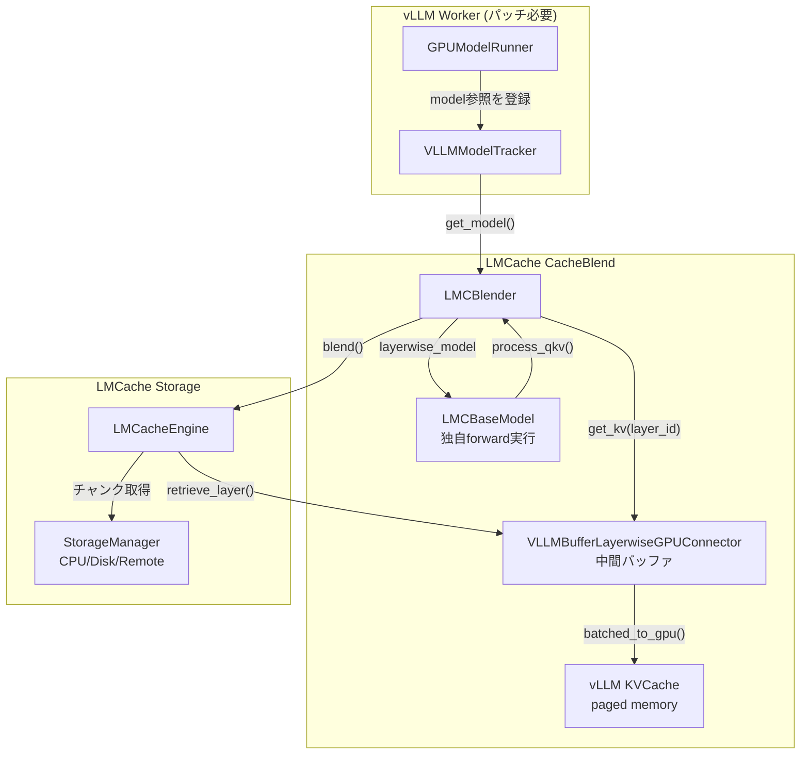

# CacheBlend 実装調査報告 [MEDIUM] [VERIFIED]

> **最終更新**: 2026-02-15
> **対象ソース**: `target/LMCache/lmcache/v1/compute/blend/`, `target/LMCache/lmcache/v1/compute/models/`, `target/LMCache/lmcache/v1/compute/attention/`, `target/LMCache/lmcache/v1/gpu_connector/gpu_connectors.py`, `target/LMCache/lmcache/integration/vllm/vllm_v1_adapter.py`

## 調査目的

CacheBlendの実装が論文の主張（RAGチャンク間のクロスアテンション、選択的KV再計算、レイヤー別KV選択、KVロード/再計算パイプライン）をどの程度実現しているか、またvLLM本体へのパッチなしにKV Transferプラグインだけで動作するかを明らかにする。

## 結論

**CacheBlendはvLLM本体への ad-hoc パッチが必要**。KV Transferプラグインの枠組みだけでは完結しない。理由は、CacheBlendがvLLMのモデルオブジェクト（Transformerレイヤー群）に直接アクセスして独自のforward計算を行うため。

## 論文機能 vs 実装状況

| 論文の主張 | 実装状態 | 備考 |
|-----------|---------|------|
| RAGチャンク間のKV再利用 | **実装済み** | セパレータトークンで段落分割、段落単位でKV保存・ルックアップ |
| 重要token同定（選択的KV再計算） | **実装済み** | topk by K差分のL2ノルム。`check_layers`で指定レイヤーで判定 |
| レイヤー別KV選択 | **部分実装** | `check_layers`で判定レイヤーを指定可能だが、判定結果は以降の全レイヤーに一律適用 |
| KVロード/再計算パイプライン | **実装済み** | ジェネレータでレイヤー別にロード→RoPE補正→paged memory書込みをオーバーラップ |
| レイヤーごとの異なるrecomp_ratio | **未実装 (TODO)** | `recomp_ratios[0]`のハードコード。TODOコメントあり |
| 閾値ベースのblending | **未実装 (TODO)** | `blend_thresholds`設定は存在するが未使用 |
| TP/PP対応 | **未実装 (TODO)** | `base.py`冒頭にTODOコメント |
| マルチモーダル対応 | **未実装 (TODO)** | 同上 |
| プレフィックスキャッシュとの互換 | **未実装 (TODO)** | `vllm_v1_adapter.py:803`にTODOコメント |

## アーキテクチャ

### 全体構成



### CacheBlendの実行フロー

`LMCacheConnectorV1Impl.start_load_kv()` 内で `self.blender.blend()` が呼ばれる:

1. **セパレータ分割**: 入力トークン列をRAGチャンク区切り（`" # # "` など）で段落に分割
2. **外部KVロード**: 段落単位でLMCacheストレージからKVキャッシュを取得 → 中間GPUバッファに配置
3. **RoPE位置補正**: 保存時の位置エンコーディングを新しい位置に変換（FusedRope カスタムCUDAカーネル）
4. **独自forward実行**: vLLMモデルのレイヤー群を使って入力を再計算
5. **重要token同定**: `check_layers`レイヤーで新旧Kの差分L2ノルムを計算、topk個を選択
6. **選択的アテンション再計算**: 選択されたtokenのみでattentionを再計算（FlashAttn or FlashInfer sparse）
7. **KVマージ**: 古いKV（外部ストレージ由来）に重要tokenのKVのみ上書き
8. **paged memory書込み**: 最終KVをvLLMのpaged memoryに書き込み

**参照**: `target/LMCache/lmcache/v1/compute/blend/blender.py:59-120`

### 重要token同定アルゴリズム

```python
# blender.py:88-110 (process_qkv)
if layer_id in self.common_metadata.check_layers:
    # 新しいK（再計算）と古いK（ストレージ由来）のL2距離
    diff_k = torch.sum(
        (k.to(torch.float32) - old_k.to(torch.float32)) ** 2, dim=[1]
    )
    # recomp_ratio割合のtop-kを選択
    topk_num = int(total_len * self.common_metadata.recomp_ratios[0])
    top_indices = torch.topk(diff_k, k=topk_num).indices
    top_indices, _ = torch.sort(top_indices)

    # 選択されたtokenのみQ, K, Vを抽出
    k, v = k[top_indices], v[top_indices]
    q = q[top_indices]
    # 古いKVの該当位置に新しいKVを書き込み
    old_k[self.metadata.imp_indices] = k
    old_v[self.metadata.imp_indices] = v
```

**参照**: `target/LMCache/lmcache/v1/compute/blend/blender.py:88-120`

### 独自モデルforward（LMCBaseModel.compute_layer）

CacheBlendはvLLMのnormalなforward pathを使わず、**vLLMのモデルオブジェクトのレイヤーを直接操作する独自のforward**を実行する:

```python
# base.py:66-141 (compute_layer, ジェネレータ)
@torch.compile
def compute_layer(self, input_ids):
    hidden_states = self.vllm_model.get_input_embeddings(input_ids)
    for idx, layer in enumerate(self.vllm_model.model.layers[...]):
        # input_layernorm
        hidden_states, residual = layer.input_layernorm(hidden_states, residual)
        # QKV projection
        qkv, _ = layer.self_attn.qkv_proj(hidden_states)
        q, k, v = qkv.split([q_size, kv_size, kv_size], dim=-1)
        # モデル固有QKV処理（Qwen3のq_norm/k_norm等）
        q, k, v = self._process_qkv(q, k, v, layer)
        # ★ blenderによる重要token選択・KVマージ
        q, k, v, residual, attn_output, attn_metadata = self.blender.process_qkv(...)
        # 独自attentionバックエンド（flash_attn_varlen_func）
        attn_output = self.lmc_attn_layers[idx].forward_contiguous(q, k, v, ...)
        # output projection + MLP
        hidden_states, _ = layer.self_attn.o_proj(attn_output)
        hidden_states, residual = layer.post_attention_layernorm(hidden_states, residual)
        hidden_states = layer.mlp(hidden_states)
        yield  # レイヤーごとにジェネレータで制御を返す
```

**重要**: これはvLLMの通常のforward pathとは完全に別のコードパス。vLLMのAttention層、CUDAGraph、InputBatch最適化等は一切使われない。

**参照**: `target/LMCache/lmcache/v1/compute/models/base.py:66-141`

### 対応モデル

| モデル | クラス | QKV処理 |
|-------|--------|---------|
| Llama | `LMCLlamaModel` | なし（そのまま） |
| Qwen2 | `LMCLlamaModel`（流用） | なし（そのまま） |
| Qwen3 | `LMCQwen3Model` | q_norm/k_norm 適用 |

**3モデルのみ**。新モデル追加には `LMCBaseModel` の継承と `_process_qkv()` 実装が必要。

**参照**: `target/LMCache/lmcache/v1/compute/models/utils.py:14-35`

### アテンションバックエンド

| バックエンド | クラス | 用途 |
|------------|--------|------|
| FlashAttention | `LMCFlashAttnBackend` | 密なアテンション計算（デフォルト） |
| FlashInfer Sparse | `HackBSAWrapper` + `LMCFlashInferSparseMetadata` | スパースブロックアテンション（`enable_sparse=True`時） |

`enable_sparse=True` を指定すると、FlashInferのVariableBlockSparseAttentionWrapperをハックした `HackBSAWrapper` を使用して、選択されたtokenブロックのみスパースにアテンション計算を行う。

**参照**: `target/LMCache/lmcache/v1/compute/attention/flash_attn.py`, `target/LMCache/lmcache/v1/compute/attention/flash_infer_sparse.py`

## vLLM本体パッチの分析

### 必要なパッチ（examples/blend_kv_v1/README.md に明記）

```python
# vllm/v1/worker/gpu_worker.py の load_model() 末尾に追加が必要:
from lmcache.v1.compute.models.utils import VLLMModelTracker
from lmcache.integration.vllm.utils import ENGINE_NAME

VLLMModelTracker.register_model(ENGINE_NAME, self.model_runner.model)
ensure_kv_transfer_initialized(self.vllm_config)
```

さらに `init_worker_distributed_environment()` 内の `ensure_kv_transfer_initialized()` をコメントアウトし、上記の `load_model()` に移動する必要がある。

**参照**: `target/LMCache/examples/blend_kv_v1/README.md`

### パッチが必要な理由

1. **モデルオブジェクトへの直接アクセス**: `VLLMModelTracker` にvLLMのモデルオブジェクトを登録する必要がある。CacheBlendはこのオブジェクトの `.model.layers[i]` に直接アクセスして独自forwardを実行する
2. **初期化順序の変更**: KV Transfer初期化をモデルロード後に移動する必要がある（モデルオブジェクトが存在しないとblender構築に失敗）
3. **KVConnectorのAPIでは不十分**: KVConnectorBase_V1の`start_load_kv()`/`wait_for_layer_load()`/`save_kv_layer()`インタフェースは、KVの読み書きのみを想定。CacheBlendが行う「独自forward＋選択的再計算」はスコープ外

### プラグイン境界の問題

| KV Transferプラグインの範囲 | CacheBlendが必要とすること | ギャップ |
|---|---|---|
| KVキャッシュの読み書き | モデルのforward計算 | forwardはWorker/GPUModelRunnerの責任 |
| レイヤー別KVロード/セーブ | レイヤー内部のQKV取得・attention再計算 | レイヤー内部ロジックへのアクセス不可 |
| メタデータ受け渡し | vLLMモデルオブジェクトへの参照 | メタデータでは渡せない |
| slot_mapping操作 | 独自のattention計算結果のpaged memory書込み | 通常のattention pathをバイパス |

## VLLMBufferLayerwiseGPUConnector — Blending専用GPUコネクタ

`enable_blending=True` 時に選択される専用コネクタ。通常のLayerwiseGPUConnectorとの違い:

1. **中間GPUバッファ**: ロード結果をpaged memoryではなく連続バッファに保持（`get_kv(layer_id)`でblenderがアクセス）
2. **RoPE位置補正**: `batched_to_gpu()`ジェネレータ内で `fused_rotary_emb` による位置エンコーディング変換を実行
3. **ギャップゼロイング**: RAGチャンク間のセパレータ位置をゼロで埋める（`current_gap_positions`）
4. **ダブルバッファ**: compute/loadバッファのping-pongでロードと計算をオーバーラップ

### パイプライン動作

```
Layer 0: [ロード: CPU→GPU buf_load]
         [compute: ─────────────] [RoPE補正: buf_load→buf_compute]
Layer 1: [ロード: CPU→GPU buf_load]
         [compute: ─────────────] [RoPE補正: buf_load→buf_compute] [buf→paged: Layer 0]
Layer 2: [ロード: CPU→GPU buf_load]
         [compute: ─────────────] [RoPE補正: buf_load→buf_compute] [buf→paged: Layer 1]
...
Layer N+1: [buf→paged: Layer N-1]
Layer N+2: (yield完了)
```

**参照**: `target/LMCache/lmcache/v1/gpu_connector/gpu_connectors.py:552-836`

## BlendServer（マルチプロセス版）

`blend_server.py` は `MPCacheEngine` を継承した `BlendEngine` クラスを提供する。ZMQメッセージキューで別プロセスとして動作し、以下の追加APIを持つ:

| API | 用途 |
|-----|------|
| `cb_register_kv_cache` | blendエンジンのKVキャッシュ登録 |
| `cb_lookup_pre_computed` | セパレータで段落分割→段落単位ルックアップ |
| `cb_store_pre_computed` | 段落単位の事前計算KV保存（BLEND_HASH_PREFIX付き） |
| `cb_retrieve_pre_computed` | 段落単位の事前計算KV取得→GPUバッファ書込み |
| `cb_store_final` | 最終KV保存（通常ハッシュ、通常モードLLMからも利用可能） |

`ParallelPatternMatcher`（Cで実装）でセパレータトークンを高速マッチング。

**参照**: `target/LMCache/lmcache/v1/multiprocess/blend_server.py`

## 設定

### LMCache側

| 設定 | デフォルト | 用途 |
|------|----------|------|
| `enable_blending` | `False` | CacheBlendモード有効化 |
| `blend_check_layers` | `None` | 重要token判定を行うレイヤーIDリスト |
| `blend_recompute_ratios` | `None` | 再計算するtokenの割合リスト（現在は`[0]`のみ使用） |
| `blend_thresholds` | `None` | 閾値ベースblending用（**未実装**） |
| `enable_sparse` (extra_config) | `False` | FlashInfer スパースアテンション使用 |

**参照**: `target/LMCache/lmcache/v1/config.py:101-118`

### 暗黙の前提

- `use_layerwise=True` が必須（blending有効時に自動選択: `VLLMBufferLayerwiseGPUConnector`）
- `save_unfull_chunk=True` が自動設定される
- `SegmentTokenDatabase` が使用される（`ChunkedTokenDatabase`ではなく）

## 制約・未実装機能

1. **vLLM本体パッチ必須** — プラグインのみでは動作しない
2. **対応モデル3種のみ** — Llama, Qwen2, Qwen3。新モデルはLMCBaseModel継承が必要
3. **RoPE制約** — `rotary_dim == head_size`、`rope_scaling=None`、`partial_rotary_factor=1.0` のみ
4. **プレフィックスキャッシュ非互換** — TODOコメント、blending後のプレフィックスキャッシュスキップ
5. **TP/PP未対応** — TODOコメント
6. **マルチモーダル未対応** — TODOコメント
7. **バッチサイズ1前提** — FlashAttnMetadata初期化で `batch_size=1` ハードコード
8. **レイヤー別ratio未実装** — `recomp_ratios[0]`のみ使用
9. **CUDAGraph未対応** — 独自forward pathのため`torch.compile`のみ

## 関連ドキュメント

- [LMCache統合調査報告](../investigations/lmcache-integration.md) — LMCache全体のvLLM統合
- [KV Transfer summary](../components/kv-transfer/summary.md) — KVConnectorBase_V1のAPI
- [GPUModelRunner summary](../components/gpu-model-runner/summary.md) — 通常のforward path
