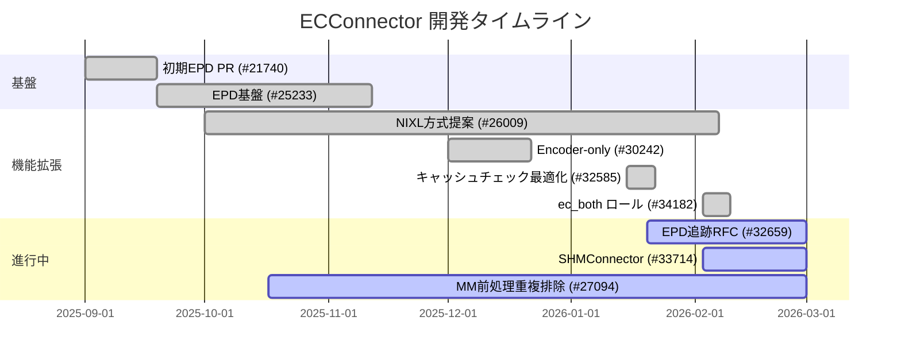

# ECConnector GitHub 議論調査レポート

> **ステータス**: 調査完了
> **作成日**: 2026-02-14
> **深度**: [MEDIUM]
> **確信度**: [VERIFIED]
> **関連ドキュメント**: [EncoderCache 永続化と階層キャッシュ](./encoder-cache-persistence.md)、[KVCacheManager](../components/kv-cache-manager/summary.md)

---

## 1. 概要

ECConnector は、マルチモーダルモデルの **Encode-Prefill-Decode (EPD) 分離推論** を実現するために導入されたインフラストラクチャである。エンコーダ出力（画像埋め込みなど）を別プロセス間で転送・キャッシュするための抽象インタフェース `ECConnectorBase` を定義し、プラグイン可能な設計になっている。

2025年11月に基盤PR ([#25233](https://github.com/vllm-project/vllm/pull/25233)) がマージされた後、encoder-onlyモード、リモートキャッシュチェック最適化、ec_both ロールが順次マージされた。現在は**高性能転送バックエンド**（SHMConnector vs Mooncake ECConnector）の方向性が議論中で、メンテナーは Mooncake ベースの統一的なソリューションを志向している。

## 2. マージ済み PR（確定した設計）

### 2.1 基盤: EPD分離 (#25233) — 2025-11-12 マージ [VERIFIED]

**主導**: Chenguang Zheng (fake0fan)

ECConnectorBase はスケジューラ側とワーカー側の責務を明確に分離:

| 責務 | メソッド | 実行場所 |
|------|---------|---------|
| キャッシュ存在確認 | `check_caches_exist` | スケジューラ |
| 割当後状態更新 | `update_state_after_alloc` | スケジューラ |
| メタデータ構築 | `build_connector_meta` | スケジューラ |
| リクエスト完了通知 | `request_finished` | スケジューラ |
| キャッシュ読み込み | `start_load_caches` | ワーカー |
| キャッシュ保存 | `save_caches` | ワーカー |

参照実装として `ECExampleConnector`（safetensors でディスク保存）を同梱。`ec_connector_module_path` によるOOTプラグインロードもサポート。

**参照**: `target/vllm/vllm/distributed/ec_transfer/ec_connector/`

### 2.2 Encoder-only モード (#30242) — 2025-12-22 マージ [VERIFIED]

EPD分離時にエンコーダ専用インスタンスがLLM重みまでロードしてしまう問題を解決。`--convert mm_encoder_only` オプションを追加。

- 当初 `VisionOnly` という名称 → オーディオ等も対象のため `MMEncoderOnly` に変更
- A100でのGPUメモリ使用量: **44GB → 3.7GB** に削減
- `adapters.py` の pooling モデルと同様のアプローチ

### 2.3 リモートキャッシュチェック最適化 (#32585) — 2026-01-22 マージ [VERIFIED]

スケジューラでのリモートエンコーダキャッシュ存在確認を最適化。EPD追跡RFCのタスクリストの一環。

### 2.4 ec_both ロール (#34182) — 2026-02-10 マージ [VERIFIED]

**貢献**: Qi Wang (furionw, NVIDIA)

従来は producer/consumer のどちらか一方のみだったが、集約ノード（EPD一体型）でのエンベディングオフロード（GPU → CPU → GPU）を可能にするため `ec_both` ロールを追加。KV Connector の both ロールと同様の概念。変更は3ファイル・計10行程度の小規模PR。

## 3. 進行中の議論

### 3.1 高性能転送バックエンド: SHMConnector vs Mooncake [INFERRED]

**関連 PR**: [#33714](https://github.com/vllm-project/vllm/pull/33714) (open)

PiratePai が共有メモリ + PyTorch RPC ベースの `SHMConnector` を提案:
- RTX 4090 での1E-1PD構成で ExampleConnector より **8-9% の TTFT 改善** を実証

しかしメンテナー (NickLucche) は「vllm のツリー内コネクタは少数の高品質ソリューションに絞りたい」と慎重姿勢。fake0fan は **Mooncake ベースの統一 ECConnector** を提案し、RDMA/NVLink/TCP フォールバックの複数バックエンドを1つのコネクタで対応する構想を示している。

#### 技術的課題: エンコーダキャッシュの固定アドレス問題

エンコーダキャッシュテンソルは KVキャッシュと異なり事前割り当てされた固定アドレスを持たない。NickLucche は2つの選択肢を提示:

1. **中間バッファ方式**: 転送前にコピーする
2. **事前割り当て方式**: ECConnector 使用時にはエンコーダキャッシュを固定アドレスバッファに切り替える（現在の dict ベースを置き換え）

### 3.2 NIXL/セグメントツリーベースのEPD分離 (#26009) [SHALLOW]

H. Jhoo (MerHS) が NIXL コミュニケータを使った P2P 直接通信方式を提案。セグメントツリーベースのエンコーダキャッシュマネージャ（ベストフィット割り当て）、動的ロールスイッチング、エンコーダ専用スケジューラなど大規模な変更を含む。

- 90日間の非活動で stale クローズ（2026-02-07）
- fake0fan の fork に NIXL ECConnector の作業が継続中

### 3.3 マルチモーダル前処理の重複排除 (#27094) [INFERRED]

EPD分離時に全ワーカーで画像前処理が繰り返される問題:
- プロファイリングで前処理が推論時間の **約50%**（Qwen2.5-VL-3B で 143ms × 3回 ≈ 430ms）を占める
- `image_meta` タイプの導入を提案し、エンコーダ処理後は形状メタデータのみを後続ワーカーに転送する案
- DarkLight1337 は前処理をエンコーダプロセスに完全移動する方針を示唆

### 3.4 ECキャッシュの解放メカニズム (#32659) [SHALLOW]

EPD追跡RFCのタスクの一つ。エンコーダキャッシュの明示的解放メカニズムが未実装で、リソースリークの原因となりうる。fake0fan の fork で作業中。

## 4. タイムライン

## 5. 未解決の課題一覧

| 課題 | Issue/PR | 状態 | 備考 |
|------|----------|------|------|
| 高性能転送バックエンド | [#33714](https://github.com/vllm-project/vllm/pull/33714) | 方向性議論中 | Mooncake統一案が有力 |
| ECキャッシュ解放 | [#32659](https://github.com/vllm-project/vllm/issues/32659) | 作業中 | fake0fan fork |
| EPDプロキシ最適化 | #31017 | 未着手 | — |
| MM前処理重複排除 | [#27094](https://github.com/vllm-project/vllm/issues/27094) | RFC | 前処理の50%コスト |
| エンコーダキャッシュ事前割り当て | #33714 コメント | 提案段階 | dict→固定バッファ |
| NIXL ECConnector | #32659 タスク | fork作業中 | — |

## 6. 主要コントリビューター

| 名前 | GitHub | 役割 |
|------|--------|------|
| Chenguang Zheng | fake0fan | ECConnector基盤設計者、EPDフォローアップ主導 |
| NickLucche | NickLucche | vLLM Collaborator、アーキテクチャ方針決定者 |
| Cyrus Leung | DarkLight1337 | vLLM Member、マルチモーダルレビューアー |
| Qi Wang | furionw (NVIDIA) | ec_both ロール貢献 |
| H. Jhoo | MerHS | NIXL方式提案者 |
| PiratePai | PiratePai | SHMConnector 実装者 |

## 7. プラグイン開発への示唆 [INFERRED]

独自ECConnectorプラグインを開発する場合の留意点:

1. **現在の安定インタフェース**: `ECConnectorBase` の6メソッドは安定しているが、今後のリファクタリング（事前割り当て方式への移行）で変更の可能性あり
2. **OOTプラグイン**: `ec_connector_module_path` で外部モジュールロード可能。`ECConnectorFactory` 経由で登録
3. **転送方式の選択**: Mooncake方式が統一バックエンドとして推奨される方向。独自実装よりMooncakeの上に構築する方が将来的に有利
4. **エンコーダキャッシュ管理の変更予定**: dict ベースから事前割り当て型への移行が検討中。プラグインはこの変更に備えるべき
