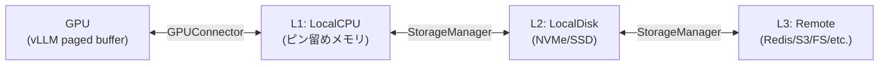
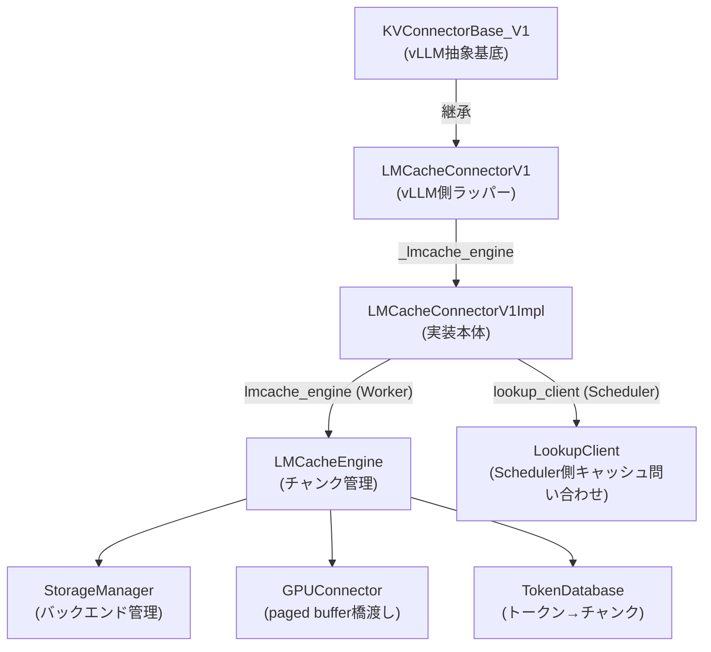
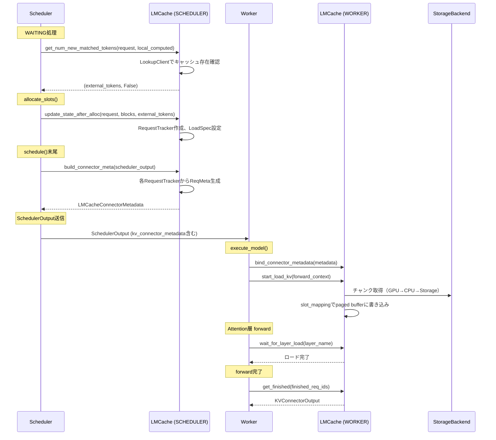
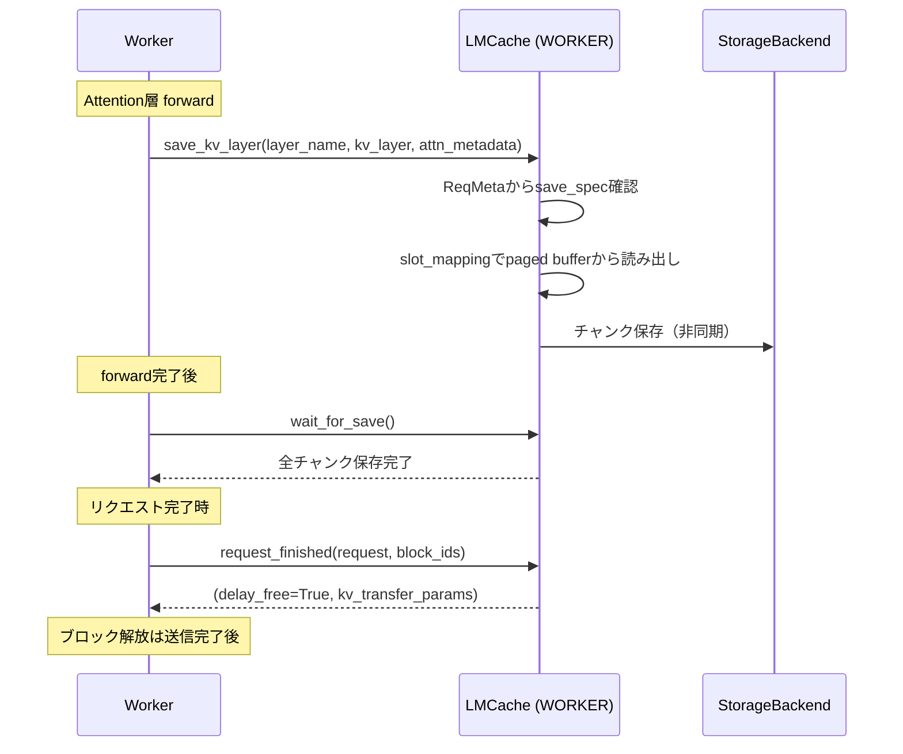

# LMCache 統合調査報告 [MEDIUM] [VERIFIED]

> **最終更新**: 2026-02-15
> **対象ソース**: `target/vllm/vllm/distributed/kv_transfer/kv_connector/v1/lmcache_connector.py`, `target/vllm/vllm/distributed/kv_transfer/kv_connector/v1/lmcache_integration/`, `target/LMCache/lmcache/`

## 調査目的

LMCacheがvLLMのKVConnectorBase_V1インタフェースをどのように実装し、チャンク単位のKVキャッシュ保存・取得を実現しているかを明らかにする。

## LMCache 概要

LMCacheはLLM推論のKVキャッシュを外部に保存・共有するためのライブラリ。vLLMと統合して、同じプロンプトプレフィックスのKVキャッシュを再利用したり、Prefill/Decode分離（Disaggregated Serving）でKVキャッシュを転送したりする。

### チャンク単位保存

KVキャッシュをトークン列のチャンク（デフォルト256トークン）に分割して保存する。各チャンクは独立したキーで管理される。

```
プロンプト: [t0, t1, ..., t511]
  → チャンク0: [t0..t255] のKV → CacheEngineKey(chunk_hash=hash([t0..t255]))
  → チャンク1: [t256..t511] のKV → CacheEngineKey(chunk_hash=hash([t0..t511]))
```

**ハッシュチェーン**: チャンクハッシュはプレフィックス全体のハッシュ（先頭からそのチャンク末尾まで）。これにより、同一プレフィックスを持つ異なるリクエスト間でKVキャッシュが共有可能。

### CacheEngineKey

```python
@dataclass(slots=True)
class CacheEngineKey:
    model_name: str       # モデル名
    world_size: int       # TP並列度
    worker_id: int        # TPランク
    chunk_hash: int       # トークン列ハッシュ
    dtype: torch.dtype    # KVキャッシュのデータ型
    request_configs: dict | None  # リクエスト固有タグ
    tags: tuple | None    # (key, value) ペア
```

**参照**: `target/LMCache/lmcache/utils.py:330-410`

### 3層ストレージ階層



| 層 | バックエンド | 設定 | 容量目安 |
|---|---|---|---|
| L1 | LocalCPUBackend | `local_cpu=True, max_local_cpu_size` | ~5GB |
| L2 | LocalDiskBackend | `local_disk, max_local_disk_size` | ~数十GB |
| L3 | RemoteBackend | `remote_url` | 無制限 |

**追加バックエンド**: P2PBackend（GPU直接）, GdsBackend（GPU Direct Storage）, NixlStorageBackend（RDMA）, PDBackend（P/D分離用）

**参照**: `target/LMCache/lmcache/v1/storage_backend/`

### リモートコネクタ（15+実装）

| コネクタ | URLスキーム | 用途 |
|---------|-----------|------|
| RedisConnector | `redis://` | Redis単体 |
| RedisSentinelConnector | `redis-sentinel://` | Redis Sentinel |
| RedisClusterConnector | `redis://` (cluster) | Redisクラスタ |
| S3Connector | `s3://` | AWS S3 |
| FSConnector | `fs:///` | ローカルファイルシステム |
| MooncakestoreConnector | `mooncakestore://` | Mooncake |
| ValkeyConnector | `valkey://` | Valkey |
| EICConnector | `infinistore://` | InfiniStore |

**参照**: `target/LMCache/lmcache/v1/storage_backend/connector/`

## vLLM統合アーキテクチャ

### 2つの実装パス

`LMCacheConnectorV1`はvLLM側のラッパーで、`use_native`設定により2つの実装を切り替える。

```python
# target/vllm/.../lmcache_connector.py:83-101
use_native = vllm_config.kv_transfer_config.get_from_extra_config("use_native", False)
if use_native:
    # vLLM内蔵の native 実装
    cls = lmcache_integration.vllm_v1_adapter.LMCacheConnectorV1Impl
else:
    # lmcache パッケージの latest 実装
    cls = lmcache.integration.vllm.vllm_v1_adapter.LMCacheConnectorV1Impl
```

| パス | ソース | 用途 |
|------|--------|------|
| native | `target/vllm/.../lmcache_integration/vllm_v1_adapter.py` | vLLM同梱版。安定性重視 |
| latest | `target/LMCache/lmcache/integration/vllm/vllm_v1_adapter.py` | LMCache最新版。機能追加優先 |

**参照**: `target/vllm/vllm/distributed/kv_transfer/kv_connector/v1/lmcache_connector.py:72-103`

### クラス階層



### ロール別初期化

`LMCacheConnectorV1Impl.__init__()`はロールにより異なるコンポーネントを初期化する。

**Scheduler側** (`role=SCHEDULER`):
- `LookupClient` — 外部KVキャッシュの存在確認（`get_num_new_matched_tokens`用）
- `_request_trackers` — リクエスト状態管理
- `load_specs` — ロード仕様管理
- `lmcache_engine = None` — エンジンは持たない

**Worker側** (`role=WORKER`):
- `LMCacheEngine` — KVキャッシュの保存・取得エンジン
- `LookupServer` — Scheduler側LookupClientへの応答
- `ZMQOffloadServer` — KVオフロードサーバ
- `GPUConnector` — vLLMのpaged bufferとの橋渡し（3種: Paged/Layerwise/Buffer）

**参照**: `target/vllm/vllm/distributed/kv_transfer/kv_connector/v1/lmcache_integration/vllm_v1_adapter.py:570-715`

## 主要データ構造

### RequestTracker

リクエストのライフサイクルを追跡する。

```python
@dataclass
class RequestTracker:
    req_id: str
    prompt_len: int                    # プロンプト全長
    token_ids: list[int]               # スケジュール済みトークン列
    allocated_block_ids: list[int]     # 割り当て済みブロックID
    num_saved_tokens: int = 0          # 保存済みトークン数
    disagg_spec: DisaggSpec | None     # P/D分離仕様
    mm_hashes: list[str] | None        # マルチモーダルハッシュ
    mm_positions: list[PlaceholderRange] | None  # MM位置情報
    request_configs: dict | None       # リクエスト固有設定
    is_decode_phase: bool = False      # デコードフェーズか
    skip_save: bool = False            # 保存スキップフラグ
```

**ライフサイクル**:
1. `from_new_request()` — 新規リクエスト時にSchedulerOutputから生成
2. `update()` — 各stepで新トークン・新ブロック追加
3. `is_decode_phase` — 新トークン数=1でデコードフェーズ判定

**参照**: `target/vllm/vllm/distributed/kv_transfer/kv_connector/v1/lmcache_integration/vllm_v1_adapter.py:121-246`

### ReqMeta

各stepでWorkerに送信されるメタデータ。

```python
@dataclass
class ReqMeta:
    req_id: str
    token_ids: list[int]             # 保存/ロード対象トークン
    slot_mapping: torch.Tensor       # vLLM paged bufferへのマッピング
    is_last_prefill: bool = False    # 最終プリフィルステップか
    save_spec: SaveSpec | None       # セーブ仕様
    load_spec: LoadSpec | None       # ロード仕様
    disagg_spec: DisaggSpec | None   # P/D分離仕様
    request_configs: dict | None     # リクエスト固有設定
```

**slot_mapping計算**: `block_id * block_size + offset`（vLLMのBlockTable.compute_slot_mappingと同じ方式）

**参照**: `target/vllm/vllm/distributed/kv_transfer/kv_connector/v1/lmcache_integration/vllm_v1_adapter.py:248-398`

### LoadSpec / SaveSpec

```python
@dataclass
class LoadSpec:
    vllm_cached_tokens: int      # vLLMローカルキャッシュ済みトークン数
    lmcache_cached_tokens: int   # LMCacheキャッシュ済みトークン数
    can_load: bool               # Schedulerがロードを許可

@dataclass
class SaveSpec:
    skip_leading_tokens: int     # スキップする先頭トークン数（既保存分）
    can_save: bool               # セーブ実行するか
```

### セーブ判定ロジック

以下のいずれかに該当する場合、セーブをスキップ:
1. 既に保存済み(`num_saved_tokens > 0`)で、未保存トークンがチャンク境界に達していない
2. デコードフェーズで`save_decode_cache=False`
3. リクエスト設定で`lmcache.skip_save=True`
4. Disagg接続でない場合のみスキップ（Disaggは転送のためスキップ不可）

部分チャンク（チャンクサイズ未満）は`discard_partial_chunks`設定でセーブ可否が決まる。最終プリフィルでない場合は必ず破棄される（次stepでトークンが追加されるため）。

**参照**: `target/vllm/vllm/distributed/kv_transfer/kv_connector/v1/lmcache_integration/vllm_v1_adapter.py:295-338`

## KV形状とGPUConnector

### KV形状

```python
kv_shape = (num_layer, 1 if use_mla else 2, chunk_size, num_kv_head, head_size)
# 通常: (num_layer, 2, 256, num_kv_heads, head_size)
#   2 = Key + Value
# MLA: (num_layer, 1, 256, 1, aligned_head_size)
#   1 = compressed_kv (KeyとValueが圧縮済み)
```

### GPUConnector 3種

| コネクタ | 用途 | 特徴 |
|---------|------|------|
| `VLLMPagedMemGPUConnectorV2` | 標準 | vLLMのpaged bufferから直接読み書き |
| `VLLMPagedMemLayerwiseGPUConnector` | レイヤー別 | レイヤーごとに個別処理 |
| `VLLMBufferLayerwiseGPUConnector` | Blending用 | 中間バッファ経由でブレンディング |

**参照**: `target/vllm/vllm/distributed/kv_transfer/kv_connector/v1/lmcache_integration/vllm_v1_adapter.py:500-541`

## エンドツーエンドフロー

### ロード（外部KV取得）



### セーブ（KV保存）



## LMCacheEngine 内部

### StorageManager

`OrderedDict[name, StorageBackendInterface]`でバックエンドを管理。ルックアップは登録順に検索し、最初にヒットしたバックエンドから取得する。保存は全バックエンドに書き込む（write-through）。

### TokenDatabase

トークン列からチャンクキー（`CacheEngineKey`）へのマッピングを管理。2つの実装:
- `ChunkedTokenDatabase` — 固定チャンクサイズで分割
- `SegmentTokenDatabase` — セグメント単位で管理

### KVイベント生成

LMCacheConnectorV1はWorker側でKV保存時に`BlockStored`イベントを生成する。これはvLLMのKVイベントシステム（`kv_events.py`）に変換され、外部のルーティングシステム等に配信される。

```python
# LMCacheConnectorV1.get_kv_connector_kv_cache_events()
events = self._lmcache_engine.get_kv_events()
blocks = [BlockStored(block_hashes=e.block_hashes, ...) for e in events]
lmcache_kv_events = LMCacheKVEvents(num_workers=1)
lmcache_kv_events.add_events(blocks)
```

**参照**: `target/vllm/vllm/distributed/kv_transfer/kv_connector/v1/lmcache_connector.py:220-244`

## Disaggregated Serving（P/D分離）

LMCacheはDisaggregated Serving（PrefillインスタンスとDecodeインスタンスの分離）もサポートする。

### DisaggSpec

```python
@dataclass
class DisaggSpec:
    req_id: str
    receiver_id: str          # 受信側エンジンID
    receiver_host: str        # 受信側ホスト
    receiver_init_port: int   # 初期化ポート
    receiver_alloc_port: int  # 割り当てポート
    is_last_prefill: bool = False
    num_transferred_tokens: int = 0
```

P/D分離時のフロー:
1. Producerインスタンス（`kv_role=kv_producer`）がプリフィル実行
2. KVキャッシュをLMCache経由で保存/転送
3. Consumerインスタンス（`kv_role=kv_consumer`）がKVキャッシュをロード
4. Consumerはデコードのみ実行

**参照**: `target/vllm/vllm/distributed/kv_transfer/kv_connector/v1/lmcache_integration/vllm_v1_adapter.py:88-99`

## 設定

### vLLM側（KVTransferConfig）

```bash
vllm serve model_name \
  --kv-transfer-config '{"kv_connector": "LMCacheConnectorV1", "kv_role": "kv_both"}'
```

### LMCache側（LMCACHE_CONFIG_FILE）

環境変数`LMCACHE_CONFIG_FILE`でYAML設定ファイルを指定。主要設定:

| 設定 | デフォルト | 用途 |
|------|----------|------|
| `chunk_size` | 256 | チャンクサイズ（トークン数） |
| `local_cpu` | True | CPUキャッシュ有効化 |
| `max_local_cpu_size` | 5.0 | CPU最大容量（GB） |
| `local_disk` | None | ディスクキャッシュパス |
| `remote_url` | None | リモートストレージURL |
| `enable_async_loading` | True | 非同期ロード |
| `use_layerwise` | False | レイヤー別処理 |
| `enable_blending` | False | CacheBlendモード |
| `save_decode_cache` | False | デコードKVも保存 |
| `save_unfull_chunk` | True | 部分チャンク保存 |
| `enable_pd` | False | P/D分離モード |

### vLLM extra_configからの設定伝搬

`kv_connector_extra_config`で`lmcache.`プレフィックス付きの設定をLMCacheに渡せる:

```json
{
  "kv_connector": "LMCacheConnectorV1",
  "kv_role": "kv_both",
  "kv_connector_extra_config": {
    "lmcache.chunk_size": 512,
    "lmcache.skip_save": true
  }
}
```

**参照**: `target/vllm/vllm/distributed/kv_transfer/kv_connector/v1/lmcache_integration/vllm_v1_adapter.py:586-601`

## LMCacheディレクトリ構造

```
target/LMCache/lmcache/
├── v1/
│   ├── cache_engine.py              # LMCacheEngine（中核エンジン）
│   ├── config.py                    # LMCacheEngineConfig
│   ├── metadata.py                  # LMCacheMetadata
│   ├── manager.py                   # LMCacheManager（ライフサイクル）
│   ├── storage_backend/
│   │   ├── storage_manager.py       # StorageManager
│   │   ├── abstract_backend.py      # StorageBackendInterface
│   │   ├── local_cpu_backend.py     # LocalCPUBackend (L1)
│   │   ├── local_disk_backend.py    # LocalDiskBackend (L2)
│   │   ├── remote_backend.py        # RemoteBackend (L3)
│   │   ├── connector/               # 15+リモートコネクタ
│   │   ├── cache_policy/            # Evictionポリシー
│   │   └── naive_serde/             # シリアライゼーション
│   ├── gpu_connector/               # GPU↔CPU橋渡し
│   ├── compute/                     # CacheBlend等
│   ├── token_database/              # トークン→チャンクマッピング
│   ├── lookup_client/               # Scheduler側問い合わせ
│   └── ...
├── integration/
│   └── vllm/                        # vLLM統合（latest版）
│       ├── lmcache_connector_v1.py  # エントリポイント
│       ├── vllm_v1_adapter.py       # 主実装（~700行）
│       └── utils.py
└── utils.py                         # CacheEngineKey等
```

## ECConnectorとの類似点・相違点

| 観点 | LMCache (KV Transfer) | ECConnector |
|------|----------------------|-------------|
| 対象 | デコーダKVキャッシュ | エンコーダキャッシュ |
| 粒度 | チャンク単位（256トークン） | エンコーダ出力全体 |
| ストレージ | 3層階層（CPU/Disk/Remote） | safetensors（参照実装） |
| 問い合わせ | LookupClient（非同期） | has_cache_item（同期） |
| 非同期ロード | あり（WAITING_FOR_REMOTE_KVS） | なし |
| P/D分離 | サポート | なし |
| KVイベント | BlockStored/Removed | なし |
| 成熟度 | 本番利用可能（10+コネクタ） | 参照実装段階 |
