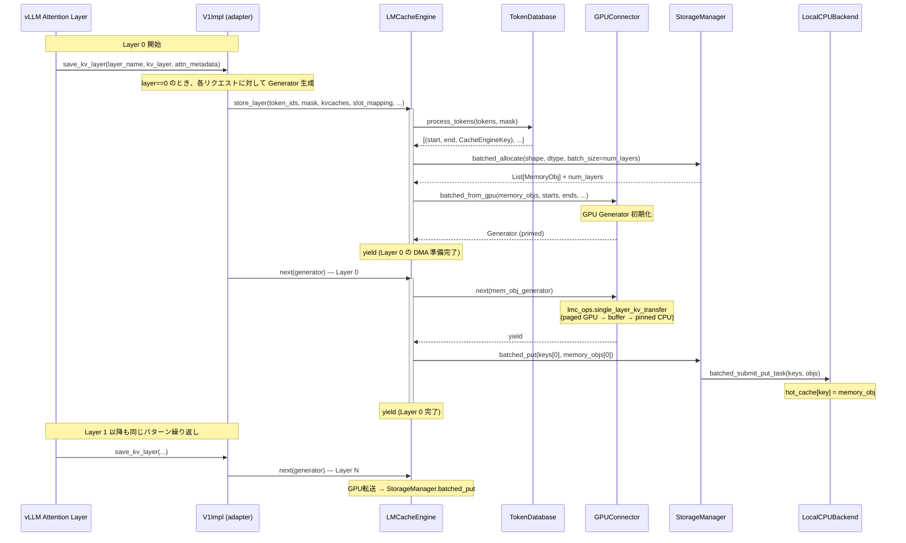

# データフロー

> **深度**: [MEDIUM] / **確信度**: [VERIFIED]
> **最終更新**: 2026-02-16（Phase 1 セッション1）

本ドキュメントはLMCacheのKVキャッシュ store パスを追跡する。
retrieve パスはPhase 1 セッション2で追加予定。

## Store パス概要

vLLMのattentionレイヤー実行中に、KVキャッシュをGPUからCPU（および後段ストレージ）に退避するパス。
**レイヤーワイズ方式**（`use_layerwise=True`）が主要パスであり、各attentionレイヤーの実行直後にそのレイヤーのKVデータを転送する。



## 各コンポーネントの役割

### 1. LMCacheConnectorV1Impl（adapter）

**参照**: `target/LMCache/lmcache/integration/vllm/vllm_v1_adapter.py:964` (`save_kv_layer`)

vLLMの`KVConnectorBase_V1.save_kv_layer()`フックから呼ばれるアダプタ。
`LMCacheConnectorV1Dynamic`は純粋な委譲シェルであり、実装は`V1Impl`に集約。

**Layer 0での処理**:
1. `connector_metadata.requests`を走査し、`save_spec.can_save`がTrueのリクエストを処理
2. `skip_leading_tokens`をLMCacheのchunk_size（256）の倍数に切り下げてマスク境界を整合
3. `store_mask`を構築：プレフィックス部分=False、新規部分=True
4. `LMCacheEngine.store_layer()`を呼んでGeneratorを取得、`self.layerwise_storers`に追加
5. 最初のリクエストのみ`sync=True`でCUDAストリームを同期

**全レイヤー共通**: `self.layerwise_storers`内の全Generatorを`next()`で1ステップ進める。

### 2. LMCacheEngine.store_layer()

**参照**: `target/LMCache/lmcache/v1/cache_engine.py:528`

**Generator関数**であり、呼び出し側（adapter）が1レイヤーごとに`next()`で進める。

**初期化フェーズ**（最初のyieldまで）:
1. `TokenDatabase.process_tokens()`でトークン列をチャンク分割し、各チャンクのCacheEngineKeyを取得
2. `StorageManager.contains()`で既存チャンクをスキップ（layer 0のキーで判定）
3. `StorageManager.batched_allocate()`で各チャンク×全レイヤー分のMemoryObjを確保
4. チャンク×レイヤー → レイヤー×チャンクに転置
5. `GPUConnector.batched_from_gpu()`でGPU転送Generatorを生成・prime

**レイヤーループ**（`num_layers`回yield）:
```
yield → next(mem_obj_generator) → batched_put(keys[layer_id], memory_objs[layer_id])
```
各レイヤーで「GPU→CPU DMA」→「ストレージ書き込み」を実行。

**重要**: メモリ確保失敗時（`batched_allocate`がNone）は`break`で即座にstore中止。yieldだけ行ってストレージには書かない。

### 3. ChunkedTokenDatabase.process_tokens()

**参照**: `target/LMCache/lmcache/v1/token_database.py:309`

トークン列をチャンク（デフォルト256トークン）に分割し、プレフィックスチェーンハッシュを計算。

**ハッシュアルゴリズム**: vLLMと**完全に同一**。
- `vllm.utils.hashing.get_hash_fn_by_name("sha256_cbor")`を直接利用
- NONE_HASHも`vllm.v1.core.kv_cache_utils.NONE_HASH`から取得
- ハッシュ入力: `(prefix_hash, token_tuple, extra_keys)`

**マスク処理**: `mask`のFalse数（=already-cached prefix長）がchunk_sizeの倍数であることを検証。False区間のチャンクはスキップ。

**CacheEngineKey生成**: `_make_key_by_hash()`で`(model_name, world_size, worker_id, chunk_hash, kv_dtype, request_configs)`の6タプルを構築。その後`split_layers()`でレイヤーIDを付与した`LayerCacheEngineKey`に分割。

### 4. VLLMPagedMemLayerwiseGPUConnector.batched_from_gpu()

**参照**: `target/LMCache/lmcache/v1/gpu_connector/gpu_connectors.py:1212`

GPU上のページドKVキャッシュからCPU上のMemoryObjにデータを転送するGenerator関数。

**2段転送パス**（`use_gpu=True`時）:
1. **Paged GPU → 中間GPUバッファ**: `lmc_ops.single_layer_kv_transfer()`（CUDAカーネル）でslot_mappingに基づきscatter→gatherコピー
2. **GPUバッファ → Pinned CPU**: `memory_obj.tensor.copy_(..., non_blocking=True)`で非同期DMA

**直接転送パス**（`use_gpu=False`時）:
- `lmc_ops.single_layer_kv_transfer()`でpaged GPUから直接pinned CPUへ（チャンク単位）

**CUDAストリーム**: `self.store_stream`（専用ストリーム）を使用し、計算ストリームとオーバーラップ可能。`sync=True`の場合のみ`store_stream.synchronize()`で同期。

**出力形式**: `MemoryFormat.KV_T2D` = `[num_tokens, 2, hidden_dim]`（token-major、K/Vインターリーブ）。MLAの場合は`KV_MLA_FMT` = `[num_tokens, hidden_dim]`。

### 5. StorageManager.batched_put()

**参照**: `target/LMCache/lmcache/v1/storage_backend/storage_manager.py:388`

登録された全ストレージバックエンドにデータを配布するディスパッチャ。

**処理フロー**:
1. `allocator_backend`（通常LocalCPUBackend）の元データをそのまま利用
2. `OrderedDict`順に全バックエンド（L1→L2→L3）を走査
3. 異なるallocatorを持つバックエンドには`allocate_and_copy_objects()`で新たにメモリ確保＋コピー
4. 各バックエンドの`batched_submit_put_task()`を呼び出し
5. 最後にref_countをデクリメント

**注意**: `put()`メソッドは**非推奨**（`RuntimeError`を投げる）。`batched_put()`が唯一のエントリポイント。

### 6. LocalCPUBackend.submit_put_task()

**参照**: `target/LMCache/lmcache/v1/storage_backend/local_cpu_backend.py:141`

**同期実行**（バックグラウンドスレッドなし）。`cpu_lock`下で以下を実行:
1. 既存キーの重複チェック
2. `memory_obj.ref_count_up()`でrefcount増加
3. `hot_cache[key] = memory_obj`で保存
4. `cache_policy.update_on_put(key)`でEvictionポリシー更新（LRU: OrderedDictの末尾に移動、等）
5. 必要に応じてcontrollerへADMITメッセージ送信（`batched_msg_sender`経由）

## パイプライン動作の詳細

store_layerとbatched_from_gpuは2つの入れ子Generatorで**パイプライン動作**する:

```
store_layer Generator:     [初期化] → yield → [L0転送+保存] → yield → [L1転送+保存] → yield → ...
batched_from_gpu Generator: [初期化] → yield → [L0 DMA]     → yield → [L1 DMA]     → yield → ...
```

**タイミング**（`num_layers=N`の場合）:
- `store_layer`は`N+1`回yield（初期化1回 + レイヤーN回）
- `batched_from_gpu`は`N+1`回yield（初期化prime + レイヤーN回）
- adapterは合計`N`回`next()`を呼ぶ（各attentionレイヤー実行後）

**パイプラインのステップ**: Layer Lの`next()`呼び出しで、`batched_from_gpu`がLayer LのDMAを実行し、`store_layer`がLayer LのStorageManager書き込みを行う。つまり**DMAとストレージ書き込みは同一レイヤーで連続実行**される。

## データ構造

| 構造 | 型 | 説明 |
|---|---|---|
| CacheEngineKey | `(model_name, world_size, worker_id, chunk_hash, kv_dtype, request_configs)` | チャンク単位のキー（レイヤー横断） |
| LayerCacheEngineKey | CacheEngineKey + layer_id | レイヤー単位のキー |
| MemoryObj | pinned CPU tensor wrapper | ref_count管理、MemoryObjMetadata付き |
| MemoryFormat.KV_T2D | `[num_tokens, 2, hidden_dim]` | レイヤーワイズ形式（token-major） |
| MemoryFormat.KV_MLA_FMT | `[num_tokens, hidden_dim]` | MLA形式（K/V統合） |
| store_mask | `torch.Tensor[bool]` | False=キャッシュ済みprefix、True=新規トークン |
| slot_mapping | `torch.Tensor[long]` | トークン位置→vLLMページドメモリのflat slot |
| hot_cache | `OrderedDict[CacheEngineKey, MemoryObj]` | L1 CPUキャッシュ（Evictionポリシー付き） |
