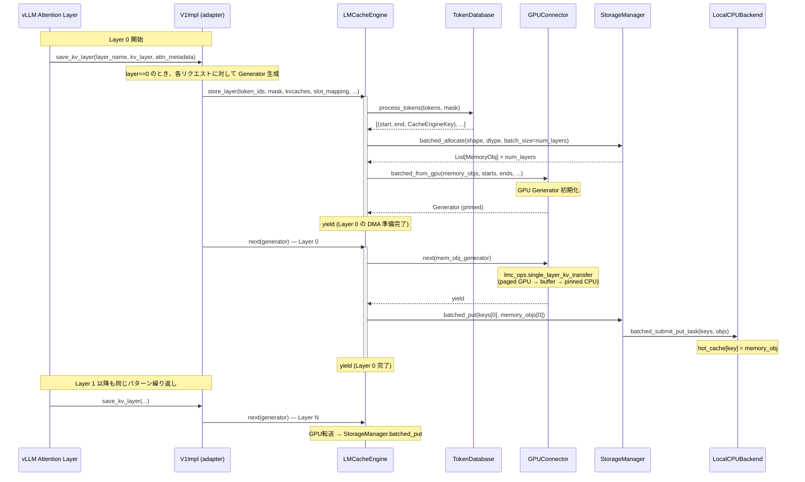
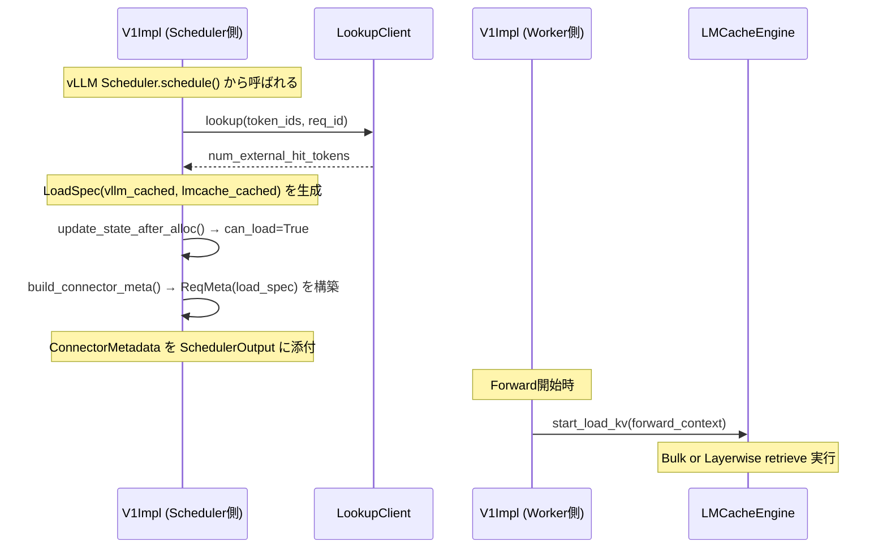
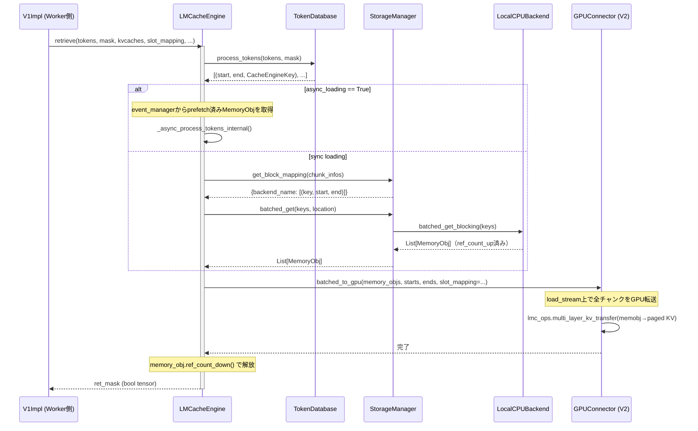
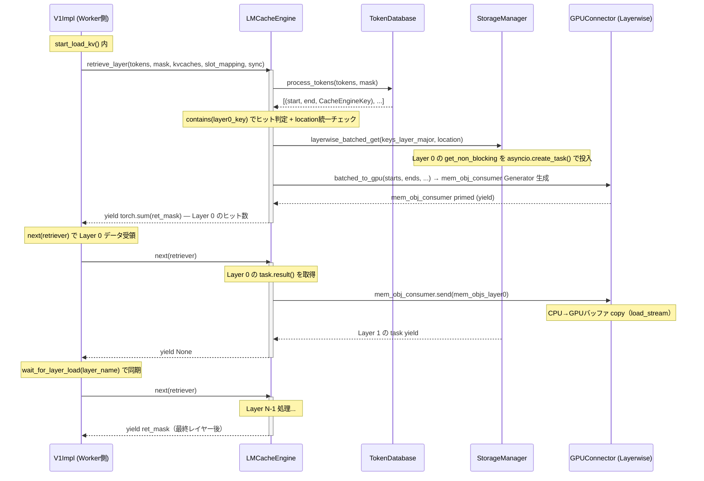
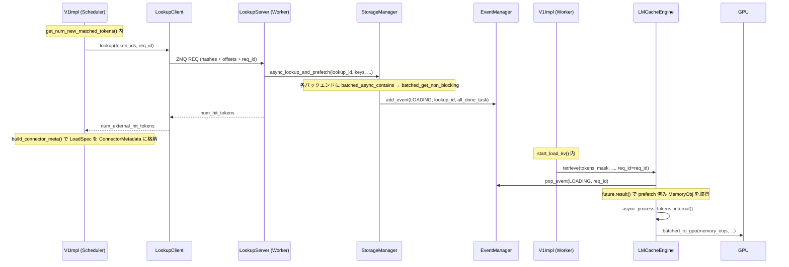

# データフロー

> **深度**: [MEDIUM] / **確信度**: [VERIFIED]
> **最終更新**: 2026-02-16（Phase 1 セッション2）

本ドキュメントはLMCacheのKVキャッシュ store / retrieve パスを追跡する。

## Store パス概要

vLLMのattentionレイヤー実行中に、KVキャッシュをGPUからCPU（および後段ストレージ）に退避するパス。
**レイヤーワイズ方式**（`use_layerwise=True`）が主要パスであり、各attentionレイヤーの実行直後にそのレイヤーのKVデータを転送する。



## 各コンポーネントの役割

### 1. LMCacheConnectorV1Impl（adapter）

**参照**: `target/LMCache/lmcache/integration/vllm/vllm_v1_adapter.py:964` (`save_kv_layer`)

vLLMの`KVConnectorBase_V1.save_kv_layer()`フックから呼ばれるアダプタ。
`LMCacheConnectorV1Dynamic`は純粋な委譲シェルであり、実装は`V1Impl`に集約。

**Layer 0での処理**:
1. `connector_metadata.requests`を走査し、`save_spec.can_save`がTrueのリクエストを処理
2. `skip_leading_tokens`をLMCacheのchunk_size（256）の倍数に切り下げてマスク境界を整合
3. `store_mask`を構築：プレフィックス部分=False、新規部分=True
4. `LMCacheEngine.store_layer()`を呼んでGeneratorを取得、`self.layerwise_storers`に追加
5. 最初のリクエストのみ`sync=True`でCUDAストリームを同期

**全レイヤー共通**: `self.layerwise_storers`内の全Generatorを`next()`で1ステップ進める。

### 2. LMCacheEngine.store_layer()

**参照**: `target/LMCache/lmcache/v1/cache_engine.py:528`

**Generator関数**であり、呼び出し側（adapter）が1レイヤーごとに`next()`で進める。

**初期化フェーズ**（最初のyieldまで）:
1. `TokenDatabase.process_tokens()`でトークン列をチャンク分割し、各チャンクのCacheEngineKeyを取得
2. `StorageManager.contains()`で既存チャンクをスキップ（layer 0のキーで判定）
3. `StorageManager.batched_allocate()`で各チャンク×全レイヤー分のMemoryObjを確保
4. チャンク×レイヤー → レイヤー×チャンクに転置
5. `GPUConnector.batched_from_gpu()`でGPU転送Generatorを生成・prime

**レイヤーループ**（`num_layers`回yield）:
```
yield → next(mem_obj_generator) → batched_put(keys[layer_id], memory_objs[layer_id])
```
各レイヤーで「GPU→CPU DMA」→「ストレージ書き込み」を実行。

**重要**: メモリ確保失敗時（`batched_allocate`がNone）は`break`で即座にstore中止。yieldだけ行ってストレージには書かない。

### 3. ChunkedTokenDatabase.process_tokens()

**参照**: `target/LMCache/lmcache/v1/token_database.py:309`

トークン列をチャンク（デフォルト256トークン）に分割し、プレフィックスチェーンハッシュを計算。

**ハッシュアルゴリズム**: vLLMと**完全に同一**。
- `vllm.utils.hashing.get_hash_fn_by_name("sha256_cbor")`を直接利用
- NONE_HASHも`vllm.v1.core.kv_cache_utils.NONE_HASH`から取得
- ハッシュ入力: `(prefix_hash, token_tuple, extra_keys)`

**マスク処理**: `mask`のFalse数（=already-cached prefix長）がchunk_sizeの倍数であることを検証。False区間のチャンクはスキップ。

**CacheEngineKey生成**: `_make_key_by_hash()`で`(model_name, world_size, worker_id, chunk_hash, kv_dtype, request_configs)`の6タプルを構築。その後`split_layers()`でレイヤーIDを付与した`LayerCacheEngineKey`に分割。

### 4. VLLMPagedMemLayerwiseGPUConnector.batched_from_gpu()

**参照**: `target/LMCache/lmcache/v1/gpu_connector/gpu_connectors.py:1212`

GPU上のページドKVキャッシュからCPU上のMemoryObjにデータを転送するGenerator関数。

**2段転送パス**（`use_gpu=True`時）:
1. **Paged GPU → 中間GPUバッファ**: `lmc_ops.single_layer_kv_transfer()`（CUDAカーネル）でslot_mappingに基づきscatter→gatherコピー
2. **GPUバッファ → Pinned CPU**: `memory_obj.tensor.copy_(..., non_blocking=True)`で非同期DMA

**直接転送パス**（`use_gpu=False`時）:
- `lmc_ops.single_layer_kv_transfer()`でpaged GPUから直接pinned CPUへ（チャンク単位）

**CUDAストリーム**: `self.store_stream`（専用ストリーム）を使用し、計算ストリームとオーバーラップ可能。`sync=True`の場合のみ`store_stream.synchronize()`で同期。

**出力形式**: `MemoryFormat.KV_T2D` = `[num_tokens, 2, hidden_dim]`（token-major、K/Vインターリーブ）。MLAの場合は`KV_MLA_FMT` = `[num_tokens, hidden_dim]`。

### 5. StorageManager.batched_put()

**参照**: `target/LMCache/lmcache/v1/storage_backend/storage_manager.py:388`

登録された全ストレージバックエンドにデータを配布するディスパッチャ。

**処理フロー**:
1. `allocator_backend`（通常LocalCPUBackend）の元データをそのまま利用
2. `OrderedDict`順に全バックエンド（L1→L2→L3）を走査
3. 異なるallocatorを持つバックエンドには`allocate_and_copy_objects()`で新たにメモリ確保＋コピー
4. 各バックエンドの`batched_submit_put_task()`を呼び出し
5. 最後にref_countをデクリメント

**注意**: `put()`メソッドは**非推奨**（`RuntimeError`を投げる）。`batched_put()`が唯一のエントリポイント。

### 6. LocalCPUBackend.submit_put_task()

**参照**: `target/LMCache/lmcache/v1/storage_backend/local_cpu_backend.py:141`

**同期実行**（バックグラウンドスレッドなし）。`cpu_lock`下で以下を実行:
1. 既存キーの重複チェック
2. `memory_obj.ref_count_up()`でrefcount増加
3. `hot_cache[key] = memory_obj`で保存
4. `cache_policy.update_on_put(key)`でEvictionポリシー更新（LRU: OrderedDictの末尾に移動、等）
5. 必要に応じてcontrollerへADMITメッセージ送信（`batched_msg_sender`経由）

## パイプライン動作の詳細

store_layerとbatched_from_gpuは2つの入れ子Generatorで**パイプライン動作**する:

```
store_layer Generator:     [初期化] → yield → [L0転送+保存] → yield → [L1転送+保存] → yield → ...
batched_from_gpu Generator: [初期化] → yield → [L0 DMA]     → yield → [L1 DMA]     → yield → ...
```

**タイミング**（`num_layers=N`の場合）:
- `store_layer`は`N+1`回yield（初期化1回 + レイヤーN回）
- `batched_from_gpu`は`N+1`回yield（初期化prime + レイヤーN回）
- adapterは合計`N`回`next()`を呼ぶ（各attentionレイヤー実行後）

**パイプラインのステップ**: Layer Lの`next()`呼び出しで、`batched_from_gpu`がLayer LのDMAを実行し、`store_layer`がLayer LのStorageManager書き込みを行う。つまり**DMAとストレージ書き込みは同一レイヤーで連続実行**される。

## データ構造

| 構造 | 型 | 説明 |
|---|---|---|
| CacheEngineKey | `(model_name, world_size, worker_id, chunk_hash, kv_dtype, request_configs)` | チャンク単位のキー（レイヤー横断） |
| LayerCacheEngineKey | CacheEngineKey + layer_id | レイヤー単位のキー |
| MemoryObj | pinned CPU tensor wrapper | ref_count管理、MemoryObjMetadata付き |
| MemoryFormat.KV_T2D | `[num_tokens, 2, hidden_dim]` | レイヤーワイズ形式（token-major） |
| MemoryFormat.KV_MLA_FMT | `[num_tokens, hidden_dim]` | MLA形式（K/V統合） |
| store_mask | `torch.Tensor[bool]` | False=キャッシュ済みprefix、True=新規トークン |
| slot_mapping | `torch.Tensor[long]` | トークン位置→vLLMページドメモリのflat slot |
| hot_cache | `OrderedDict[CacheEngineKey, MemoryObj]` | L1 CPUキャッシュ（Evictionポリシー付き） |

---

## Retrieve パス概要

KVキャッシュをストレージ（CPU/Disk/Remote）からGPUのvLLMページドメモリに復元するパス。
**2フェーズ設計**: Scheduler側の**lookup**（ヒット判定+prefetch指示）と、Worker側の**load**（実際のGPU転送）に分離。

### Scheduler→Worker間の情報伝達



### LookupClient の動作

**参照**: `target/LMCache/lmcache/v1/lookup_client/lmcache_lookup_client.py:28`

`LMCacheLookupClient`はvLLMのSchedulerプロセスで動作する。LMCacheEngine（Worker側）とは**ZMQ IPC**（REQ/REP）で通信。

**処理フロー**:
1. `process_tokens()`でトークン列をチャンクハッシュに分割
2. ハッシュ列をmsgpackシリアライズし、ZMQで`LookupServer`に送信
3. `LookupServer`（Worker側）が`StorageManager.contains()`で存在チェック
4. ヒットトークン数を返却

**キャッシュ**: 同一リクエストの2回目以降のlookupは`reqs_status`辞書から即座に返す。

### Retrieve パスの2モード

| モード | 条件 | エントリポイント | 特徴 |
|---|---|---|---|
| **Bulk** | `use_layerwise=False`（デフォルト） | `LMCacheEngine.retrieve()` | 全レイヤー一括取得→一括GPU転送 |
| **Layerwise** | `use_layerwise=True` | `LMCacheEngine.retrieve_layer()` | レイヤー単位Generator、パイプライン可能 |

### Bulk Retrieve パス



#### _process_tokens_internal() の詳細

**参照**: `target/LMCache/lmcache/v1/cache_engine.py:1527`

1. `process_tokens()`でチャンク分割・ハッシュ計算
2. `StorageManager.get_block_mapping()`でチャンクの**所在バックエンド**を特定
   - 各バックエンドの`batched_contains()`をprefix match方式で呼び出し
   - チャンクを所在バックエンドごとにグルーピング
3. バックエンドごとに`batched_get()`で`MemoryObj`を取得
4. 取得失敗時は`last_failed_block_start`以降の`ret_mask`をFalseに戻し、チャンクリストを切り詰め

#### _async_process_tokens_internal() の詳細

**参照**: `target/LMCache/lmcache/v1/cache_engine.py:1463`

非同期プリフェッチ済みの結果を`event_manager`から取得するパス。

1. `event_manager.pop_event(EventType.LOADING, req_id)`でprefetch結果の`Future`を取得
2. `future.result()`で`list[list[tuple[CacheEngineKey, MemoryObj]]]`（tier×chunk）を取得
3. `process_tokens()`で再度チャンク分割し、`memory_obj_map`からマッチングしてチャンクリストを構築
4. 未使用の`MemoryObj`は`ref_count_down()`で即座に解放

#### StorageManager.batched_get() のwrite-back

**参照**: `target/LMCache/lmcache/v1/storage_backend/storage_manager.py:484`

リモートバックエンド（Disk/Remote）からデータを取得した場合、**自動的にLocalCPUBackendにwrite-back**する。
- `LocalCPUBackend`以外から取得 && `LocalCPUBackend`が存在 && 全MemoryObjがnon-None → `batched_submit_put_task()`でL1にコピー

### Layerwise Retrieve パス



#### retrieve_layer() の Generator 構造

**参照**: `target/LMCache/lmcache/v1/cache_engine.py:851`

`num_layers + 3`回yieldする（ヒットあり時）:
1. **yield 0**: `torch.sum(ret_mask)` — ヒットトークン数（sglang統合向け）
2. **yield 1 ~ N-1**: `None` — 各レイヤーのGPU転送進行中
3. **yield N**: `None` — 最終レイヤー処理中
4. **yield N+1**: `next(mem_obj_consumer)` で同期
5. **yield N+2**: `ret_mask` — 最終結果

各レイヤーで:
- `next(get_generator)`で`StorageManager`から非同期取得した`Future`を受け取る
- `task.result()`で`List[MemoryObj]`を取得（ブロッキング）
- `mem_obj_consumer.send(mem_objs_layer)`でGPUコネクタにデータを渡す
- `MemoryObj.ref_count_down()`は全レイヤー完了後にバッチで実行

#### Layerwise GPUConnector.batched_to_gpu() のパイプライン

**参照**: `target/LMCache/lmcache/v1/gpu_connector/gpu_connectors.py:683`

`VLLMBufferLayerwiseGPUConnector`は`num_layers + 2`回のイテレーションで**3段パイプライン**を実行:

| イテレーション i | 操作1: paged書き込み | 操作2: RoPE補正+gap zeroing | 操作3: CPU→GPU load |
|---|---|---|---|
| i = 0 | — | — | `yield`で`mem_objs_layer0`受領、load_stream上でcopy |
| i = 1 | — | Layer 0のRoPE補正 | `yield`で`mem_objs_layer1`受領、load_stream上でcopy |
| i = 2 | Layer 0をpagedメモリに書き込み | Layer 1のRoPE補正 | `yield`で`mem_objs_layer2`受領 |
| ... | Layer i-2 | Layer i-1 | Layer i |
| i = N | Layer N-2 | Layer N-1 | `yield`（同期用、データなし） |
| i = N+1 | Layer N-1 | — | — |

**ダブルバッファ**: `compute_gpu_buffer_obj`と`load_gpu_buffer_obj`をping-pongして、RoPE計算とDMAをオーバーラップ。

**RoPE位置補正**: `cache_positions=True`の場合、保存時の位置と現在の位置の差分で`fused_rotary_emb()`を適用。保存時位置は`MemoryObjMetadata.cached_positions`から取得。

**gap zeroing**: チャンク間のギャップ位置（連続しないstart/endの隙間）をゼロ埋め。

### 非同期プリフェッチの全体フロー



**ポイント**:
- Scheduler側のlookupがprefetchを**トリガー**し、Worker側のretrieveがprefetch結果を**消費**する
- `EventManager`が両者を`lookup_id`（=req_id）で紐付け
- prefetchは`asyncio.create_task()`で非同期実行され、Worker側のretrieveまでに完了していればブロッキングなし

### token_mask と ret_mask の意味

| マスク | 用途 | 値の意味 |
|---|---|---|
| `token_mask` | adapter側で構築 | `False`=vLLMがキャッシュ済み（チャンク境界まで切り詰め）、`True`=LMCacheから要ロード |
| `ret_mask` | Engine内部で構築 | `True`=実際にLMCacheから取得成功、`False`=未取得 |
| `mask`（Engine引数） | token_maskと同じ | `process_tokens()`のFalseプレフィックス=スキップ対象 |

`token_mask`のFalse区間は`vllm_cached_tokens`をchunk_sizeの倍数に切り下げた範囲。これにより、vLLMとLMCacheのキャッシュ境界がチャンク単位で整合する（オーバーラップ領域はLMCacheが上書き）。

### エラーハンドリング

- **部分的取得失敗**: `ret_mask.sum() < expected`の場合、`record_failed_blocks()`で失敗ブロックIDを計算し、`_invalid_block_ids`に蓄積。vLLMのSchedulerが次stepで`get_block_ids_with_load_errors()`で回収し、再計算を指示
- **StorageManager.batched_get()**: `memory_obj=None`が返された場合、`last_failed_block_start`以降を切り捨て（prefix matchの性質上、途中の欠損以降は全て無効）
- **健全性チェック**: `is_healthy()==False`の場合、retrieve自体をスキップ（ゼロマスクを返す）
