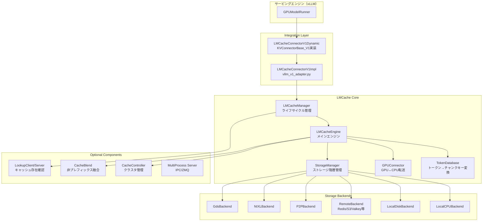

# LMCache アーキテクチャ概要

> **深度**: [SHALLOW]
> **確信度**: [VERIFIED]
> **最終更新**: 2026-02-16（Phase 0a）

## プロジェクト概要

LMCacheは、LLMサービングエンジン（vLLM, SGLang等）の**KVキャッシュを外部に保存・再利用**することで、TTFT（Time To First Token）削減とスループット向上を実現する拡張ライブラリ。

- **コア機能**: KVキャッシュのチャンク単位（256トークン）保存・検索・ロード
- **ストレージ階層**: GPU → CPU → Disk → Remote（Redis/S3/Mooncake/NIXL等）
- **統合方式**: vLLMの`KVConnectorBase_V1`を実装して接続
- **追加機能**: CacheBlend（非プレフィックス再利用）、P2P転送、Disaggregated Prefill

## リポジトリ規模

- **Python**: 約62,000行（`lmcache/`配下）
- **C++/CUDA**: 20ファイル（`csrc/`）— CacheGen圧縮、メモリ操作、位置エンコーディングカーネル
- **Rust**: 1ファイル（`rust/raw_block/`）— Raw Block ストレージバックエンド

## 全体アーキテクチャ [SHALLOW]



## パッケージ構造 [VERIFIED]

```
lmcache/
├── __init__.py
├── config.py              # レガシー設定（旧API）
├── connections.py         # 接続ヘルパー
├── logging.py             # ログ初期化
├── observability.py       # Prometheus/メトリクス（1,839行）
├── protocol.py            # LMCacheModelRequest（msgspec）
├── usage_context.py       # 利用状況トラッキング
├── utils.py               # CacheEngineKey, ユーティリティ（652行）
├── non_cuda_equivalents.py # CUDA非依存フォールバック
│
├── integration/           # サービングエンジン統合
│   ├── vllm/              # vLLM統合
│   │   ├── lmcache_connector_v1.py      # KVConnectorBase_V1実装（latest版）
│   │   ├── lmcache_connector_v1_085.py  # vLLM 0.8.5互換版
│   │   ├── vllm_v1_adapter.py           # 実装本体（LMCacheConnectorV1Impl）
│   │   ├── vllm_multi_process_adapter.py # マルチプロセス対応
│   │   └── utils.py                     # vLLM固有ユーティリティ
│   └── sglang/            # SGLang統合
│       ├── sglang_adapter.py
│       └── utils.py
│
├── server/                # レガシーサーバー
│
├── storage_backend/       # レガシーストレージ
│   ├── evictor/           # Eviction（LRU）
│   └── serde/             # シリアライゼーション（CacheGen等）
│
├── tools/                 # ベンチマーク等
│
└── v1/                    # ★ メインコード（v1アーキテクチャ）
    ├── cache_engine.py          # LMCacheEngine（1,949行）★中核
    ├── cache_interface.py       # LMCacheModelRequest
    ├── config.py                # LMCacheEngineConfig
    ├── config_base.py           # 設定基盤
    ├── manager.py               # LMCacheManager（694行）
    ├── metadata.py              # LMCacheMetadata
    ├── token_database.py        # Chunked/Segment TokenDatabase
    ├── memory_management.py     # MemoryObj, MemoryAllocator（2,339行）
    ├── event_manager.py         # イベント管理
    ├── kv_layer_groups.py       # レイヤーグループ管理
    ├── lazy_memory_allocator.py # 遅延メモリ確保
    ├── pin_monitor.py           # ピン監視
    ├── periodic_thread.py       # 定期実行スレッド
    ├── protocol.py              # MPプロトコル定義
    ├── rpc_utils.py             # ZMQ RPC
    ├── system_detection.py      # NUMA検出
    │
    ├── gpu_connector/           # GPU↔CPUデータ転送
    │   ├── gpu_connectors.py    # GPUConnectorInterface + 実装
    │   ├── gpu_ops.py           # CUDA memcpy操作
    │   └── utils.py
    │
    ├── storage_backend/         # ストレージ階層
    │   ├── abstract_backend.py  # StorageBackendInterface
    │   ├── storage_manager.py   # StorageManager（1,145行）
    │   ├── local_cpu_backend.py # CPU (L1)
    │   ├── local_disk_backend.py# Disk (L2)
    │   ├── remote_backend.py    # Remote (L3)
    │   ├── p2p_backend.py       # P2P転送
    │   ├── pd_backend.py        # Prefill-Decode分離
    │   ├── nixl_storage_backend.py # NIXL
    │   ├── gds_backend.py       # GPUDirect Storage
    │   ├── connector/           # 15+リモートコネクタ
    │   │   ├── base_connector.py
    │   │   ├── redis_connector.py
    │   │   ├── s3_connector.py
    │   │   ├── valkey_connector.py
    │   │   ├── mooncakestore_connector.py
    │   │   ├── infinistore_connector.py
    │   │   ├── fs_connector.py
    │   │   └── ...
    │   ├── cache_policy/        # Eviction方針
    │   │   ├── fifo.py / lru.py / lfu.py / mru.py
    │   │   └── base_policy.py
    │   ├── naive_serde/         # シリアライゼーション
    │   │   ├── naive_serde.py / cachegen_*.py / kivi_serde.py
    │   │   └── serde.py
    │   └── job_executor/        # 非同期ジョブ実行
    │
    ├── compute/                 # 計算コンポーネント
    │   ├── attention/           # Attention計算
    │   │   ├── flash_attn.py / flash_infer_sparse.py
    │   │   └── metadata.py
    │   ├── blend/               # CacheBlend
    │   │   ├── blender.py / metadata.py / utils.py
    │   │   └── __init__.py
    │   ├── models/              # モデル固有（Llama/Qwen3）
    │   │   ├── base.py / llama.py / qwen3.py
    │   │   └── utils.py
    │   └── positional_encoding.py # RoPE等
    │
    ├── multiprocess/            # マルチプロセスアーキテクチャ
    │   ├── server.py            # MPサーバー
    │   ├── blend_server.py      # CacheBlend用サーバー
    │   ├── mq.py                # メッセージキュー
    │   ├── session.py           # セッション管理
    │   ├── token_hasher.py      # トークンハッシュ
    │   ├── gpu_context.py       # GPUコンテキスト
    │   ├── protocols/           # プロトコル定義
    │   └── ...
    │
    ├── cache_controller/        # クラスタキャッシュ管理
    │   ├── controller_manager.py # メイン管理
    │   ├── worker.py            # LMCacheWorker
    │   ├── executor.py          # クラスタ実行
    │   ├── controllers/         # KV/Registration制御
    │   └── commands/            # コマンド（FullSync等）
    │
    ├── lookup_client/           # キャッシュ存在確認
    │   ├── abstract_client.py   # LookupClientInterface
    │   ├── lmcache_lookup_client.py  # ZMQベース
    │   ├── lmcache_async_lookup_client.py
    │   └── record_strategies/   # 記録戦略（BloomFilter等）
    │
    ├── distributed/             # 分散ストレージ管理（MPモード用）
    │   ├── storage_manager.py   # 分散StorageManager
    │   ├── l1_manager.py        # L1管理
    │   ├── memory_manager.py    # メモリ管理
    │   └── eviction_policy/     # 分散Eviction
    │
    ├── transfer_channel/        # データ転送チャネル
    │   ├── abstract.py
    │   ├── nixl_channel.py
    │   └── py_socket_channel.py
    │
    ├── offload_server/          # オフロードサーバー
    │   ├── abstract_server.py
    │   └── zmq_server.py
    │
    ├── health_monitor/          # ヘルスチェック
    ├── internal_api_server/     # 内部API（FastAPI）
    ├── standalone/              # スタンドアロンモード
    └── plugin/                  # ランタイムプラグイン
```

## 主要エントリポイント [VERIFIED]

### 1. vLLM統合（メインパス）
- **参照**: `target/LMCache/lmcache/integration/vllm/lmcache_connector_v1.py:30` (LMCacheConnectorV1Dynamic)
- vLLMの`KVConnectorBase_V1`を実装。内部で`LMCacheConnectorV1Impl`に委譲
- `LMCacheManager`がライフサイクル全体を管理

### 2. LMCacheEngine（コア）
- **参照**: `target/LMCache/lmcache/v1/cache_engine.py:78` (LMCacheEngine)
- KVキャッシュのstore/retrieve/prefetchを統合するメインクラス
- `TokenDatabase`でトークン列→チャンクキー変換
- `GPUConnector`でGPU↔CPU転送
- `StorageManager`でストレージ階層管理

### 3. StorageManager（ストレージ階層）
- **参照**: `target/LMCache/lmcache/v1/storage_backend/storage_manager.py:1`
- `OrderedDict`でバックエンド登録順管理（L1→L2→L3）
- 非同期put/getで階層間データ移動

### 4. MultiProcess Server
- **参照**: `target/LMCache/lmcache/v1/multiprocess/server.py:1`
- ZMQ IPCベースのマルチプロセスアーキテクチャ
- GPUコンテキスト管理、セッション管理

### 5. CacheController（クラスタ管理）
- **参照**: `target/LMCache/lmcache/v1/cache_controller/controller_manager.py:1`
- 複数インスタンス間のキャッシュ状態管理
- Register/Deregister/Heartbeat/P2P Lookup

### 6. LMCache APIサーバー
- **参照**: `target/LMCache/lmcache/v1/api_server/__main__.py`
- スタンドアロンAPIサーバーモード

## 新旧アーキテクチャ [VERIFIED]

- **`lmcache/v1/`**: 現行アーキテクチャ（★フォーカス対象）
- **`lmcache/server/`**, **`lmcache/storage_backend/`**: レガシー（旧API互換）
- v1がメイン。レガシーは基本的にスキップしてよい

## 2つの動作モード [SHALLOW]

### In-Process モード
- vLLMプロセス内で直接`LMCacheEngine`を動作
- `LMCacheConnectorV1Dynamic` → `LMCacheConnectorV1Impl` → `LMCacheManager` → `LMCacheEngine`

### MultiProcess (MP) モード
- 別プロセスでLMCacheサーバーを起動
- ZMQ IPCで通信
- `multiprocess/server.py`がメイン
- 分散StorageManager（`distributed/storage_manager.py`）を使用

## データフロー概要 [SHALLOW]

### Store パス（GPU → Storage）
1. vLLMのforward完了後、`wait_for_save()`が呼ばれる
2. `GPUConnector.from_gpu()` でGPU KVキャッシュ → CPU MemoryObj
3. `TokenDatabase`でトークン列をチャンクキーに変換
4. `StorageManager`が各バックエンドに非同期put

### Retrieve パス（Storage → GPU）
1. Scheduler側で`LookupClient`がキャッシュ存在確認
2. Worker側で`start_load_kv()`が呼ばれる
3. `StorageManager`がバックエンドからMemoryObjを取得
4. `GPUConnector.to_gpu()` でCPU MemoryObj → GPU KVキャッシュ

## 重要な設計判断 [SHALLOW]

- **チャンク単位保存**: 256トークン（設定可）単位でKVキャッシュを分割保存
- **プレフィックスハッシュ**: vLLMと同じsha256ベースのハッシュチェーンでチャンク識別
- **非同期ストレージ**: put操作は非同期で実行（Futureベース）
- **Eviction方針**: FIFO/LRU/LFU/MRUから選択可能
- **Layerwise GPUConnector**: レイヤー単位でのKVキャッシュ転送をサポート
- **CacheBlend**: 非プレフィックス部分のKVキャッシュも再利用（セパレータベースセグメント分割）
