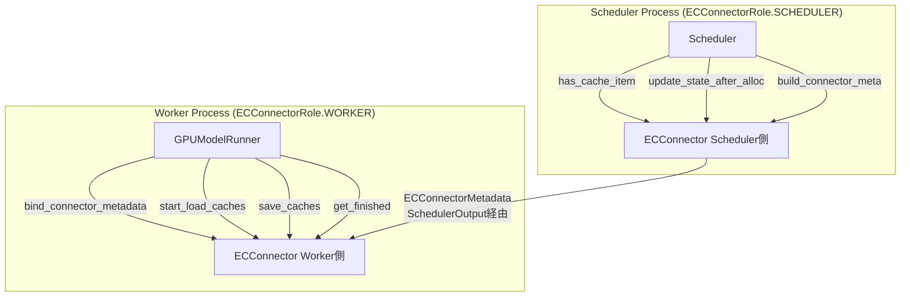

# ECConnector（Encoder Cache Connector）

> **深度**: [MEDIUM] | **確信度**: [VERIFIED] | **最終更新**: 2026-02-14

## 概要

ECConnectorは、マルチモーダルモデルのエンコーダ出力を**vLLMインスタンス間**または**外部ストレージ**と転送するためのプラグインフレームワークである。KV Transfer（デコーダKVキャッシュ用）とは完全に独立した系統で、エンコーダキャッシュに特化している。

主なユースケースは**Encoder-Prefill-Decode分離（EPD）**で、エンコーダ専用インスタンスが画像処理を行い、その結果をデコーダインスタンスに転送する。

**参照**: `target/vllm/vllm/distributed/ec_transfer/` (パッケージ全体)

## アーキテクチャ

### ファイル構成

```
vllm/distributed/ec_transfer/
├── __init__.py                          # get_ec_transfer(), has_ec_transfer() 公開API
├── ec_transfer_state.py                 # グローバルシングルトン管理
└── ec_connector/
    ├── __init__.py
    ├── base.py                          # ECConnectorBase 抽象基底クラス
    ├── factory.py                       # ECConnectorFactory レジストリ + 動的ロード
    └── example_connector.py             # ECExampleConnector 参照実装（safetensors）

vllm/v1/worker/
└── ec_connector_model_runner_mixin.py   # GPUModelRunner統合Mixin

vllm/config/
└── ec_transfer.py                       # ECTransferConfig 設定クラス
```

### 2ロール分離アーキテクチャ

ECConnectorは**Scheduler側**と**Worker側**に分離され、同じクラスが両方のロールを担う：



| ロール | 生成場所 | 主な責務 |
|---|---|---|
| SCHEDULER | `Scheduler.__init__()` via `ECConnectorFactory` | キャッシュ存在チェック、メタデータ構築 |
| WORKER | `gpu_worker.py` の `ensure_ec_transfer_initialized()` | キャッシュのロード/セーブ |

**参照**: `target/vllm/vllm/v1/core/sched/scheduler.py:135-138` (Scheduler側生成)
**参照**: `target/vllm/vllm/distributed/ec_transfer/ec_transfer_state.py:26-43` (Worker側生成)

## ECConnectorBase 抽象基底クラス

**参照**: `target/vllm/vllm/distributed/ec_transfer/ec_connector/base.py:59-253`

### プロパティ

| プロパティ | 型 | 説明 |
|---|---|---|
| `role` | `ECConnectorRole` | SCHEDULER or WORKER |
| `is_producer` | `bool` | エンコーダキャッシュを生成する側か |
| `is_consumer` | `bool` | エンコーダキャッシュを消費する側か |

### 抽象メソッド（実装必須）

#### Worker側（3メソッド）

| メソッド | シグネチャ | 説明 |
|---|---|---|
| `start_load_caches` | `(encoder_cache: dict[str, Tensor], **kwargs) → None` | メタデータに基づきキャッシュをロード |
| `save_caches` | `(encoder_cache: dict[str, Tensor], mm_hash: str, **kwargs) → None` | エンコーダ出力を外部に保存 |

#### Scheduler側（3メソッド）

| メソッド | シグネチャ | 説明 |
|---|---|---|
| `has_cache_item` | `(identifier: str) → bool` | 外部にキャッシュが存在するか判定 |
| `update_state_after_alloc` | `(request: Request, index: int) → None` | 割当後の内部状態更新 |
| `build_connector_meta` | `(scheduler_output: SchedulerOutput) → ECConnectorMetadata` | Worker転送用メタデータ構築 |

### 具象メソッド（オーバーライド任意）

| メソッド | デフォルト動作 | 説明 |
|---|---|---|
| `bind_connector_metadata` | メタデータ保持 | Worker側: 毎step実行前に呼ばれる |
| `clear_connector_metadata` | Noneに設定 | Worker側: 毎step実行後に呼ばれる |
| `register_caches` | no-op | 将来のP2P機能用 |
| `get_finished` | `(None, None)` | 非同期転送完了通知 |
| `update_connector_output` | no-op | Worker出力からScheduler状態を更新 |
| `request_finished` | `(False, None)` | リクエスト完了時のフック |

## ECTransferConfig 設定

**参照**: `target/vllm/vllm/config/ec_transfer.py:16-108`

### ECロール

```python
ECRole = Literal["ec_producer", "ec_consumer", "ec_both"]
```

| ロール | 説明 | `is_producer` | `is_consumer` |
|---|---|---|---|
| `ec_producer` | エンコーダ計算+キャッシュ保存 | True | False |
| `ec_consumer` | キャッシュ読み込み+デコーダ実行 | False | True |
| `ec_both` | 両方の機能 | True | True |

### 主要設定パラメータ

| パラメータ | デフォルト | 説明 |
|---|---|---|
| `ec_connector` | None | コネクタ名（例: "ECExampleConnector"） |
| `ec_role` | None | ECロール |
| `ec_connector_module_path` | None | カスタムコネクタのPythonモジュールパス |
| `ec_connector_extra_config` | `{}` | コネクタ固有の追加設定 |
| `ec_buffer_device` | "cuda" | バッファデバイス |
| `ec_buffer_size` | 1e9 | バッファサイズ（バイト） |
| `ec_ip` / `ec_port` | 127.0.0.1:14579 | P2P接続用 |
| `ec_rank` / `ec_parallel_size` | None / 1 | 分散接続設定 |

## ECConnectorFactory

**参照**: `target/vllm/vllm/distributed/ec_transfer/ec_connector/factory.py:20-85`

### コネクタ登録方式

2つの登録方法がある：

1. **静的登録**: `ECConnectorFactory.register_connector()` でモジュール遅延ロード登録
2. **動的ロード**: `ec_connector_module_path` で任意のPythonモジュールからロード

```python
# 静的登録（factory.py末尾）
ECConnectorFactory.register_connector(
    "ECExampleConnector",
    "vllm.distributed.ec_transfer.ec_connector.example_connector",
    "ECExampleConnector",
)

# 動的ロード（ec_connector_module_pathが設定されている場合）
connector_module = importlib.import_module(connector_module_path)
connector_cls = getattr(connector_module, connector_name)
```

### 現在登録済みコネクタ

| 名前 | 実装 | 用途 |
|---|---|---|
| `ECExampleConnector` | `example_connector.py` | 参照実装（safetensorsディスク保存） |

## ECExampleConnector 参照実装

**参照**: `target/vllm/vllm/distributed/ec_transfer/ec_connector/example_connector.py:45-199`

safetensorsフォーマットでディスクにエンコーダキャッシュを保存/読み込みする参照実装。

### メタデータ

```python
@dataclass
class MMMeta:
    mm_hash: str      # マルチモーダルデータのハッシュ
    num_token: int     # エンコーダトークン数

@dataclass
class ECExampleConnectorMetadata(ECConnectorMetadata):
    mm_datas: list[MMMeta]  # ロードすべきエントリ一覧
```

### ストレージ構造

```
{shared_storage_path}/
└── {mm_hash}/
    └── encoder_cache.safetensors    # {"ec_cache": Tensor} 形式
```

### 動作フロー

#### 保存（Producer側）

**参照**: `target/vllm/vllm/distributed/ec_transfer/ec_connector/example_connector.py:98-118`

1. GPUModelRunnerが `_execute_mm_encoder()` 完了後に `maybe_save_ec_to_connector()` を呼ぶ
2. `save_caches()`: テンソルを `.detach().cpu()` してsafetensorsで保存

#### 読み込み（Consumer側）

**参照**: `target/vllm/vllm/distributed/ec_transfer/ec_connector/example_connector.py:63-96`

1. Scheduler側: `has_cache_item()` でファイル存在確認 (`os.path.exists`)
2. Scheduler側: `build_connector_meta()` でロード対象リストを構築
3. Worker側: `start_load_caches()` でsafetensorsからGPUにロード

#### 存在確認

`has_cache_item()` は `os.path.exists()` でsafetensorsファイルの存在をチェック。

## Schedulerとの統合

### _schedule_encoder_inputs() 内の分岐

**参照**: `target/vllm/vllm/v1/core/sched/scheduler.py:1212-1218`

```python
if self.ec_connector is not None and self.ec_connector.has_cache_item(identifier):
    # 外部キャッシュにヒット → エンコーダ計算不要、compute_budget消費なし
    mm_hashes_to_schedule.add(item_identifier)
    external_load_encoder_input.append(i)
    num_embeds_to_schedule += num_encoder_embeds
    continue
```

ECConnectorにキャッシュがある場合：
- `encoder_compute_budget` は**消費しない**（エンコーダ計算不要のため）
- `external_load_encoder_input` リストに追加
- `encoder_cache_manager.allocate()` は実行される（GPU側に空きが必要）

### 割当後の状態更新

**参照**: `target/vllm/vllm/v1/core/sched/scheduler.py:523-527`

```python
if external_load_encoder_input:
    for i in external_load_encoder_input:
        self.encoder_cache_manager.allocate(request, i)
        if self.ec_connector is not None:
            self.ec_connector.update_state_after_alloc(request, i)
```

### メタデータ構築

**参照**: `target/vllm/vllm/v1/core/sched/scheduler.py:899-904`

`build_connector_meta()` がSchedulerOutputに `ec_connector_metadata` を設定。Worker側はこのメタデータを使ってロード対象を特定する。

## GPUModelRunnerとの統合

### ECConnectorModelRunnerMixin

**参照**: `target/vllm/vllm/v1/worker/ec_connector_model_runner_mixin.py:25-87`

GPUModelRunnerに3つのstatic methodを提供：

| メソッド | 説明 |
|---|---|
| `maybe_save_ec_to_connector` | エンコーダ出力保存（Producer時） |
| `get_finished_ec_transfers` | 非同期転送完了確認 |
| `maybe_get_ec_connector_output` | コンテキストマネージャでライフサイクル管理 |

### コンテキストマネージャのライフサイクル

```python
with self.maybe_get_ec_connector_output(scheduler_output, encoder_cache) as output:
    # 1. bind_connector_metadata() → メタデータ設定
    # 2. Consumer時: start_load_caches() → 外部からロード
    # 3. yield → エンコーダ実行、gather処理
    # 4. get_finished() → 非同期完了確認
    # 5. clear_connector_metadata() → クリーンアップ
```

### Producer専用モード

**参照**: `target/vllm/vllm/v1/worker/gpu_model_runner.py:3343-3349`

Producer専用インスタンスは、エンコーダ実行後にデコーダ実行をスキップし、空のModelRunnerOutputを返す：

```python
if has_ec_transfer() and get_ec_transfer().is_producer:
    with self.maybe_get_ec_connector_output(...) as ec_connector_output:
        self._execute_mm_encoder(scheduler_output)
        return make_empty_encoder_model_runner_output(scheduler_output)
```

また、Producer専用インスタンスはKVキャッシュを確保しない：

**参照**: `target/vllm/vllm/v1/worker/gpu_model_runner.py:6160-6161`

```python
if has_ec_transfer() and get_ec_transfer().is_producer:
    return {}  # KVCacheSpec空 → KVキャッシュ確保なし
```

## ECConnectorOutput

**参照**: `target/vllm/vllm/v1/outputs.py:151-154`

```python
@dataclass
class ECConnectorOutput:
    finished_sending: set[str] | None = None
    finished_recving: set[str] | None = None
```

ModelRunnerOutputに含まれてScheduler側に返されるが、**現時点ではScheduler側で未消費**（`ec_connector_output`を読み取るコードがSchedulerにない）。非同期転送完了フィードバックは将来実装予定。

## グローバルシングルトン管理

**参照**: `target/vllm/vllm/distributed/ec_transfer/ec_transfer_state.py:14-43`

```python
_EC_CONNECTOR_AGENT: ECConnectorBase | None = None
```

| 関数 | 説明 |
|---|---|
| `has_ec_transfer()` | ECConnectorが初期化済みか |
| `get_ec_transfer()` | シングルトン取得（未初期化ならassert） |
| `ensure_ec_transfer_initialized(config)` | Workerロールで初期化（冪等） |

Worker側のシングルトン初期化は `gpu_worker.py` で `ensure_ec_transfer_initialized()` を呼ぶことで行われる。Scheduler側は `ECConnectorFactory.create_connector()` で直接生成し、`self.ec_connector` に保持する（シングルトンではない）。

## カスタムECConnector実装ガイド

### 最小実装

1. `ECConnectorBase` を継承
2. 5つの抽象メソッドを実装
3. ECTransferConfigの`ec_connector`にクラス名、`ec_connector_module_path`にモジュールパスを指定

### 実装の要点

- `has_cache_item()` はSchedulerのホットパスで呼ばれるため**高速**であるべき
- `start_load_caches()` は `encoder_cache` dict に直接テンソルを追加する
- `save_caches()` は `encoder_cache[mm_hash]` からGPUテンソルを取得して保存する
- `build_connector_meta()` は内部状態をリセットすること

### 起動コマンド例

```bash
# Producer（エンコーダ専用インスタンス）
vllm serve model_name \
    --ec-connector ECExampleConnector \
    --ec-role ec_producer \
    --ec-connector-extra-config '{"shared_storage_path": "/shared/cache"}'

# Consumer（デコーダインスタンス）
vllm serve model_name \
    --ec-connector ECExampleConnector \
    --ec-role ec_consumer \
    --ec-connector-extra-config '{"shared_storage_path": "/shared/cache"}'
```

## 上流・下流依存関係

### 上流
- **ECTransferConfig**: `ec_connector`, `ec_role` 等の設定
- **Scheduler**: キャッシュ存在確認、状態更新、メタデータ構築の呼び出し
- **GPUModelRunner**: エンコーダ実行結果の保存、ロード済みキャッシュの利用

### 下流
- **外部ストレージ**: safetensors（例）、共有メモリ、ネットワーク等（実装依存）

## 開発状況・未実装機能

1. **ECConnectorOutput未消費**: Worker→Scheduler方向の非同期転送完了フィードバックが未実装
2. **request_finished未統合**: Schedulerから`ec_connector.request_finished()`が呼ばれていない
3. **register_caches未実装**: P2P直接転送のためのキャッシュ登録（TODO）
4. **エンコーダキャッシュ事前割り当て未対応**: `encoder_cache` が `dict` のため、固定バッファへの移行が必要
5. **登録済みコネクタが1つのみ**: ECExampleConnector（デバッグ用）のみ。SHMConnector等は外部PR待ち
