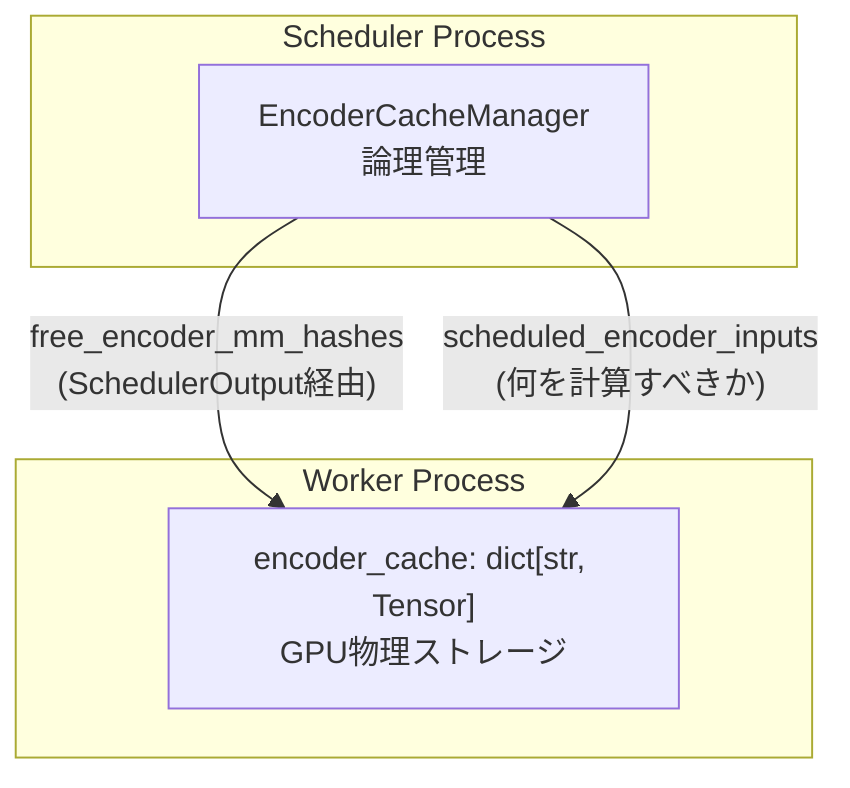
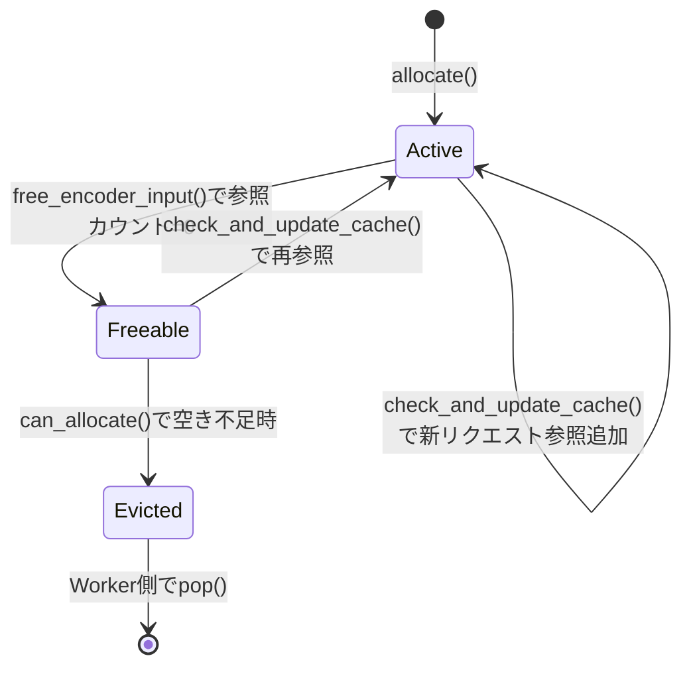
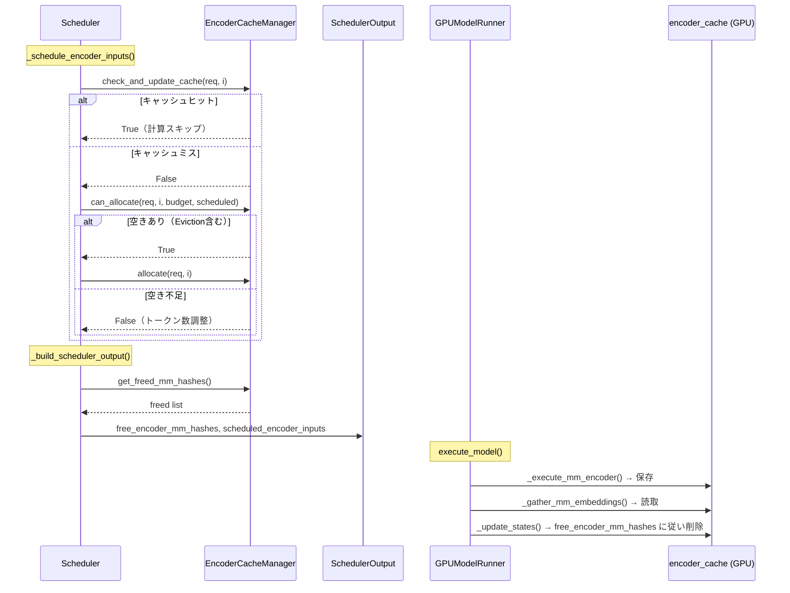

# EncoderCache（エンコーダキャッシュ）

> **深度**: [MEDIUM] | **確信度**: [VERIFIED] | **最終更新**: 2026-02-14

## 概要

EncoderCacheは、マルチモーダルモデルにおけるエンコーダ出力（例: ビジョンエンコーダの画像埋め込み）のGPUメモリ上キャッシュを管理するコンポーネントである。2層構造で、Scheduler側の論理管理（`EncoderCacheManager`）とWorker側の物理ストレージ（`GPUModelRunner.encoder_cache`）に分離されている。

**参照**: `target/vllm/vllm/v1/core/encoder_cache_manager.py` (EncoderCacheManager)

## アーキテクチャ

### 2層構造



| 層 | 場所 | データ構造 | 役割 |
|---|---|---|---|
| 論理管理 | Scheduler | `EncoderCacheManager` | キャッシュ容量管理、参照カウント、Eviction判定 |
| 物理ストレージ | GPUModelRunner | `dict[str, torch.Tensor]` | mm_hash → エンコーダ出力テンソルの保持 |

## EncoderCacheManager 詳細

### 主要フィールド

**参照**: `target/vllm/vllm/v1/core/encoder_cache_manager.py:67-77`

| フィールド | 型 | 説明 |
|---|---|---|
| `cache_size` | `int` | エンコーダ埋め込み数で測った総容量 |
| `num_free_slots` | `int` | 現在利用可能な空きスロット数 |
| `num_freeable_slots` | `int` | 参照ゼロエントリの回収で即座に利用可能になるスロット数 |
| `cached` | `dict[str, set[str]]` | mm_hash → 参照中リクエストIDの集合 |
| `freeable` | `OrderedDict[str, int]` | 参照ゼロエントリの挿入順リスト（mm_hash → 埋め込み数）|
| `freed` | `list[str]` | 直近のEvictionで物理解放すべきmm_hashリスト |

### Eviction方式: FIFO（参照ゼロエントリの遅延解放）

EncoderCacheManagerは**遅延解放FIFO方式**を採用する：

1. リクエスト完了時、参照カウントが0になったエントリは即座には解放されず `freeable` OrderedDictに追加
2. 新しいエンコーダ出力のキャッシュ確保（`can_allocate()`）時に空きが不足した場合のみ、古い順にEviction
3. Evictionされたmm_hashは `freed` リストに追加され、次の `get_freed_mm_hashes()` でWorkerに通知
4. Worker側で `encoder_cache.pop(mm_hash)` により物理メモリ解放

**参照**: `target/vllm/vllm/v1/core/encoder_cache_manager.py:119-178` (can_allocate)



### 共有キャッシュ

同じ画像を含む複数リクエストが同時に処理される場合、同一の`mm_hash`を持つエンコーダ出力は**共有**される。`cached` dictのvalue（`set[str]`）が複数リクエストIDを保持し、全リクエストの完了後にのみ`freeable`に移行する。

**参照**: `target/vllm/vllm/v1/core/encoder_cache_manager.py:91-117` (check_and_update_cache)

### 主要メソッド

| メソッド | 呼び出し元 | 説明 |
|---|---|---|
| `check_and_update_cache(request, input_id)` | Scheduler._schedule_encoder_inputs | キャッシュヒット判定。ヒット時は参照追加してTrue |
| `can_allocate(request, input_id, budget, scheduled)` | Scheduler._schedule_encoder_inputs | 空き確認+必要時Eviction。False=予算不足 |
| `allocate(request, input_id)` | Scheduler（RUNNING/WAITING処理） | 論理的にキャッシュ空間を確保 |
| `free_encoder_input(request, input_id)` | Scheduler | 1エントリの参照解放 |
| `free(request)` | Scheduler（リクエスト完了/中断時） | 全エントリの参照解放 |
| `get_freed_mm_hashes()` | Scheduler._build_scheduler_output | Eviction済みmm_hashリスト取得（Worker通知用） |

### キャッシュ容量の決定

**参照**: `target/vllm/vllm/v1/core/encoder_cache_manager.py:269-316` (compute_mm_encoder_budget)

```python
encoder_compute_budget = max(max_num_encoder_input_tokens, max_tokens_per_mm_item)
encoder_cache_size = max(encoder_cache_size_config, max_tokens_per_mm_item)
```

- `max_tokens_per_mm_item`: モデルがサポートする全モダリティの最大トークン数
- `max_num_encoder_input_tokens`: SchedulerConfig設定値
- 1アイテムは必ずキャッシュできることを保証

## GPUModelRunner.encoder_cache（物理ストレージ）

**参照**: `target/vllm/vllm/v1/worker/gpu_model_runner.py:439`

```python
self.encoder_cache: dict[str, torch.Tensor] = {}
```

- **キー**: `mm_hash`（マルチモーダルデータのidentifier）
- **値**: エンコーダ出力テンソル（GPU上）
- **書き込み**: `_execute_mm_encoder()` 完了時に `encoder_cache[mm_hash] = output`
- **読み取り**: `_gather_mm_embeddings()` でデコーダ入力に合成
- **削除**: `_update_states()` で `scheduler_output.free_encoder_mm_hashes` に従い `pop()`

### ECConnectorとの連携

エンコーダ出力をGPUキャッシュに保存した直後に、ECConnector（有効時）にも保存する：

**参照**: `target/vllm/vllm/v1/worker/gpu_model_runner.py:2442-2445`

```python
for mm_hash, output in zip(mm_hashes, encoder_outputs):
    self.encoder_cache[mm_hash] = output
    self.maybe_save_ec_to_connector(self.encoder_cache, mm_hash)
```

Consumer側では、`execute_model()` の冒頭で ECConnector から `encoder_cache` にロードする：

**参照**: `target/vllm/vllm/v1/worker/ec_connector_model_runner_mixin.py:76-77`

```python
if ec_connector.is_consumer:
    ec_connector.start_load_caches(encoder_cache, **kwargs)
```

## EncoderDecoderCacheManager

**参照**: `target/vllm/vllm/v1/core/encoder_cache_manager.py:323-382`

Encoder-Decoderモデル（例: Whisper）用の暫定実装。`EncoderCacheManager`を継承するがキャッシュ共有機能を持たず、毎回エンコーダを実行する。主な違い：

| 特性 | EncoderCacheManager (MM) | EncoderDecoderCacheManager |
|---|---|---|
| キャッシュ共有 | あり（mm_hash based） | なし（常にFalse） |
| 参照カウント | あり | なし |
| Eviction | FIFO遅延解放 | 即時解放（1step遅延バッファあり） |
| 用途 | Vision-Language Model | Encoder-Decoder Model |

## 上流・下流依存関係

### 上流
- **Scheduler**: `_schedule_encoder_inputs()` でキャッシュヒット判定・割当・解放指示
- **SchedulerConfig**: `encoder_cache_size`, `max_num_encoder_input_tokens` で容量決定

### 下流
- **GPUModelRunner**: 物理テンソル保持、エンコーダ実行、gather処理
- **ECConnector**: 外部ストレージへの保存/読み込み（有効時）

## データフロー



## 注意事項

- キャッシュサイズは**エンコーダ埋め込み数**で測定される。画像間のテキストトークン（break tokens等）は含まない
- 物理メモリ解放はEviction判定（Scheduler側）と実際の`pop()`（Worker側）の間に1step以上のラグがある
- `num_freeable_slots` は `num_free_slots` 以上の値を常に持つ（freeable + free の合計）
