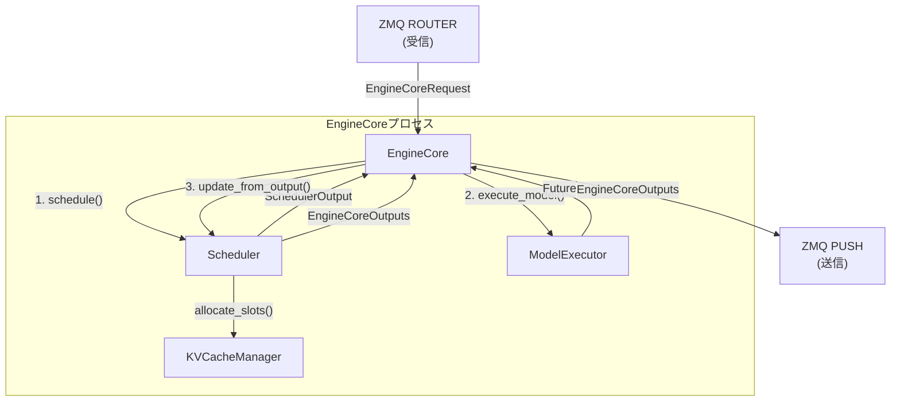

# EngineCore サマリー

> **深度**: [MEDIUM]
> **確信度**: [VERIFIED]
> **最終更新**: 2026-02-11

## 概要

`EngineCore`はバックエンドプロセス（`EngineCoreProc`）内で動作する推論ループの中央制御コンポーネントである。`Scheduler`、`ModelExecutor`、`KVCacheManager`を統括し、`step()`メソッドで **schedule → execute → update** のサイクルを繰り返す。フロントエンドプロセスとはZMQ IPC経由で通信し、`EngineCoreRequest`を受信して`EngineCoreOutputs`を返す。

## アーキテクチャ



## 主要コンポーネント

| コンポーネント | 用途 | ファイル |
|--------------|------|---------|
| `EngineCore` | 推論ループ本体 | `target/vllm/vllm/v1/engine/core.py:82` |
| `EngineCoreProc` | プロセスラッパー。ZMQソケット管理とイベントループ | `target/vllm/vllm/v1/engine/core.py` |

## 主要メソッド

| メソッド | 行 | 説明 |
|---------|-----|------|
| `__init__()` | L82 | Scheduler, ModelExecutor, KVキャッシュの初期化 |
| `step()` | L389 | メインループ: schedule → execute → update |
| `step_with_batch_queue()` | L434 | パイプライン並列化版step（batch_queue使用） |
| `add_request()` | L288 | リクエストをバリデーション後Schedulerに登録 |
| `post_step()` | L424 | step後処理（Speculative Decodingのドラフトトークン更新） |

## step() サイクル

**参照**: `target/vllm/vllm/v1/engine/core.py:389`

```
EngineCore.step() -> tuple[dict[int, EngineCoreOutputs], bool]
  │
  ├─ スケジューラ停止チェック                           # L397
  │   if _scheduler_paused: return {}, False
  │
  ├─ リクエスト有無チェック                             # L402
  │   if not scheduler.has_requests(): return {}, False
  │
  ├─ 1. scheduler.schedule()                            # L404
  │   → SchedulerOutput
  │
  ├─ 2. executor.execute_model(scheduler_output,        # L405
  │       non_block=True)
  │   → Future[ModelRunnerOutput | None]
  │
  ├─ 3. scheduler.get_grammar_bitmask(scheduler_output) # L406
  │   → grammar_output（構造化出力用）
  │
  ├─ 4. future.result()                                 # L411
  │   → ModelRunnerOutput（ブロッキング待機）
  │
  ├─ 5. if model_output is None:                        # L413
  │       model_output = executor.sample_tokens(grammar_output)
  │   （非同期スケジューリング時: execute_modelとsamplingが分離）
  │
  ├─ 6. _process_aborts_queue()                         # L417
  │
  └─ 7. scheduler.update_from_output(                   # L418
  │       scheduler_output, model_output)
  │   → dict[int, EngineCoreOutputs]
  │
  └─ return (engine_core_outputs,                       # L422
             total_num_scheduled_tokens > 0)
```

**戻り値**:
- 第1要素: クライアントインデックス → EngineCoreOutputs のマッピング
- 第2要素: モデル実行が行われたか（`total_num_scheduled_tokens > 0`）

## add_request() フロー

**参照**: `target/vllm/vllm/v1/engine/core.py:288`

```
add_request(request, request_wave=0)                    # L288
  ├─ request_id の型チェック（str必須）                   # L295
  ├─ pooling_params のタスクバリデーション                # L300
  ├─ kv_transfer_params の互換性チェック                  # L311
  └─ scheduler.add_request(request)                      # L319
```

## batch_queue パイプライン並列化 [SHALLOW]

**参照**: `target/vllm/vllm/v1/engine/core.py:434` (step_with_batch_queue)

`max_concurrent_batches > 1` の場合、`step_with_batch_queue()` が `step_fn` として使用される。スケジューリングとモデル実行をパイプライン的にオーバーラップさせ、GPUのアイドル時間を削減する。

- `batch_queue`: `deque[tuple[Future, SchedulerOutput, Future]]`
- 新しいスケジュール結果を `appendleft()` で追加、完了待ちを `pop()` で取得
- 前のバッチの実行完了を待たずに次のバッチをスケジュール可能

## KVキャッシュ初期化フロー [SHALLOW]

**参照**: `target/vllm/vllm/v1/engine/core.py:82` (__init__)

```
EngineCore.__init__()
  → _initialize_kv_caches()
    → model_executor.get_kv_cache_specs()       # モデルのKVキャッシュ要件取得
    → determine_available_memory()               # GPUメモリプロファイリング
    → get_kv_cache_configs()                     # ブロック数等の設定算出
    → generate_scheduler_kv_cache_config()       # Scheduler用設定生成
    → model_executor.initialize_from_config()    # GPUメモリ確保
```

KV Connector（KV Transfer/LMCache連携）が有効な場合:
- `scheduler.get_kv_connector()` でコネクタ有無を確認 (L159)
- 各ワーカーのハンドシェイクメタデータを収集・統合 (L164-175)

## async_scheduling [SHALLOW]

`vllm_config.scheduler_config.async_scheduling` で有効化。

- 通常: `execute_model()` がモデル実行 + トークンサンプリングをまとめて実行
- async有効時: `execute_model()` はモデル実行のみ（`None` を返す）→ `sample_tokens()` で別途サンプリング
- `post_step()` でのSpeculative Decodingドラフトトークン更新タイミングに影響

## 設定

| パラメータ | デフォルト | 説明 |
|-----------|----------|------|
| `max_concurrent_batches` | 1 | batch_queueサイズ（>1でパイプライン並列化） |
| `async_scheduling` | False | 非同期スケジューリングモード |

## 呼び出しフロー

```
[EngineCoreProc イベントループ]
  ├─ ZMQ受信 → EngineCore.add_request()
  ├─ EngineCore.step_fn()  (= step() or step_with_batch_queue())
  │   ├─ Scheduler.schedule()
  │   ├─ ModelExecutor.execute_model()
  │   └─ Scheduler.update_from_output()
  ├─ EngineCore.post_step()
  └─ ZMQ送信 ← EngineCoreOutputs
```

## 関連ドキュメント

- [Scheduler](../scheduler/summary.md)
- [KVCacheManager](../kv-cache-manager/summary.md)
- [EngineCoreClient](../engine-core-client/summary.md)
- [エントリポイント](../entrypoint/summary.md)
- [データフロー](../../architecture/data-flow.md)
