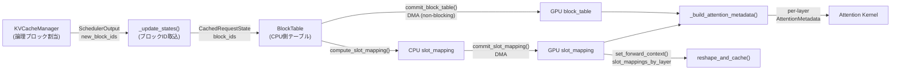
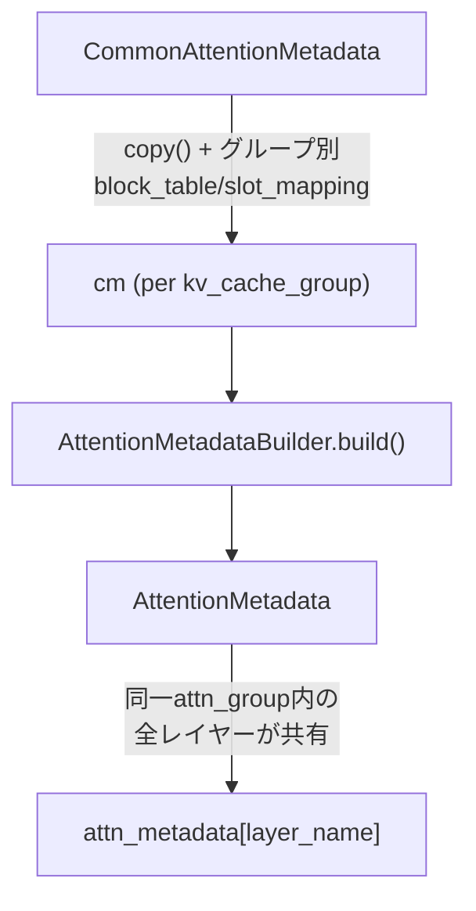

# KVCache-GPU Interface: ブロックテーブルとスロットマッピング

> **深度**: [MEDIUM]
> **確信度**: [VERIFIED]
> **最終更新**: 2026-02-14

## 概要

KVCacheManager（Scheduler側）が割り当てた論理ブロックIDは、GPUModelRunner内で4段階の変換を経てAttentionカーネルが消費できる形式になる。この文書では、ブロックIDの取り込みからAttentionMetadata構築までの完全なデータパスを追跡する。



## Stage A: ブロックID取込 — `_update_states()` [VERIFIED]

**参照**: `target/vllm/vllm/v1/worker/gpu_model_runner.py:874`

SchedulerOutputには3種類のリクエストデータが含まれ、それぞれブロックIDの扱いが異なる:

| ケース | block_ids の処理 | InputBatch操作 |
|--------|-----------------|---------------|
| **新規リクエスト** | `new_req_data.block_ids` → `CachedRequestState` 作成 | `add_request()` で追加 |
| **継続（非プリエンプション）** | `new_block_ids` を既存 `block_ids` に `extend()` | `block_table.append_row()` で差分追加 |
| **プリエンプション復帰** | `block_ids` を丸ごと `new_block_ids` で置換 | `add_request()` で再追加（前stepで `remove_request()` 済み） |

`block_ids` の型は `list[list[int]]` — 外側のリストはKVキャッシュグループ（Hybridモデルで複数）、内側はそのグループのブロックID列。

**重要な最適化 — 永続バッチ**: 前stepで存在し今回もスケジュールされたリクエストは、InputBatchに残り続ける。スケジュールされなかったリクエストだけが `remove_request()` で除去されるが、`CachedRequestState` は `self.requests` に保持される（L901-921）。

## Stage B: スロットマッピング計算 — `BlockTable.compute_slot_mapping()` [VERIFIED]

**参照**: `target/vllm/vllm/v1/worker/block_table.py:133`

トークンの論理位置を、KVキャッシュの物理GPUメモリスロットに変換する式:

```
block_table_index = req_index * max_num_blocks_per_req + position // block_size
block_number = block_table[block_table_index]  # ravel()で1D化してルックアップ
block_offset = position % block_size
slot = block_number * block_size + block_offset
```

### Hybrid Block対応

KVCacheManagerの割当ブロックサイズとAttentionカーネルのブロックサイズが異なる場合（例: 割当=32トークン、カーネル=16トークン）:

**参照**: `target/vllm/vllm/v1/worker/block_table.py:203` (`map_to_kernel_blocks`)

```python
# 割当ブロックID [0, 1, 2] → カーネルブロックID [0, 1, 2, 3, 4, 5]
# ブロック0 → [0, 1], ブロック1 → [2, 3], ブロック2 → [4, 5]
kernel_ids = block_id * blocks_per_kv_block + arange(blocks_per_kv_block)
```

`append_row()` と `add_row()` は、ブロックIDを追加する前にこの変換を適用する。`compute_slot_mapping()` では変換後の `kernel_block_size` が `block_size` として使用される。

### Context Parallel対応

CP（DCP/PCP）有効時は「仮想ブロック」サイズ（= `block_size * cp_world_size`）を使ってブロックテーブルインデックスを算出し、ローカルランクに属さないトークンのスロットを `-1` にマスクする（L142-179）。

## Stage C: GPU転送 — `_prepare_inputs()` [VERIFIED]

**参照**: `target/vllm/vllm/v1/worker/gpu_model_runner.py:1454`

`_prepare_inputs()` は以下の順序でCPU→GPU転送を実行する:

```
1. commit_block_table(num_reqs)      ← 最初に発行（DMAオーバーラップ最適化）
2. positions計算 (CPU)               ← DMA中にCPU演算
3. token_indices計算 (CPU)           ← DMA中にCPU演算
4. compute_slot_mapping()            ← CPU演算
5. commit_slot_mapping()             ← DMA発行
6. query_start_loc → GPU
7. seq_lens → GPU
8. input_ids → GPU
9. positions → GPU
```

**最適化ポイント**: `commit_block_table()` をCPU演算の前に呼ぶことで、ブロックテーブルのDMA転送とCPU上のslot_mapping/positions計算を並行実行する（L1472-1474のコメント）。

### CpuGpuBuffer

**参照**: `target/vllm/vllm/v1/utils.py:105`

ピン留めメモリCPUテンソル + GPUテンソルのペア。`np` 属性でnumpyビューを公開し、CPU側の演算をnumpy高速演算で行える。`copy_to_gpu(n)` は `non_blocking=True` でDMA転送を発行。

| 属性 | 型 | 説明 |
|------|-----|------|
| `cpu` | `torch.Tensor` (pinned) | ピン留めCPUメモリ |
| `gpu` | `torch.Tensor` | GPU VRAM |
| `np` | `np.ndarray` | `cpu` のnumpyビュー |

## Stage D: 2形式のスロットマッピング出力 — `_get_slot_mappings()` [VERIFIED]

**参照**: `target/vllm/vllm/v1/worker/gpu_model_runner.py:3237`

`_get_slot_mappings()` はスロットマッピングを2つの形式で返す:

| 形式 | キー | 消費者 |
|------|------|--------|
| `slot_mappings_by_gid` | `dict[int, Tensor]` — KVキャッシュグループID | `_build_attention_metadata()` → `CommonAttentionMetadata.slot_mapping` |
| `slot_mappings_by_layer` | `dict[str, Tensor]` — レイヤー名 | `set_forward_context()` → `reshape_and_cache()` |

同一KVキャッシュグループ内のレイヤーは同じスロットマッピングテンソルを共有する。

**CUDAGraph FULLモード時のパディング**: 未使用トークンスロットは `-1` で埋められる（L3283-3285）。これはMambaの `PAD_SLOT_ID` と一致し、`reshape_and_cache()` が `-1` スロットをスキップする。

## Stage E: Attentionメタデータ構築 — `_build_attention_metadata()` [VERIFIED]

**参照**: `target/vllm/vllm/v1/worker/gpu_model_runner.py:1673`

### CommonAttentionMetadata

全KVキャッシュグループの共通基盤。グループ0のblock_table/slot_mappingで初期化し、他グループでは `copy()` (shallow copy) してblock_tableとslot_mappingのみ差し替える。

```python
cm_base = CommonAttentionMetadata(
    query_start_loc=...,     # GPU tensor [num_reqs+1]
    seq_lens=...,            # GPU tensor [num_reqs]
    block_table_tensor=...,  # GPU tensor [num_reqs, max_blocks] ← グループ0
    slot_mapping=...,        # GPU tensor [num_tokens] ← グループ0
    max_query_len=...,
    max_seq_len=...,
    ...
)
```

### Per-layer AttentionMetadata構築



`_build_attn_group_metadata()` 内部関数が各`(kv_cache_gid, attn_gid)`ペアに対して:

1. `attn_group.get_metadata_builder()` でビルダーを取得
2. `builder.build(common_attn_metadata=cm)` で `AttentionMetadata` を生成
3. `attn_group.layer_names` の全レイヤーに同じメタデータを割り当て

### キャッシュ最適化

Hybridモデルで同じ `KVCacheSpec` + 同じビルダー型の組み合わせが複数グループに現れる場合、2番目以降は `builder.update_block_table()` で block_table のみ差し替え、ビルド全体をスキップする（L1824-1832）。

### 戻り値の型

```python
PerLayerAttnMetadata = dict[str, AttentionMetadata]      # 通常
                     | list[dict[str, AttentionMetadata]] # UBatching(DBO)時
```

## execute_model() 内の呼び出し順序 [VERIFIED]

**参照**: `target/vllm/vllm/v1/worker/gpu_model_runner.py:3312`

```
execute_model(scheduler_output)
  │
  ├─ 1. _prepare_inputs()                    # L3383
  │     block_table DMA + slot_mapping計算 + GPU転送
  │
  ├─ 2. _determine_batch_execution_and_padding()  # L3398
  │     CUDAGraphモード判定 → num_tokens_padded, num_reqs_padded
  │
  ├─ 3. _get_slot_mappings()                  # L3468
  │     2形式出力: by_gid (→ attn_metadata), by_layer (→ ForwardContext)
  │
  ├─ 4. _build_attention_metadata()           # L3479
  │     CommonAttentionMetadata → per-layer AttentionMetadata
  │
  ├─ 5. set_forward_context(slot_mapping=slot_mappings_by_layer)  # L3524
  │     ForwardContext にスロットマッピングを設定
  │
  └─ 6. _model_forward()                      # L3538
        model.forward() → Attention layer が ForwardContext から
        slot_mapping を取得し reshape_and_cache() を実行
```

## 主要ファイル

| ファイル | 主要クラス/関数 |
|---------|----------------|
| `target/vllm/vllm/v1/worker/gpu_model_runner.py` | `_update_states()` (L874), `_prepare_inputs()` (L1454), `_build_attention_metadata()` (L1673), `_get_slot_mappings()` (L3237), `execute_model()` (L3312) |
| `target/vllm/vllm/v1/worker/block_table.py` | `BlockTable` (L16), `compute_slot_mapping()` (L133), `map_to_kernel_blocks()` (L203), `MultiGroupBlockTable` (L253) |
| `target/vllm/vllm/v1/utils.py` | `CpuGpuBuffer` (L105) |
