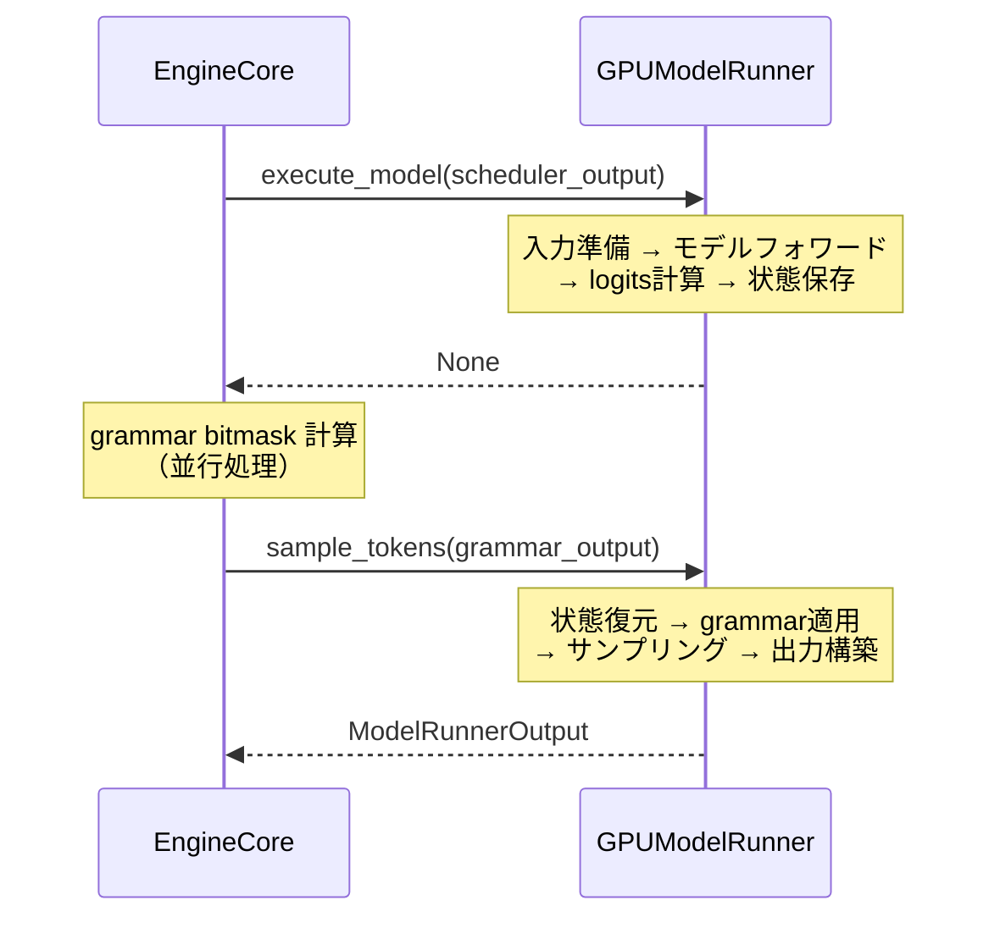

# GPUModelRunner

> **深度**: [MEDIUM]
> **確信度**: [VERIFIED]
> **最終更新**: 2026-02-15

## 概要

GPUModelRunnerは、推論パイプラインの実行中核を担う巨大クラス（約6,300行）である。SchedulerOutputを受け取り、入力テンソルの準備、モデルのforward実行、サンプリングを経て、ModelRunnerOutputを返す。**2フェーズ実行パターン**（`execute_model()` → `sample_tokens()`）を採用し、モデルフォワードとgrammar bitmask計算の並行実行を可能にしている。

## クラス定義

**参照**: `target/vllm/vllm/v1/worker/gpu_model_runner.py:329` (GPUModelRunner)

```python
class GPUModelRunner(
    LoRAModelRunnerMixin,           # LoRAアダプタ管理
    KVConnectorModelRunnerMixin,    # KV Transfer対応
    ECConnectorModelRunnerMixin,    # エンコーダキャッシュ対応
):
```

## 状態管理

GPUModelRunnerは2つのデータ構造でリクエスト状態を管理する:

- **`self.requests: dict[str, CachedRequestState]`** — リクエストの論理状態（プリエンプション後も保持）
- **`self.input_batch: InputBatch`** — 永続バッチテンソル群（事前割り当て、差分更新）

永続バッチ最適化により、連続stepで変更があったリクエストのデータのみCPU側で更新し、GPUへはDMA一括転送する。

詳細は [InputBatch: 永続バッチと状態管理](input-batch.md) を参照。

## KVCache-GPU Interface

KVCacheManager（Scheduler側）が割り当てた論理ブロックIDは、4段階の変換を経てAttentionカーネルが消費する形式になる:

```
_update_states()        ← ブロックID取込（3ケース: 新規/追加/プリエンプション復帰）
  ↓
BlockTable              ← CPU側テーブル（CpuGpuBuffer）
  ↓
_prepare_inputs()       ← commit_block_table() DMA + compute_slot_mapping()
  ↓
_get_slot_mappings()    ← by_gid（AttentionMetadata用）/ by_layer（ForwardContext用）
  ↓
_build_attention_metadata() ← CommonAttentionMetadata → per-layer AttentionMetadata
```

**核心的な変換式**: `slot = block_number * block_size + (position % block_size)`

詳細は [KVCache-GPU Interface](kv-cache-interface.md) を参照。

## 2フェーズ実行パターン

GPUModelRunnerの中核設計。`execute_model()`でモデルフォワードとlogits計算を行い、結果を`ExecuteModelState`に保存して`None`を返す。その後`sample_tokens()`が状態を復元してサンプリングを実行する。



### Phase 1: execute_model()

**参照**: `target/vllm/vllm/v1/worker/gpu_model_runner.py:3312` (execute_model)

```
execute_model(scheduler_output, intermediate_tensors=None)
  │
  ├─ 1. バッチ状態更新 _update_states()                     # L3376
  │     新規リクエスト登録、ブロックID更新、不要リクエスト除去
  │
  ├─ 2. 入力準備 _prepare_inputs()                          # L3383
  │     block_table DMA → slot_mapping計算 → positions/input_ids GPU転送
  │     ※ DMAオーバーラップ最適化（L1472-1474）
  │
  ├─ 3. CUDAGraph判定                                       # L3398
  │     _determine_batch_execution_and_padding()
  │     → CUDAGraphMode(FULL/PIECEWISE/NONE) + パディング量決定
  │
  ├─ 4. スロットマッピング2形式出力                            # L3468
  │     _get_slot_mappings() → by_gid + by_layer
  │
  ├─ 5. Attentionメタデータ構築                               # L3479
  │     _build_attention_metadata()
  │     → CommonAttentionMetadata → per-layer AttentionMetadata
  │
  ├─ 6. モデルフォワード                                      # L3538
  │     set_forward_context(slot_mapping=by_layer)
  │     → _model_forward() → model.forward() → logits
  │
  └─ 7. 状態保存                                              # L3605-3615
      ExecuteModelState に保存 → None を返す
```

**戻り値のパターン**:
- `None` — 通常ケース（sample_tokens()を後で呼ぶ）
- `ModelRunnerOutput` — プーリングモデル等（サンプリング不要）
- `IntermediateTensors` — Pipeline Parallelismの中間ランク
- `EMPTY_MODEL_RUNNER_OUTPUT` — スケジュールトークン0件

### Phase 2: sample_tokens()

**参照**: `target/vllm/vllm/v1/worker/gpu_model_runner.py:3621` (sample_tokens)

```
sample_tokens(grammar_output)
  │
  ├─ 1. 状態復元 — ExecuteModelState から logits 等を復元     # L3643-3657
  ├─ 2. Grammar制約適用 — bitmask → logits                  # L3659-3663
  ├─ 3. サンプリング — _sample() → SamplerOutput             # L3665-3666
  ├─ 4. 後処理 — バッチ状態反映、PP broadcast、ドラフト提案    # L3668-3699
  └─ 5. ModelRunnerOutput構築                                # L3775-3787
```

## CUDAGraph統合 [VERIFIED]

### CUDAGraphMode

3つの実行モードが存在する:

| モード | 説明 | 使用条件 |
|--------|------|---------|
| `FULL` | forward全体をキャプチャ | Attentionバックエンドが対応、cascade attention無効 |
| `PIECEWISE` | Attention以外をキャプチャ（torch.compile統合） | Attention部分はコンパイル済みコードで実行 |
| `NONE` | Eagerモード | CUDAGraph無効、バッチサイズ超過、calc_kv_scales時 |

### CudagraphDispatcher

**参照**: `target/vllm/vllm/v1/cudagraph_dispatcher.py:14`

事前キャプチャ済みCUDAGraphの中からランタイムで適切なグラフを選択する:

1. `cudagraph_keys: dict[CUDAGraphMode, set[BatchDescriptor]]` にキャプチャ済みのバッチ記述子を保持
2. `dispatch()` は入力 `num_tokens` を最小のパディングサイズに丸め上げ
3. FULL → PIECEWISE → NONE の優先順序でキーを探索

**バッチパディング**: CUDAGraphは固定形状のテンソルを要求するため、実際のトークン数をキャプチャ済みサイズに丸め上げる。未使用スロットはslot_mapping `-1`（PAD_SLOT_ID）で埋められ、`reshape_and_cache()` がスキップする。

### _determine_batch_execution_and_padding()

**参照**: `target/vllm/vllm/v1/worker/gpu_model_runner.py:3076`

毎stepの実行モード判定:

1. `_is_uniform_decode()` — 全リクエストがデコードフェーズ（query_len=1）か判定
2. `cudagraph_dispatcher.dispatch()` — モードとパディングサイズを決定
3. Data Parallel時は `coordinate_batch_across_dp()` で全ランク間で合意

## ExecuteModelState

**参照**: `target/vllm/vllm/v1/worker/gpu_model_runner.py:313` (ExecuteModelState)

2フェーズ間の一時状態を保持するNamedTuple。GPUテンソルを含むため、シリアライズはされない。

| フィールド | 型 | 説明 |
|-----------|-----|------|
| `scheduler_output` | `SchedulerOutput` | スケジュール結果 |
| `logits` | `torch.Tensor` | モデル出力logits |
| `spec_decode_metadata` | `SpecDecodeMetadata \| None` | Speculative Decoding情報 |
| `hidden_states` | `torch.Tensor` | 隠れ状態 |
| `sample_hidden_states` | `torch.Tensor` | サンプリング用隠れ状態 |
| `aux_hidden_states` | `list[torch.Tensor] \| None` | 補助隠れ状態 |
| `ec_connector_output` | `ECConnectorOutput \| None` | エンコーダ出力 |
| `cudagraph_stats` | `CUDAGraphStat \| None` | CUDAGraph統計 |
| `slot_mappings` | `dict \| list \| None` | KVキャッシュスロットマッピング |

## 6,300行の内訳 [VERIFIED]

| 行範囲 | セクション |
|--------|-----------|
| 1-312 | インポート、型エイリアス、Async出力クラス、ExecuteModelState |
| 329-712 | `__init__`（設定、バッファ割当、状態初期化） |
| 713-873 | ライフサイクルヘルパー（`reset_mm_cache`, `init_fp8_kv_scales` 等） |
| 874-1453 | 状態管理: `_update_states()`, `_update_states_after_model_execute()` |
| 1454-1672 | 入力準備: `_prepare_inputs()`, `_prepare_input_ids()` |
| 1673-2049 | `_build_attention_metadata()`（Attentionメタデータ構築） |
| 2050-2557 | 位置計算、MMエンコーダ実行 |
| 2558-3311 | モデルユーティリティ、`_get_slot_mappings()` |
| 3312-3620 | `execute_model()`（メインforward） |
| 3621-3934 | `sample_tokens()`、PP broadcast、ドラフト提案 |
| 3935-4118 | Speculative Decoding提案 |
| 4119-4609 | モデルロード: `load_model()`, `reload_weights()` |
| 4610-5108 | ダミー実行、プロファイリング |
| 5109-5332 | CUDAGraphキャプチャ: `capture_model()`, `_capture_cudagraphs()` |
| 5333-5596 | Attentionバックエンド初期化、メタデータビルダー |
| 5597-6152 | KVキャッシュ初期化: `initialize_kv_cache()` |
| 6152-6273 | `get_kv_cache_spec()`, タイミング統計 |

## マルチモーダル処理

マルチモーダル推論時、GPUModelRunnerは `execute_model()` 内で以下の追加処理を行う:

1. **`_execute_mm_encoder()`** (L2293): `model.embed_multimodal()` でビジョンエンコーダ実行。結果を `encoder_cache[mm_hash]` に格納
2. **`_gather_mm_embeddings()`** (L2449): `encoder_cache` からスケジュール範囲に対応する埋め込みをスライス。チャンクPrefill対応
3. **`embed_input_ids()`**: `masked_scatter_` でテキスト + ビジョン埋め込みをマージ → `inputs_embeds` として model.forward() に渡す

`encoder_cache: dict[str, torch.Tensor]` はGPU上のシンプルなdictキャッシュで、Schedulerの `free_encoder_mm_hashes` 指示で解放される。

詳細は [バックエンド MM処理パス](../multimodal/mm-engine-gpu.md) を参照。

## 上流・下流の関係

- **上流**: Worker（`execute_model()` / `sample_tokens()`経由で呼び出し）
- **下流**: モデル層（`model.forward()`）、Sampler

## 深堀り候補（今後）

| テーマ | 関連メソッド | ユーザー関心 |
|--------|------------|------------|
| サンプリング実装 | `_sample()`, Sampler | 低 |
| KV Transfer連携 | `KVConnectorModelRunnerMixin` | 高（ユーザー関心2位。次セッション候補） |
| Speculative Decoding | `propose_draft_token_ids()` | 中 |
| async_scheduling | `_update_states_after_model_execute()` | 中 |

## 主要ファイル

| ファイル | 主要クラス/関数 |
|---------|----------------|
| `target/vllm/vllm/v1/worker/gpu_model_runner.py` | `GPUModelRunner` (L329), `execute_model()` (L3312), `sample_tokens()` (L3621), `ExecuteModelState` (L313) |
| `target/vllm/vllm/v1/worker/gpu_input_batch.py` | `CachedRequestState` (L30), `InputBatch` (L81) |
| `target/vllm/vllm/v1/worker/block_table.py` | `BlockTable` (L16), `MultiGroupBlockTable` (L253) |
| `target/vllm/vllm/v1/cudagraph_dispatcher.py` | `CudagraphDispatcher` (L14) |
| `target/vllm/vllm/v1/utils.py` | `CpuGpuBuffer` (L105) |
| `target/vllm/vllm/v1/outputs.py` | `ModelRunnerOutput` (L160), `AsyncModelRunnerOutput` (L200) |
