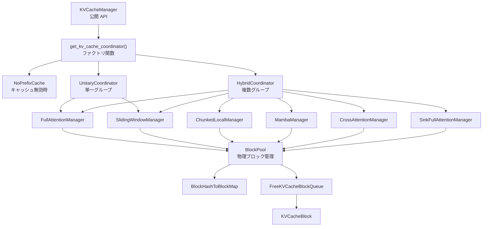

# KVCacheManager サマリー

> **深度**: [DEEP]
> **確信度**: [VERIFIED]
> **最終更新**: 2026-02-11

## 概要

`KVCacheManager` は PagedAttention に基づく KV キャッシュブロックの割り当て・解放・プレフィックスキャッシュ検索を管理するクラスである。4層の階層設計（`KVCacheManager` → `KVCacheCoordinator` → `SingleTypeKVCacheManager` → `BlockPool`）でマルチグループ KV キャッシュを統括する。Scheduler から呼び出され、各リクエストに必要な GPU メモリブロックを確保する。

## アーキテクチャ

### クラス階層



### Coordinator 選択ロジック

**参照**: `target/vllm/vllm/v1/core/kv_cache_coordinator.py:542`

```
get_kv_cache_coordinator()
  ├─ enable_caching == False  → KVCacheCoordinatorNoPrefixCache
  ├─ kv_cache_groups == 1     → UnitaryKVCacheCoordinator
  └─ kv_cache_groups > 1      → HybridKVCacheCoordinator
```

| Coordinator | 用途 | find_longest_cache_hit |
|-------------|------|----------------------|
| `NoPrefixCache` | キャッシュ無効 | 空リスト、0 トークン |
| `Unitary` | 単一アテンションタイプ | 単一 Manager に委譲 |
| `Hybrid` | 複数アテンションタイプ | 反復固定点アルゴリズム |

### KV キャッシュグループ

**KV キャッシュグループ**とは、同一の `KVCacheSpec`（アテンションタイプ・ブロックサイズ）を共有するモデルレイヤーの集合である。

| モデル例 | グループ構成 |
|---------|------------|
| 全層 Full Attention | 1 グループ |
| 12 層 Full + 12 層 Sliding Window | 2 グループ |
| デコーダ + クロスアテンション | 2-3 グループ |

各グループは独立した `SingleTypeKVCacheManager` を持ち、異なるキャッシュ検索アルゴリズム・スキップポリシーを適用する。

## KVCacheBlocks [DEEP] [VERIFIED]

**参照**: `target/vllm/vllm/v1/core/kv_cache_manager.py:21`

Scheduler と KVCacheManager のインターフェース。内部データ構造を隠蔽する。

```python
@dataclass
class KVCacheBlocks:
    blocks: tuple[Sequence[KVCacheBlock], ...]
    # blocks[i][j] = i 番目の kv_cache_group、j 番目のブロック
```

| メソッド | 説明 |
|---------|------|
| `__add__` | 2 つの KVCacheBlocks を結合 |
| `get_block_ids()` | `tuple[list[int], ...]` に変換（GPU カーネル用） |
| `get_unhashed_block_ids()` | 未ハッシュブロックの ID リスト（ドラフトトークン用） |
| `new_empty()` | 空の KVCacheBlocks を生成 |

**GC 最適化**: `KVCacheManager` は `empty_kv_cache_blocks` を事前生成し、空の結果を返す際に再利用する。

### ブロック配置図（allocate_slots）

`allocate_slots()` がリクエストに割り当てるブロックの論理構造:

```
|  comp  | new_comp | ext_comp |   new   | lookahead |
|<------ 既計算トークン ------>|<-- 新規計算対象 -->|
                               |<- 割り当て対象 ->|
```

- `comp`: `request.num_computed_tokens` — 前ステップまでに計算済み
- `new_comp`: `num_new_computed_tokens` — プレフィックスキャッシュから新規にヒットしたトークン
- `ext_comp`: `num_external_computed_tokens` — KV コネクタ（LMCache 等）から取得したトークン
- `new`: `num_new_tokens` — 今回計算するトークン
- `lookahead`: `num_lookahead_tokens` — Speculative Decoding 用の先読みトークン

## 主要コンポーネント

| コンポーネント | 用途 | ファイル |
|--------------|------|---------|
| `KVCacheManager` | Scheduler 向け公開 API | `target/vllm/vllm/v1/core/kv_cache_manager.py:94` |
| `KVCacheCoordinator` | マルチグループ統括（3 実装） | `target/vllm/vllm/v1/core/kv_cache_coordinator.py:28` |
| `SingleTypeKVCacheManager` | アテンションタイプ別管理（7 実装） | `target/vllm/vllm/v1/core/single_type_kv_cache_manager.py:24` |
| `BlockPool` | 物理ブロック割り当て・解放・キャッシュ管理 | `target/vllm/vllm/v1/core/block_pool.py:128` |
| `KVCacheBlock` | ブロックメタデータ（block_id, ref_cnt, block_hash） | `target/vllm/vllm/v1/core/kv_cache_utils.py:107` |
| `BlockHashToBlockMap` | プレフィックスキャッシュ用ハッシュ→ブロック対応表 | `target/vllm/vllm/v1/core/block_pool.py:32` |
| `FreeKVCacheBlockQueue` | LRU 順序の空きブロック管理（双方向リンクリスト） | `target/vllm/vllm/v1/core/kv_cache_utils.py:156` |

## 主要メソッド

| メソッド | 行 | 説明 |
|---------|-----|------|
| `allocate_slots()` | L206 | リクエストに KV キャッシュブロックを割り当て。成功時 `KVCacheBlocks`、失敗時 `None` |
| `get_computed_blocks()` | L164 | プレフィックスキャッシュから最長ヒットを検索。`(KVCacheBlocks, int)` |
| `free()` | L378 | リクエストのブロックをプールに返却 |
| `usage` (property) | L143 | KV キャッシュ使用率 (0.0-1.0) |
| `reset_prefix_cache()` | L409 | プレフィックスキャッシュ全体をリセット |
| `get_num_common_prefix_blocks()` | L425 | 全リクエスト共通の先頭ブロック数（Cascade Attention 用） |
| `cache_blocks()` | L475 | ブロックをプレフィックスキャッシュに登録 |

## allocate_slots() の 5 段階フロー [DEEP] [VERIFIED]

**参照**: `target/vllm/vllm/v1/core/kv_cache_manager.py:206`

```
allocate_slots(request, num_new_tokens, ...)
  │
  ├─ Stage 1: スキップブロック解放（Sliding Window 用）
  │  └─ coordinator.remove_skipped_blocks(request_id, total_computed_tokens)
  │
  ├─ Stage 2: 容量チェック
  │  ├─ coordinator.get_num_blocks_to_allocate(...)
  │  └─ 空きブロック不足 → return None（プリエンプション誘発）
  │
  ├─ Stage 3: キャッシュヒットブロック割り当て
  │  └─ new_computed_blocks 非空 or external_computed > 0:
  │     └─ coordinator.allocate_new_computed_blocks(...)
  │
  ├─ Stage 4: 新規ブロック割り当て
  │  └─ coordinator.allocate_new_blocks(request_id, num_tokens_need_slot, ...)
  │
  └─ Stage 5: キャッシュ登録判定
     ├─ NOT enable_caching or delay_cache_blocks → スキップ
     └─ coordinator.cache_blocks(request, num_tokens_to_cache)
        ※ num_tokens_to_cache はドラフトトークンを除外
```

**delay_cache_blocks**: P/D（Prefill/Decode 分離）構成で KV Transfer 完了前にキャッシュ登録を遅延する。

## プレフィックスキャッシュ

**参照**: `target/vllm/vllm/v1/core/kv_cache_manager.py:164` (get_computed_blocks)

プロンプトトークン列をブロックサイズ単位でハッシュ化し、`BlockHashToBlockMap` で過去に計算済みのブロックを検索する。ハッシュチェーン（各ブロックのハッシュが前ブロックのハッシュに依存）により、プレフィックスの最長一致を効率的に検索する。

```
get_computed_blocks(request)
  → coordinator.find_longest_cache_hit(request.block_hashes, max_length)
    → アテンションタイプ別の検索アルゴリズム
  → (キャッシュ済みブロック, ヒットトークン数) を返却
```

**制約**: 全トークンがキャッシュヒットしても、logits 取得のため最後の 1 トークンは再計算が必要（`max_cache_hit_length = request.num_tokens - 1`）。

→ 詳細は [プレフィックスキャッシュ詳細](prefix-cache.md) を参照

## 参照カウントと Eviction

**KVCacheBlock** (L107) の `ref_cnt` フィールドでブロックの使用状況を管理:

| ref_cnt | 状態 |
|---------|------|
| 0 | 空きブロックキュー（`FreeKVCacheBlockQueue`）内。Eviction 候補 |
| ≥ 1 | リクエストに使用中。Eviction 対象外 |

- **touch()**: キャッシュヒット時に `ref_cnt` を増加し、空きキューから除外
- **free_blocks()**: `ref_cnt` を減少。0 になったら空きキューに戻す（逆順追加で LRU 効率化）
- **_maybe_evict_cached_block()**: 新規ブロック要求時に空きキューの先頭（最古）から Evict。ハッシュメタデータをリセット

→ 詳細は [BlockPool 詳細](block-pool.md) を参照

## アテンションタイプ対応

7 種の `SingleTypeKVCacheManager` がアテンションタイプごとのブロック管理を担当:

| Manager | KVCacheSpec | スキップ計算 | キャッシュ検索 |
|---------|------------|------------|--------------|
| `FullAttentionManager` | FullAttention / MLA | 0 | 左→右 |
| `SlidingWindowManager` | SlidingWindow | `max(0, n-w+1)` | 右→左（連続） |
| `ChunkedLocalAttentionManager` | ChunkedLocal | `(n//c)*c` | null_pad + 左→右 |
| `MambaManager` | Mamba | `n - 1` | 右→左（単一） |
| `CrossAttentionManager` | CrossAttention | N/A | 非対応 |
| `SinkFullAttentionManager` | SinkFullAttention | 0 | 左→右 |

→ 詳細は [アテンションタイプ別 Manager](attention-type-managers.md) を参照

## 設定

| パラメータ | デフォルト | 説明 |
|-----------|----------|------|
| `block_size` | モデル依存 | 1 ブロックあたりのトークン数 |
| `enable_caching` | 設定依存 | プレフィックスキャッシュの有効化 |
| `num_gpu_blocks` | プロファイリングで決定 | GPU メモリから算出される総ブロック数 |
| `hash_block_size` | block_size と同値 | ハッシュ計算に使用するブロックサイズ |
| `prefix_caching_hash_algo` | `sha256_cbor` | ハッシュ関数（sha256/sha256_cbor/xxhash/xxhash_cbor） |
| `enable_kv_cache_events` | False | KV Transfer 用イベント発行 |

## 呼び出しフロー

```
Scheduler.schedule()
  ├─ kv_cache_manager.get_computed_blocks(request)     # プレフィックスキャッシュ検索
  ├─ kv_cache_manager.allocate_slots(request, ...)     # ブロック割り当て
  │   └─ None の場合 → プリエンプション実行
  └─ （完了時）kv_cache_manager.free(request)           # ブロック解放
```

## ソースファイル一覧

| ファイル | 行数 | 内容 |
|---------|------|------|
| `kv_cache_manager.py` | 490 | KVCacheManager、KVCacheBlocks |
| `kv_cache_coordinator.py` | 586 | Coordinator 3 実装 |
| `single_type_kv_cache_manager.py` | 1065 | Manager 7 種 |
| `block_pool.py` | 490 | BlockPool、BlockHashToBlockMap |
| `kv_cache_utils.py` | 1644 | KVCacheBlock、Queue、ハッシュ計算 |
| `kv_cache_metrics.py` | 96 | メトリクス収集 |

## 詳細ドキュメント

- **[BlockPool 詳細](block-pool.md)** — FreeKVCacheBlockQueue、BlockHashToBlockMap、KVCacheBlock ライフサイクル、Eviction、KV Cache Events
- **[プレフィックスキャッシュ詳細](prefix-cache.md)** — ハッシュチェーン計算、Extra Keys、Lookup アルゴリズム、Hybrid fixed-point
- **[アテンションタイプ別 Manager](attention-type-managers.md)** — 7 種 Manager の詳細、スキップ計算、キャッシュ検索アルゴリズム

## 関連ドキュメント

- [Scheduler](../scheduler/summary.md)
- [EngineCore](../engine-core/summary.md)
- [データフロー](../../architecture/data-flow.md)
- [用語集](../../glossary.md)
