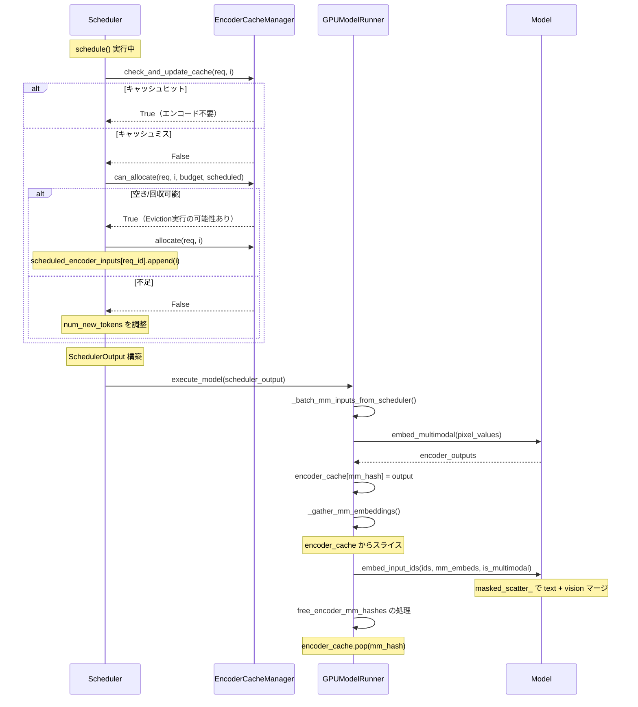

# バックエンド マルチモーダル処理パス [MEDIUM] [VERIFIED]

> **最終更新**: 2026-02-11

EngineCore（P1）でマルチモーダルリクエストがどのように処理されるかを追跡する。EncoderCacheManager、Schedulerのエンコーダ予算管理、GPUModelRunnerのエンコーダ実行・キャッシュ・埋め込みマージを含む。

## 全体フロー



## 1. EncoderCacheManager

### 概要

**参照**: `target/vllm/vllm/v1/core/encoder_cache_manager.py:17-267`

ビジョンエンコーダの出力（埋め込みテンソル）のライフサイクルを管理する。リファレンスカウント方式でリクエスト間のキャッシュ共有を実現し、遅延Evictionでメモリ効率を高める。

### データ構造

| フィールド | 型 | 説明 |
|-----------|-----|------|
| `cache_size` | `int` | キャッシュ容量（エンコーダ埋め込み数単位） |
| `num_free_slots` | `int` | 現在の空き容量 |
| `num_freeable_slots` | `int` | 回収可能な容量（参照なしエントリ含む） |
| `cached` | `dict[str, set[str]]` | mm_hash → 参照中のrequest_id集合 |
| `freeable` | `OrderedDict[str, int]` | mm_hash → 埋め込み数（参照なし、回収可能） |
| `freed` | `list[str]` | 実際にEvictされたmm_hashのリスト |

### 主要操作

#### check_and_update_cache(request, input_id) → bool

**参照**: `target/vllm/vllm/v1/core/encoder_cache_manager.py:91-117`

```
1. mm_hash が cached にない → False（キャッシュミス）
2. cached[mm_hash] が空集合（参照なし）→ freeable から除去、num_freeable_slots 減算
3. cached[mm_hash] に request_id 追加 → True（キャッシュヒット）
```

キャッシュヒット時、エンコーダ計算が **完全にスキップ** される。

#### can_allocate(request, input_id, budget, scheduled) → bool

**参照**: `target/vllm/vllm/v1/core/encoder_cache_manager.py:119-178`

```
1. num_embeds > encoder_compute_budget → False（予算不足）
2. total ≤ num_free_slots → True（空きあり）
3. total > num_freeable_slots → False（回収しても不足）
4. total > num_free_slots かつ ≤ num_freeable_slots
   → Eviction 実行: freeable から oldest-first で popitem(last=False)
   → cached から削除、freed に追加
   → num_free_slots 回復 → True
```

**Eviction ポリシー**: FIFO順（OrderedDict の挿入順）。最も古い unreferenced エントリを先にEvict。

#### allocate(request, input_id)

**参照**: `target/vllm/vllm/v1/core/encoder_cache_manager.py:180-205`

キャッシュスペースを予約（論理的な簿記のみ）。物理メモリの割り当てはGPUModelRunnerで行われる。

#### free(request)

**参照**: `target/vllm/vllm/v1/core/encoder_cache_manager.py:242-253`

リクエスト完了時に呼ばれる。全エンコーダ入力の参照を解放。参照セットが空になったエントリは `freeable` に移動する（物理メモリは解放しない）。

#### get_freed_mm_hashes() → list[str]

**参照**: `target/vllm/vllm/v1/core/encoder_cache_manager.py:255-266`

Evictされたmm_hashを返してクリア。SchedulerOutputに含められ、GPUModelRunnerに通知される。

### キャッシュ予算の計算

**参照**: `target/vllm/vllm/v1/core/encoder_cache_manager.py:269-316`

```python
encoder_compute_budget = max(max_num_encoder_input_tokens, max_tokens_per_mm_item)
encoder_cache_size = max(encoder_cache_size_config, max_tokens_per_mm_item)
```

- `encoder_compute_budget`: 1ステップあたりのエンコーダ計算量上限（埋め込み数）
- `encoder_cache_size`: キャッシュ全体の容量

## 2. Scheduler のエンコーダスケジューリング

### _get_encoder_budget()

**参照**: `target/vllm/vllm/v1/core/sched/scheduler.py:1060-1215`

各リクエストのエンコーダ入力をスケジューリングするロジック。`mm_features` の各アイテムについて:

```
for i, mm_feature in enumerate(mm_features):
    1. 位置チェック: start_pos + num_encoder_tokens がスケジュール範囲内か
    2. 重複チェック: 同じ mm_hash が既にスケジュール済みか
    3. キャッシュチェック: encoder_cache_manager.check_and_update_cache() → True ならスキップ
    4. チャンクMMチェック: disable_chunked_mm_input の場合、部分スケジュール禁止
    5. 割り当てチェック: can_allocate() → False ならトークン数調整して break
    6. ECConnectorチェック: 外部キャッシュにある場合は external_load_encoder_input に追加
    7. encoder_inputs_to_schedule に追加、予算減算
```

### SchedulerOutput のMM関連フィールド

**参照**: `target/vllm/vllm/v1/core/sched/output.py:207-218`

| フィールド | 型 | 説明 |
|-----------|-----|------|
| `scheduled_encoder_inputs` | `dict[str, list[int]]` | req_id → エンコーダ入力インデックスのリスト |
| `free_encoder_mm_hashes` | `list[str]` | 解放すべきmm_hashのリスト |

### スケジューリングの統合

schedule() のRUNNINGフェーズとWAITINGフェーズの両方で `_get_encoder_budget()` が呼ばれる:

```
schedule()
  ├─ encoder_compute_budget = max_num_encoder_input_tokens  # 初期予算
  │
  ├─ RUNNING リクエスト処理
  │   └─ _get_encoder_budget(request, ...)
  │       → encoder_inputs_to_schedule, 調整後の num_new_tokens
  │       → allocate() 実行
  │
  ├─ WAITING リクエスト処理
  │   └─ _get_encoder_budget(request, ...)
  │       → 同上
  │
  └─ SchedulerOutput 構築
      ├─ scheduled_encoder_inputs = {req_id: [input_ids], ...}
      └─ free_encoder_mm_hashes = encoder_cache_manager.get_freed_mm_hashes()
```

## 3. GPUModelRunner のエンコーダ実行

### encoder_cache

**参照**: `target/vllm/vllm/v1/worker/gpu_model_runner.py:439`

```python
self.encoder_cache: dict[str, torch.Tensor] = {}
```

mm_hash をキーとして、エンコーダ出力テンソル（GPU上）を保持する単純なdictキャッシュ。

### _batch_mm_inputs_from_scheduler()

**参照**: `target/vllm/vllm/v1/worker/gpu_model_runner.py:2250-2291`

SchedulerOutput の `scheduled_encoder_inputs` から、エンコーダに渡すデータをバッチにまとめる。

```
入力: scheduled_encoder_inputs = {req_id: [input_ids], ...}
出力: (mm_hashes, mm_kwargs, mm_lora_refs)

for req_id, encoder_input_ids in scheduled_encoder_inputs.items():
    for mm_input_id in encoder_input_ids:
        mm_feature = req_state.mm_features[mm_input_id]
        if mm_feature.data is None:  # P0キャッシュヒットで省略された場合
            continue
        mm_hashes.append(mm_feature.identifier)
        mm_kwargs.append((modality, mm_feature.data))
```

### _execute_mm_encoder()

**参照**: `target/vllm/vllm/v1/worker/gpu_model_runner.py:2293-2447`

```
1. mm_kwargs をモダリティごとにグループ化（group_mm_kwargs_by_modality）
2. 各グループに対して model.embed_multimodal(**mm_kwargs_group) を実行
3. LoRA tower mapping が必要な場合は事前にセット
4. 出力を encoder_cache[mm_hash] に格納
5. ECConnector があれば maybe_save_ec_to_connector() で外部キャッシュにも保存
```

**バッチ処理**: 同一モダリティのアイテムはバッチ実行される。異なるモダリティは別グループとして処理。

### _gather_mm_embeddings()

**参照**: `target/vllm/vllm/v1/worker/gpu_model_runner.py:2449-2556`

スケジュールされたトークン範囲に対応するエンコーダ出力をキャッシュから取得し、マージ用のデータを準備する。

```
for req_id in input_batch.req_ids:
    for mm_feature in req_state.mm_features:
        1. プレースホルダーの範囲 [start_pos, start_pos + num_encoder_tokens)
        2. スケジュールされた範囲 [num_computed_tokens, num_computed + num_scheduled)
        3. 重複部分を計算 → start_idx, end_idx
        4. encoder_cache[mm_hash] からスライス → mm_embeds_item
        5. is_mm_embed マスクの対応位置を True に設定
```

**チャンクPrefill対応**: `num_computed_tokens` と `num_scheduled_tokens` に基づいて部分的な埋め込み取得が可能。

出力:
- `mm_embeds: list[torch.Tensor]` — 全リクエストの埋め込みスライスを連結
- `is_mm_embed: torch.Tensor` — `(total_num_scheduled_tokens,)` のboolマスク

### 統合: _model_forward() 内の処理

**参照**: `target/vllm/vllm/v1/worker/gpu_model_runner.py:2756-2777`

```python
# 1. エンコーダ実行 + キャッシュ格納
self._execute_mm_encoder(scheduler_output)

# 2. キャッシュから必要な埋め込みを収集
mm_embeds, is_mm_embed = self._gather_mm_embeddings(scheduler_output)

# 3. テキスト + ビジョン埋め込みのマージ
inputs_embeds_scheduled = self.model.embed_input_ids(
    self.input_ids.gpu[:num_scheduled_tokens],
    multimodal_embeddings=mm_embeds,
    is_multimodal=is_mm_embed,
)
```

`embed_input_ids()` は内部で `masked_scatter_` を使い、`is_multimodal=True` の位置を `mm_embeds` で置換する。

### エンコーダキャッシュの解放

**参照**: `target/vllm/vllm/v1/worker/gpu_model_runner.py:898-899`

```python
for mm_hash in scheduler_output.free_encoder_mm_hashes:
    self.encoder_cache.pop(mm_hash, None)
```

SchedulerOutput に含まれる `free_encoder_mm_hashes` に基づいて、GPUメモリ上のテンソルを解放。

## 4. テキスト推論との差分まとめ

| 処理ステップ | テキスト推論 | マルチモーダル推論 |
|-------------|------------|-----------------|
| Scheduler: _get_encoder_budget | 不要（has_encoder_inputs=False） | エンコーダ入力のスケジューリング |
| Scheduler: encoder_compute_budget | 消費しない | ステップごとに予算管理 |
| SchedulerOutput | scheduled_encoder_inputs={} | {req_id: [input_ids]} |
| GPUModelRunner: encoder実行 | なし | _execute_mm_encoder() |
| GPUModelRunner: 埋め込み | input_ids をそのまま使用 | embed_input_ids() で text + vision マージ |
| GPUModelRunner: キャッシュ | なし | encoder_cache dict |
| モデルforward入力 | input_ids | inputs_embeds（テンソル） |

## 5. キャッシュの3層構造

```
P0（フロントエンド）          P1（バックエンド/Scheduler）      P1（バックエンド/GPU）
┌────────────────────┐     ┌───────────────────────┐      ┌──────────────────┐
│ ProcessorCache     │     │ EncoderCacheManager   │      │ encoder_cache    │
│ (LRU, mm_hash)     │     │ (RefCount, mm_hash)   │      │ (dict, mm_hash)  │
│                    │     │                       │      │                  │
│ キャッシュ対象:     │     │ キャッシュ対象:        │      │ キャッシュ対象:   │
│ HF処理済みテンソル  │     │ 論理的な存在管理      │      │ GPU上のテンソル   │
│ + prompt_updates   │     │ (容量・参照カウント)   │      │ (エンコーダ出力)  │
│                    │     │                       │      │                  │
│ Eviction: LRU      │     │ Eviction: FIFO        │      │ Eviction:        │
│ (サイズベース)      │     │ (OrderedDict oldest)  │      │ Scheduler指示    │
└────────────────────┘     └───────────────────────┘      └──────────────────┘
        ↓                           ↓                            ↓
  HF処理スキップ            エンコーダ計算スキップ          テンソル再利用
```

## 主要ファイル

| ファイル | 主要クラス/関数 | 行 |
|---------|----------------|-----|
| `target/vllm/vllm/v1/core/encoder_cache_manager.py` | `EncoderCacheManager` | L17 |
| `target/vllm/vllm/v1/core/sched/scheduler.py` | `_get_encoder_budget()` | L1060 |
| `target/vllm/vllm/v1/core/sched/output.py` | `SchedulerOutput` (MM fields) | L207, L218 |
| `target/vllm/vllm/v1/worker/gpu_model_runner.py` | `_execute_mm_encoder()`, `_gather_mm_embeddings()` | L2293, L2449 |

## 関連ドキュメント

- [フロントエンド MM処理パス](mm-processing.md)
- [Gemma3 ビジョンエンコーダ](gemma3-vision.md)
- [GPUModelRunner](../gpu-model-runner/summary.md)
- [Scheduler](../scheduler/summary.md)
- [KVCacheManager](../kv-cache-manager/summary.md)
