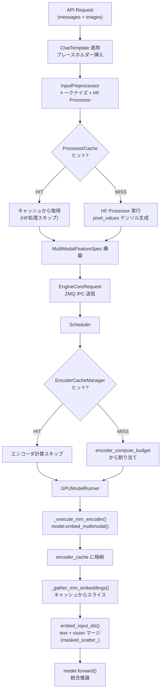

# マルチモーダル処理パイプライン サマリー

> **深度**: [MEDIUM]
> **確信度**: [VERIFIED]
> **最終更新**: 2026-02-11

## 概要

vLLMのマルチモーダル処理パイプラインは、画像・音声・動画等の非テキストデータをLLMの推論に統合するシステムである。フロントエンド（P0）でのメディア前処理・キャッシュと、バックエンド（P1）でのエンコーダ実行・埋め込みマージの2段構成で動作する。

## エンドツーエンド データフロー



## 主要コンポーネント

| コンポーネント | 場所 | 役割 |
|--------------|------|------|
| `MULTIMODAL_REGISTRY` | `vllm/multimodal/registry.py` | モデルごとのプロセッサ/情報を登録・取得 |
| `BaseMultiModalProcessor` | `vllm/multimodal/processing/processor.py` | HFプロセッサ実行、プロンプト更新管理 |
| `MultiModalHasher` | `vllm/multimodal/hasher.py` | コンテンツベースハッシュ（blake3） |
| `ProcessorCache` (4種) | `vllm/multimodal/cache.py` | P0側のHF処理結果キャッシュ |
| `EncoderCacheManager` | `vllm/v1/core/encoder_cache_manager.py` | P1側のエンコーダ出力の論理管理 |
| `encoder_cache` | `vllm/v1/worker/gpu_model_runner.py:439` | GPU上のエンコーダ出力テンソルキャッシュ |

## キャッシュの3層構造

```
P0（フロントエンド）               P1（Scheduler）              P1（GPU）
┌──────────────────┐           ┌─────────────────┐        ┌──────────────┐
│ ProcessorCache   │           │ EncoderCache    │        │ encoder_cache│
│ LRU, サイズベース │           │ Manager         │        │ dict[str,    │
│                  │           │ RefCount + FIFO │        │  Tensor]     │
│ 何をキャッシュ:   │           │                 │        │              │
│ HF処理済みテンソル │           │ 何を管理:       │        │ 何をキャッシュ:│
│ + prompt_updates │           │ 容量・参照カウント│       │ エンコーダ出力│
│                  │           │ Evictionリスト   │        │ (GPUテンソル) │
└──────────────────┘           └─────────────────┘        └──────────────┘
  ヒット時:                      ヒット時:                   ヒット時:
  HF処理スキップ                 エンコーダ計算スキップ        テンソル再利用
  IPC転送量削減                  予算節約                    再計算不要
```

## テキスト推論との主な差分

| 処理段階 | テキスト推論 | マルチモーダル推論 |
|---------|------------|-----------------|
| 入力前処理 | tokenize のみ | tokenize + HF Processor + ハッシュ + キャッシュ |
| プロンプト | テキストトークンのみ | テキスト + プレースホルダートークン（`<start_of_image>` 等） |
| EngineCoreRequest | `mm_features = None` | `mm_features = [MultiModalFeatureSpec, ...]` |
| Scheduler | KVキャッシュ予算のみ | + エンコーダ計算予算管理 |
| GPUModelRunner | input_ids → model.forward() | encoder実行 → embed_input_ids(masked_scatter_) → inputs_embeds → model.forward() |

## Gemma3 固有の特徴

- **ビジョンエンコーダ**: SiglipVisionModel（SIGLIP ViT、双方向Attention）
- **プロジェクタ**: AvgPool2d → GemmaRMSNorm → Linear（vision → text空間）
- **プレースホルダー**: `<start_of_image>` → `image_token × 256` に展開
- **Pan-and-Scan**: アスペクト比が大きい画像を複数クロップ（V1では簡略化されたアテンション）
- **改行トークン結合**: `\n` + `\n\n` → `\n\n\n` 等の特殊処理

## 詳細ドキュメント

| ドキュメント | 内容 |
|------------|------|
| [mm-processing.md](mm-processing.md) | フロントエンド: チャットテンプレート、プレースホルダー、MMハッシュ[DEEP]（hash_kwargs/serialize_item/iter_item_to_bytes詳細、identifier vs mm_hash使い分け、プレフィックスキャッシュ連携）、プロセッサキャッシュ4種、ZMQ送信データ |
| [mm-engine-gpu.md](mm-engine-gpu.md) | バックエンド: EncoderCacheManager、Schedulerエンコーダ予算、GPUModelRunnerエンコーダ実行・キャッシュ・埋め込みマージ |
| [gemma3-vision.md](gemma3-vision.md) | Gemma3: SiglipVisionModel、MultiModalProjector、Pan-and-Scan、masked_scatter_マージ |

## 上流・下流

- **上流**: [エントリポイント](../entrypoint/summary.md) → [InputProcessor](../input-processor/summary.md)
- **下流**: [Scheduler](../scheduler/summary.md) → [GPUModelRunner](../gpu-model-runner/summary.md) → モデル層

## 主要ファイル

| ファイル | 概要 |
|---------|------|
| `target/vllm/vllm/multimodal/` | マルチモーダル処理の基盤（レジストリ、ハッシュ、キャッシュ、パース） |
| `target/vllm/vllm/v1/engine/input_processor.py` | フロントエンドでのMM処理統合 |
| `target/vllm/vllm/v1/core/encoder_cache_manager.py` | バックエンドのエンコーダキャッシュ管理 |
| `target/vllm/vllm/v1/worker/gpu_model_runner.py` | GPU上でのエンコーダ実行と埋め込みマージ |
| `target/vllm/vllm/model_executor/models/gemma3_mm.py` | Gemma3のマルチモーダル実装 |
| `target/vllm/vllm/model_executor/models/siglip.py` | SiglipVisionModel（ビジョンエンコーダ） |
