# Scheduler サマリー

> **深度**: [MEDIUM]
> **確信度**: [VERIFIED]
> **最終更新**: 2026-02-11

## 概要

`Scheduler`はContinuous Batchingの中核コンポーネントであり、各ステップでどのリクエストにどれだけのトークンを計算させるかを決定する。`schedule()`メソッドは3フェーズ（RUNNING処理 → WAITING処理 → Output構築）で構成され、トークン予算の範囲内で最大限のリクエストをスケジュールする。Unified Compute Modelを採用し、Prefill/Decodeを明示的に区別せず `num_computed_tokens` の進捗で統一的に管理する。

## アーキテクチャ

```mermaid
graph TD
    subgraph schedule 3フェーズ
        P1["Phase 1: RUNNING<br>既実行リクエスト処理<br>L350-517"]
        P2["Phase 2: WAITING<br>新規リクエスト受け入れ<br>L532-800"]
        P3["Phase 3: Output構築<br>SchedulerOutput生成<br>L827-896"]
    end

    AR["add_request()"] -->|"WAITINGキューに追加"| P2
    P1 -->|"トークン予算消費"| P2
    P2 -->|"トークン予算消費"| P3
    P1 -->|"プリエンプション"| KVM["KVCacheManager"]
    P2 -->|"allocate_slots()"| KVM
    P2 -->|"get_computed_blocks()"| KVM
    P3 -->|"SchedulerOutput"| EC["EngineCore"]

    UO["update_from_output()"] -->|"ModelRunnerOutput"| OUT["EngineCoreOutputs"]
```



## 主要コンポーネント

| コンポーネント | 用途 | ファイル |
|--------------|------|---------|
| `Scheduler` | スケジューリング本体 | `target/vllm/vllm/v1/core/sched/scheduler.py` |
| `Request` | リクエスト内部状態 | `target/vllm/vllm/v1/request.py` |
| `SchedulerOutput` | スケジュール結果（Executor向け） | `target/vllm/vllm/v1/core/sched/output.py:184` |
| `NewRequestData` | 初回スケジュールのフルデータ | `target/vllm/vllm/v1/core/sched/output.py:34` |
| `CachedRequestData` | 既スケジュール済みの差分データ | `target/vllm/vllm/v1/core/sched/output.py:114` |

## 主要メソッド

| メソッド | 行 | 説明 |
|---------|-----|------|
| `schedule()` | L321 | メイン: 3フェーズスケジューリング → SchedulerOutput |
| `add_request()` | L1644 | WAITINGキューにリクエスト登録 |
| `update_from_output()` | L1241 | ModelRunnerOutputから出力生成 → EngineCoreOutputs |
| `finish_requests()` | L1666 | リクエストを完了/中止状態にする |
| `_preempt_request()` | L898 | プリエンプション実行（ブロック解放→WAITINGに戻す） |
| `_make_cached_request_data()` | L999 | CachedRequestData（差分データ）構築 |
| `_update_request_with_output()` | L1538 | 生成トークンをリクエストに追加、停止判定 |

## schedule() 3フェーズ

### Phase 1: RUNNING リクエストのスケジューリング（L350-517）

既に実行中のリクエストに対してトークンを割り当てる。

```
while req_index < len(self.running) and token_budget > 0:
    request = self.running[req_index]

    # 計算すべき新規トークン数
    num_new_tokens = (
        request.num_tokens_with_spec           # 最終目標
        + request.num_output_placeholders      # asyncプレースホルダ
        - request.num_computed_tokens           # 既計算分を差引
    )
    num_new_tokens = min(num_new_tokens, token_budget)

    # KVキャッシュブロック割り当て
    new_blocks = kv_cache_manager.allocate_slots(request, num_new_tokens)

    if new_blocks is None:
        # → プリエンプション: 最低優先度リクエストを解放して再試行
```

**プリエンプション**: ブロック割り当て失敗時、Priority/FIFOポリシーで最低優先度のリクエストを選びブロック解放。解放後に再試行する。

### Phase 2: WAITING リクエストのスケジューリング（L532-800）

WAITINGキューから新規リクエストを受け入れる。

```
for request in self.waiting:
    # スキップ条件チェック
    #   - WAITING_FOR_REMOTE_KVS: 非同期KV受信待ち
    #   - WAITING_FOR_FSM: 構造化出力のFSMコンパイル待ち
    #   - WAITING_FOR_STREAMING_REQ: ストリーミング入力待ち
    #   - LoRA制約超過

    # プレフィックスキャッシュ検索（初回のみ）
    if request.num_computed_tokens == 0:
        computed_blocks, num_hits = kv_cache_manager.get_computed_blocks(request)
        # KVコネクタ（LMCache等）による外部キャッシュも検索

    # 計算対象トークン数
    num_new_tokens = request.num_tokens - num_computed_tokens
    num_new_tokens = min(num_new_tokens, token_budget)

    # KVキャッシュブロック割り当て
    new_blocks = kv_cache_manager.allocate_slots(request, num_new_tokens, ...)
    if new_blocks is None:
        break  # ← RUNNINGと異なりプリエンプションせずループ終了

    # RUNNINGキューに追加
    self.running.append(request)
    request.status = RequestStatus.RUNNING
    token_budget -= num_new_tokens
```

### Phase 3: SchedulerOutput 構築（L827-896）

```
# 新規リクエスト → NewRequestData（フルデータ）
new_reqs_data = [NewRequestData.from_request(req, block_ids) for req in scheduled_new_reqs]

# 既実行リクエスト → CachedRequestData（差分のみ）
cached_reqs_data = self._make_cached_request_data(running_reqs, resumed_reqs, ...)

return SchedulerOutput(
    scheduled_new_reqs=new_reqs_data,
    scheduled_cached_reqs=cached_reqs_data,
    num_scheduled_tokens=num_scheduled_tokens,
    total_num_scheduled_tokens=total,
    ...
)
```

## Unified Compute Model

vLLM v1のSchedulerはPrefillとDecodeを明示的に区別しない。各リクエストの `num_computed_tokens` が `num_tokens_with_spec`（プロンプト長 + 出力長 + スペキュレーショントークン）に追いつくまでトークンを割り当てる。

このアプローチにより以下が統一的に扱える:
- **Chunked Prefill**: 大きなプロンプトを複数ステップに分割
- **Prefix Caching**: キャッシュヒット分を `num_computed_tokens` に反映
- **Speculative Decoding**: ドラフトトークンを `num_tokens_with_spec` に含める

## トークン予算

```python
token_budget = self.max_num_scheduled_tokens  # ステップあたりの上限
```

- 各リクエストのスケジュール時に `token_budget -= num_new_tokens` で消費
- Phase 1（RUNNING）→ Phase 2（WAITING）の順で消費
- 枯渇時: RUNNING側は continue（次リクエスト試行）、WAITING側は break（ループ終了）

## プリエンプション

**参照**: `target/vllm/vllm/v1/core/sched/scheduler.py:898` (_preempt_request)

KVキャッシュブロック不足時にRUNNINGリクエストに対してのみ発動:

1. ポリシーに基づき最低優先度のリクエストを選択
   - **Priority**: `(priority, arrival_time)` が最大のリクエスト
   - **FIFO**: 最後のリクエスト
2. `kv_cache_manager.free(request)` でブロック解放
3. `request.status = RequestStatus.PREEMPTED`、`num_computed_tokens = 0` にリセット
4. WAITINGキューの先頭に戻す（LIFO順序で優先再スケジュール）

## Request ステータス遷移


## update_from_output() フロー

**参照**: `target/vllm/vllm/v1/core/sched/scheduler.py:1241`

```
update_from_output(scheduler_output, model_runner_output)
  → dict[int, EngineCoreOutputs]

処理:
  for req_id in scheduler_output.scheduled requests:
    # Speculative Decoding リジェクション処理
    #   → 不採用トークン分 num_computed_tokens を巻き戻し

    # 生成トークンをリクエストに追加
    new_token_ids, stopped = _update_request_with_output(request, tokens)

    # 完了判定
    if stopped:
      finish_reason = request.get_finished_reason()
      _free_request(request)  # ブロック解放

    # EngineCoreOutput を構築
    outputs[client_index].append(EngineCoreOutput(
      request_id, new_token_ids, finish_reason, logprobs, ...
    ))

  return {client_index: EngineCoreOutputs(outputs=outs) for ...}
```

## 設定

| パラメータ | デフォルト | 説明 |
|-----------|----------|------|
| `max_num_seqs` | 設定依存 | 同時実行リクエスト数上限 |
| `max_num_batched_tokens` | 設定依存 | ステップあたりのトークン予算上限 |
| `enable_chunked_prefill` | 設定依存 | Chunked Prefillの有効化 |
| `long_prefill_token_threshold` | 0 | 長プロンプト分割閾値（0=無効） |
| `scheduling_policy` | Priority | プリエンプション選択ポリシー |

## 呼び出しフロー

```
EngineCore.add_request(request)
  → scheduler.add_request(request)       # WAITINGキューに登録

EngineCore.step()
  ├─ scheduler.schedule()                 # → SchedulerOutput
  │   ├─ kv_cache_manager.get_computed_blocks()  # プレフィックスキャッシュ
  │   └─ kv_cache_manager.allocate_slots()       # ブロック割り当て
  ├─ executor.execute_model(scheduler_output)     # GPU実行
  └─ scheduler.update_from_output(output)         # → EngineCoreOutputs
```

## 関連ドキュメント

- [KVCacheManager](../kv-cache-manager/summary.md)
- [EngineCore](../engine-core/summary.md)
- [エントリポイント](../entrypoint/summary.md)
- [データフロー](../../architecture/data-flow.md)
- [用語集: Continuous Batching, Unified Compute Model](../../glossary.md)
