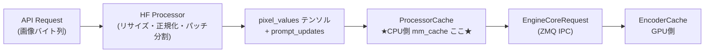

# mm_cache 内部実装調査 [MEDIUM] [VERIFIED]

> **最終更新**: 2026-02-18

CPU側（フロントエンドプロセス P0）でHugging FaceのPreprocessorが画像等を処理した結果をキャッシュする `mm_cache` の内部実装・設定・CPU並列化の調査報告。GPU側の [EncoderCache](../components/encoder-cache/summary.md)（`dict[str, Tensor]`）とは完全に別の機構。

---

## 1. mm_cacheとは



**キャッシュキー**: `mm_hash`（blake3/sha256によるコンテンツハッシュ、[mm-processing.md §3](../components/multimodal/mm-processing.md) 参照）

**キャッシュ値**: HF Processor実行結果（`pixel_values` 等のテンソル群 + `prompt_updates`）

**キャッシュヒット時にスキップされる処理**:
1. HF Processorの実行（画像リサイズ・正規化・パッチ分割）
2. テンソルデータのZMQ IPC転送（`lru`/`shm`モード時）

---

## 2. Config設定項目

**参照**: `target/vllm/vllm/config/multimodal.py:103`（`MultiModalConfig`）

| フィールド名 | CLIオプション | デフォルト | 制約 | 説明 |
|------------|-------------|---------|------|------|
| `mm_processor_cache_gb` | `--mm-processor-cache-gb` | **4** | `≥0` | キャッシュ容量（GiB）。`0` で完全無効 |
| `mm_processor_cache_type` | `--mm-processor-cache-type` | **"lru"** | `"lru"` or `"shm"` | キャッシュ実装タイプ |
| `mm_shm_cache_max_object_size_mb` | （直接CLIオプションなし） | **128** | `≥0` | shmモード時の1オブジェクト上限（MiB）。`shm`専用 |

> **注意**: キャッシュはプロセスごとに独立して確保される。総メモリ使用量 = `mm_processor_cache_gb × (api_server_count + data_parallel_size)`。

### 設定変更例

```bash
# キャッシュを8GBに増量（デフォルト4GB）
vllm serve <model> --mm-processor-cache-gb 8

# 共有メモリキャッシュに切り替え（マルチworker時に効率的）
vllm serve <model> --mm-processor-cache-type shm

# キャッシュを無効化
vllm serve <model> --mm-processor-cache-gb 0
```

```python
# Python APIから
from vllm import LLM
llm = LLM(model=..., mm_processor_cache_gb=8)
```

---

## 3. キャッシュタイプの選択ロジック

**参照**: `target/vllm/vllm/multimodal/registry.py:281`（`_get_cache_type()`）

```
mm_processor_cache_gb <= 0
  → None（キャッシュ無効）

マルチモーダル非対応モデル
  → None

IPC非対応（以下のいずれか）:
  - api_process_count > 1（マルチAPIプロセス）
  - data_parallel_size > 1 かつ data_parallel_external_lb が False
  → "processor_only"（P0のみのLRU）

IPC対応:
  mm_processor_cache_type == "lru" → "lru"（SenderCache + ReceiverCache）
  mm_processor_cache_type == "shm" → "shm"（共有メモリ）
```

> `processor_only` は IPC 不可時の自動フォールバックで、ユーザーが直接指定するオプションではない。

---

## 4. キャッシュ実装5クラスの詳細

**参照**: `target/vllm/vllm/multimodal/cache.py`

### 4.1 P0（送信側）3実装

#### `MultiModalProcessorOnlyCache`（L326）— processor_only モード

IPC非対応時に使用。P0プロセス内でHF処理結果を丸ごとLRUに保持し、ZMQ経由で毎回テンソルを送信。

```python
self._cache = LRUCache(
    GiB_bytes * mm_config.mm_processor_cache_gb,
    getsizeof=lambda x: MultiModalCache.get_item_size(x)
)
# キャッシュ値: MultiModalProcessorCacheItem（item テンソル + prompt_updates）
```

#### `MultiModalProcessorSenderCache`（L379）— lru モード

**P0はサイズメタデータのみ保持**（テンソルはP1側に保存）。IPC経路のメモリ使用を削減。

```python
self._cache = LRUCache(
    GiB_bytes * mm_config.mm_processor_cache_gb,
    getsizeof=lambda x: MultiModalCache.get_item_size(x)
)
# キャッシュ値: MultiModalProcessorCacheItemMetadata（item_size + prompt_updates）
# ヒット時: data=None で ZMQ 送信（テンソル転送スキップ）
```

#### `ShmObjectStoreSenderCache`（L437）— shm モード

**テンソルを共有メモリに書き込み**、Worker は直接共有メモリから読む（ZMQ 経由のコピー不要）。

```python
ring_buffer = SingleWriterShmRingBuffer(
    data_buffer_size=int(mm_config.mm_processor_cache_gb * GiB_bytes),
    name=envs.VLLM_OBJECT_STORAGE_SHM_BUFFER_NAME,
    create=True,  # P0がWriter
)
self._shm_cache = SingleWriterShmObjectStorage(
    max_object_size=mm_config.mm_shm_cache_max_object_size_mb * MiB_bytes,
    n_readers=self.world_size,
    ring_buffer=ring_buffer,
    serde_class=MsgpackSerde,
)
# P0-private dict に prompt_updates のみ別途保管
self._p0_cache: dict[str, Sequence[ResolvedPromptUpdate]] = {}
```

- エビクション: **FIFO**（LRUではない）
- 1オブジェクト上限を超えると `ValueError`/`MemoryError` → フォールバックで元の mm_input をそのまま返す

### 4.2 P1（受信側）2実装

#### `MultiModalReceiverCache`（L614）— lru モード時 EngineCore

P1でテンソルをLRU保持。P0のSenderCacheと**同じEviction順序を維持**することでキャッシュ状態を同期。

```python
self._cache = LRUCache(
    GiB_bytes * mm_config.mm_processor_cache_gb,
    getsizeof=lambda x: MultiModalCache.get_item_size(x)
)
# キャッシュ値: MultiModalKwargsItem（テンソルデータそのもの）
```

#### `ShmObjectStoreReceiverCache`（L662）— shm モード時 Worker

共有メモリ上のアドレスからテンソルを直接読み取る。`reader_lock`（`multiprocessing.Lock`）で参照カウントを保護。

---

## 5. LRUキャッシュの内部実装

**参照**: `target/vllm/vllm/utils/cache.py:51`（`vllm.utils.cache.LRUCache`）

`cachetools.LRUCache` を継承したサイズベースのLRU実装:

| 機能 | 実装 |
|------|------|
| 容量 | `maxsize = GiB_bytes * mm_processor_cache_gb`（バイト数） |
| サイズ計算 | `getsizeof()` コールバック経由で `tensor.nbytes` を再帰的に合計 |
| Eviction | 最低使用時間（LRU）順。ピン済みエントリはスキップ |
| ヒット統計 | `stat(delta=True)` でインターバル別 hits/total を取得可能 |
| ピン機能 | `pin(key)` でEviction対象外にできる |
| `touch()` | Eviction順序を更新（P0-P1同期用） |

**サイズ計算の詳細**（`MultiModalCache.get_item_size()`）:

```python
# json_map_leaves + json_reduce_leaves で再帰的にリーフ要素のサイズを合計
# leaf ごと: torch.Tensor → tensor.nbytes, str → sys.getsizeof, etc.
```

---

## 6. SHMキャッシュ（SingleWriterShmRingBuffer）の内部実装

**参照**: `target/vllm/vllm/distributed/device_communicators/shm_object_storage.py:22`

### リングバッファ構造

```
バッファ全体 (mm_processor_cache_gb GiB)
┌─────────────────────────────────────────────────┐
│ [4B id][4B size][data...] [4B id][4B size][data..] │
│ ^start                     ↑                    ^end│
└─────────────────────────────────────────────────┘
```

- **シングルライター**: P0のみが書き込み（`allocate_buf`）
- **マルチリーダー**: Worker×TP数が読み取り可能（`access_buf`）
- **FIFOエビクション**: 最も古い（start側の）オブジェクトから解放
- **参照カウント**: 全リーダーが解放を確認してからGC（ライターが管理）
- **ラップアラウンド**: バッファ末尾に達したら先頭に折り返す

### `SingleWriterShmObjectStorage` の付加機能

| 機能 | 実装 |
|------|------|
| キー管理 | `key_index: dict[str, (address, monotonic_id)]`（ライター側のみ） |
| 重複キー | 既存キーはデータ再書き込みなし（アドレス再参照） |
| シリアライズ | `MsgpackSerde`（デフォルト） |
| 上限超過 | `ValueError`/`MemoryError` → SenderCacheがフォールバック |
| 上限チェック | `put()` 時に `max_object_size` と比較。超えたらエラー |

**メモリレイアウト（オブジェクト単位）**:
```
[4-byte ref_count][metadata_size][serialized_object_data]
```

---

## 7. P0–P1 キャッシュ整合性の設計

**参照**: `target/vllm/vllm/multimodal/cache.py:175`（`BaseMultiModalCache` docstring）

```
P0: From API --> is_cached() × N --> get_and_update() --> To P1
P1: From P0  --> get_and_update()                     --> To model
```

**核心**: `get_and_update()` は P0 と P1 で**必ず同じ順序**で呼ばれる必要がある。これにより、P0のキャッシュ状態だけを参照してP1のキャッシュ状態を推定でき、IPC通信なしでキャッシュヒット確認が可能。

- `is_cached()`: Eviction順序を変えない（P0のみ参照）
- `get_and_update()`: Eviction順序を更新（P0・P1で順番に呼ぶ）
- `touch_sender_cache_item()`: Sender側のEviction順序を手動更新（LoRA切り替え等で使用）

---

## 8. CPU並列処理

### intra-request 並列化（1リクエスト内）

**参照**: `target/vllm/vllm/v1/engine/input_processor.py:363`

```python
with set_request_id(request_id), set_default_torch_num_threads():
    processed_inputs = self.input_preprocessor.preprocess(...)
```

`set_default_torch_num_threads()`（`target/vllm/vllm/utils/torch_utils.py:106`）:

```python
# OMP_NUM_THREADS 環境変数を読んで torch.set_num_threads() を設定
# 未設定時のデフォルト: 1
num_threads = int(os.environ.get("OMP_NUM_THREADS", 1))
torch.set_num_threads(num_threads)
```

HF Processorの実行（`apply()` → `_cached_apply_hf_processor()` → `_call_hf_processor()`）はすべて同期処理。`OMP_NUM_THREADS` を増やすとTorchのOpenMP並列化（行列演算等）が有効になる。

```bash
OMP_NUM_THREADS=4 vllm serve <model>  # 1画像あたりのCPU処理を4スレッド化
```

### inter-request 並列化（複数リクエスト間）

**vLLMには複数リクエストを同時にHF Processorで処理する機構はない。**

- `process_inputs()` は **同期呼び出し**（async/await なし）
- AsyncLLMの `add_request()` 内で呼ばれ、asyncioイベントループで逐次実行される
- 並列化する唯一の手段: **複数のAPIサーバープロセスを立ち上げる**
  - ただし各プロセスが独立して `mm_processor_cache_gb` GiBを確保する
  - IPC非対応になり `processor_only` モードに自動フォールバック

### mm_cacheによる実質的な高速化

同一画像が何度も送られる場合（例: 同じシステム画像を全リクエストで使用）、キャッシュヒット時は HF Processor の実行を完全にスキップできるため、事実上の並列化効果が得られる。

---

## 9. キャッシュモード別データフロー比較

| | processor_only | lru | shm |
|--|--------------|-----|-----|
| **P0保持** | テンソル + prompt_updates | サイズメタデータ + prompt_updates | SHMアドレス + prompt_updates（P0-private dict） |
| **P1保持** | なし | テンソル（LRU） | 共有メモリ上のテンソル |
| **エビクション** | LRU | LRU（P0/P1連動） | FIFO |
| **IPCヒット時** | テンソルをZMQ送信 | data=None 送信（テンソル省略） | data=None 送信（SHMアドレスのみ） |
| **MissのZMQ転送** | テンソル全体 | テンソル全体 | data=None（SHM経由） |
| **適用場面** | マルチAPIプロセス / DP≥2 | 単一APIプロセス + 単一DP（デフォルト） | 同左（マルチWorkerで転送削減） |

---

## 関連ドキュメント

- [マルチモーダル処理パイプライン（§3 MMハッシュ DEEP）](../components/multimodal/mm-processing.md) — ProcessorCacheのキー計算
- [マルチモーダル処理パイプライン概要](../components/multimodal/summary.md) — 3層キャッシュ構造図
- [EncoderCache（GPU側）](../components/encoder-cache/summary.md) — GPU側の別キャッシュ機構
- [Gemma3ビジョンパイプラインのキャッシュ機構](gemma3-vision-caches.md) — 3層キャッシュの具体例

## 主要ファイル

| ファイル | 主要クラス/関数 | 行 |
|---------|----------------|-----|
| `target/vllm/vllm/config/multimodal.py` | `MultiModalConfig`（mm_processor_cache_gb等） | L103 |
| `target/vllm/vllm/multimodal/cache.py` | `MultiModalProcessorOnlyCache`, `SenderCache`, `ShmObjectStoreSenderCache`, `ReceiverCache`, `ShmObjectStoreReceiverCache` | L326, L379, L437, L614, L662 |
| `target/vllm/vllm/multimodal/registry.py` | `_get_cache_type()`, `processor_cache_from_config()`, `engine_receiver_cache_from_config()`, `worker_receiver_cache_from_config()` | L281, L307, L335, L348 |
| `target/vllm/vllm/utils/cache.py` | `LRUCache`（cachetools継承、サイズベース、ピン機能） | L51 |
| `target/vllm/vllm/distributed/device_communicators/shm_object_storage.py` | `SingleWriterShmRingBuffer`, `SingleWriterShmObjectStorage` | L22, L412 |
| `target/vllm/vllm/v1/engine/input_processor.py` | `process_inputs()`（`set_default_torch_num_threads`呼び出し） | L363 |
| `target/vllm/vllm/utils/torch_utils.py` | `set_default_torch_num_threads()`（OMP_NUM_THREADS読み取り） | L106 |
