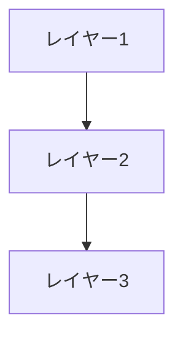

# {トピック名}

> **深度**: [SHALLOW|MEDIUM|DEEP]
> **確信度**: [VERIFIED|INFERRED|TODO]
> **最終更新**: YYYY-MM-DD

## 概要

（このトピックの全体像を2-3文で）

## 構造

## 主要コンポーネント

### コンポーネントA

（説明）

**参照**: `target/path/to/file.py:123`

### コンポーネントB

（説明）

**参照**: `target/path/to/file.py:456`

## 設計原則

（重要な設計判断とその理由）

## 参照ファイル

| ファイル | 主要クラス/関数 |
|---------|----------------|
| `target/path/to/file.py` | `ClassName`, `function_name()` |
