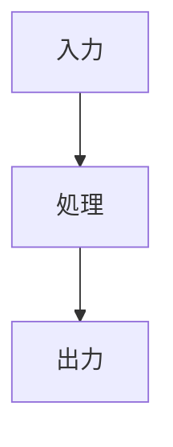

# {コンポーネント名} サマリー

> **深度**: [SHALLOW|MEDIUM|DEEP]
> **確信度**: [VERIFIED|INFERRED|TODO]
> **最終更新**: YYYY-MM-DD

## 概要

（このコンポーネントが何であり、何をするかを2-3文で）

## アーキテクチャ

（または ASCII 図）

## 主要コンポーネント

| コンポーネント | 用途 | ファイル |
|--------------|------|---------|
| `ClassName` | 説明 | `target/path/to/file.py` |

## 設定

| パラメータ | デフォルト | 説明 |
|-----------|----------|------|

## 呼び出しフロー

（このコンポーネントがシステム内でどのように呼ばれるか）

## 関連ドキュメント

- [関連コンポーネント](../other-component/summary.md)
- [データフロー](../../architecture/data-flow.md)
